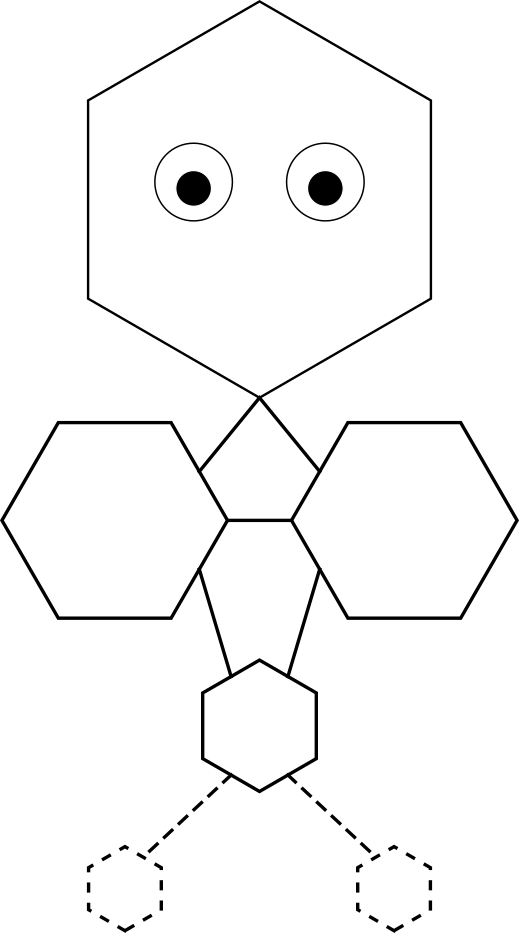

# Resid Branding Guidelines

**Version 1.0** — Last updated: August 2026

## Core Identity
- **Name**: Resid
- **Tagline**: "What Remains is What Matters" 
- **Secondary Tagline**: "Know Everything"
- **Mascot**: **Rezzi the Residual** — A character in the form of a graph.

## Logo
- **Primary Logo**: The Resid "R"
- **Monotone / B&W**: High-contrast black version for dark/light modes or print.
- **Minimum Size**: 100px wide for digital use.
- **Clear Space**: Maintain padding equal to 1/4 the logo height around all sides.

**Do's**:
- Use official assets only.
- Pair with tagline when space allows.
- Use on dark backgrounds for the color version.

**Don'ts**:
- Distort, stretch, or recolor the logo.
- Add effects or shadows unless approved.
- Use the mascot overlapping the logo without proper spacing.

## Mascot: Rezzi the Residual
</img>
- Simple residual graph.
- Use for fun illustrations, error pages, stickers, or social posts.
- Keep consistent black/white palette.

**Approved Uses**:
- GitHub README hero.
- Conference slides.
- Merch (stickers, t-shirts).

## Color Palette
- **Black**: RGB(0, 0, 0) | Hex #000000
- **White**: RGB(255, 255, 255) | HEX #FFFFFF

## Typography
- **Headings**: Bold sans-serif (e.g., Inter or system sans).
- **Body/Code**: Monospace (e.g., JetBrains Mono).

## Acceptable Use
This branding is for promoting the Resid programming language. Commercial use (e.g., merchandise) is allowed with attribution. Contact the maintainer for high-res assets or custom approvals.

See `assets/` folder for logo, mascot, and SVG/PNG files.

---

*Questions? Open an issue on the repo.*

