# Resid cross-language benchmarks

*Generated by `bench/suite/bench.py report` from `bench/suite/results/`. Do not edit by hand; rerun the generator.*

## Abstract

We compare the Resid compiler against 10 other languages (C, C++, Rust, Go, Java, C#, JavaScript, Python, Fortran, Pascal) on the 10 programs of the Computer Language Benchmarks Game, in two tracks: a single-threaded same-algorithm track (`st`) and a fastest-known-program track (`best`). The suite currently holds 220 runnable program cells and 0 cell(s) declared not applicable; 5833 timed process executions are recorded. Every program output is checked byte-for-byte against the C `st` reference. Times are wall-clock medians of cold process runs; languages are aggregated by the geometric mean of their time ratio to C.

- **st, official**: Resid geometric-mean wall-time ratio to C is **0.97×** over its 10 completed benchmark(s); 0.97× over the 10 benchmark(s) all compared languages completed.
- **st, small**: Resid geometric-mean wall-time ratio to C is **0.99×** over its 10 completed benchmark(s); 0.99× over the 10 benchmark(s) all compared languages completed.
- **best, official**: Resid geometric-mean wall-time ratio to C is **0.83×** over its 10 completed benchmark(s); 0.83× over the 10 benchmark(s) all compared languages completed.
- **best, small**: Resid geometric-mean wall-time ratio to C is **0.86×** over its 10 completed benchmark(s); 0.86× over the 10 benchmark(s) all compared languages completed.

Contents: [Environment](#environment) · [Methodology](#methodology) · [Overall ranking](#overall-ranking) · [Matrices](#matrices) · [Resid versus other languages](#resid-versus-other-languages) · [Per-benchmark results](#per-benchmark-results) · [Coverage](#coverage) · [Appendix](#appendix-cell-notes-and-provenance)

## Environment

| Item | Value |
| --- | --- |
| CPU | AMD Ryzen AI 7 PRO 350 w/ Radeon 860M |
| Cores / threads | 8 / 16 |
| SMT active | 1 |
| Max clock | 5091 MHz (pinned core 2: 5090 MHz) |
| Frequency boost | enabled |
| RAM | 54.6 GiB |
| Kernel | Linux 7.2.5-3-omarchy |
| CPU governor | performance |
| Transparent huge pages | [always] madvise never |
| Resid commit | `426d4450c5d070b132beb68b930331845035e680-dirty` |
| stage2.bin sha256 | `c31dde62ef6c59054e75da94a26fd208b913771e86cf997489310eaedc4d6c01` |
| Environment id | `0291c1b378bb` |
| Captured | 2026-10-05T23:58:07Z |

The CPU is heterogeneous (per-CPU maximum clocks differ: 5090 MHz: CPUs 0,2,4,6,8,10,12,14; 3506 MHz: CPUs 1,3,5,7,9,11,13,15). The `st` track is pinned to CPU 2; `best` programs run on all CPUs, mixing core types.

| Toolchain | Version |
| --- | --- |
| cargo | `cargo 1.98.0 (797e8a9bc 2026-08-05)` |
| clang | `clang version 22.1.8` |
| dotnet | `10.0.111` |
| fpc | `3.2.2` |
| g++ | `g++ (GCC) 16.2.1 20260810` |
| gcc | `gcc (GCC) 16.2.1 20260810` |
| gfortran | `GNU Fortran (GCC) 16.2.1 20260810` |
| go | `go version go1.27.0-X:nodwarf5 linux/amd64` |
| java | `openjdk version "26.0.2.1" 2026-08-18` |
| javac | `javac 26.0.2.1` |
| node | `v26.5.0` |
| pcre2 | `10.48` |
| python3 | `Python 3.14.7` |
| rustc | `rustc 1.98.0 (88d9e12ae 2026-08-18)` |

## Methodology

### Tracks and fairness rules

- **`st` (single-thread, same algorithm).** Every language implements the algorithm described by the Benchmarks Game for that program, single-threaded, without SIMD intrinsics, inline assembly or `-march=native`, using the standard release optimisation level of its toolchain. Bignum and regex benchmarks use the language's standard or customary library (GMP for C/C++/Fortran/Pascal, PCRE2 for C/C++). Processes are pinned to one CPU (CPU 2) with `sched_setaffinity`.
- **`best` (fastest known program).** The fastest program known for the language, adapted from the Benchmarks Game (3-clause BSD); multithreading, SIMD and `-O3 -march=native` are allowed. Processes may use every CPU.
- Program cells live in `bench/suite/src/<track>/<bench>/<lang>/`, each with a `build` script, a one-line `cmd`, optional `NOTES.md` (deviations, provenance, licence) or an `NA` file explaining why the cell cannot exist. See `bench/suite/CONTRACT.md`.

### Compiler flags per language

| Language | `st` policy | `st` example build | `best` example build |
| --- | --- | --- | --- |
| Resid | `stage2.bin -O2` (default) | `HERE="$(pwd)" ; ulimit -v 16000000 ; (cd "$ROOT" && build/boot/stage2.bin "$HERE/nbody.resid" -o "$HERE/out/nbody" -O2 >/dev/null)` (nbody) | `HERE="$(pwd)" ; ulimit -v 16000000 ; (cd "$ROOT" && build/boot/stage2.bin "$HERE/nbody.resid" -o "$HERE/out/nbody" -O3 -march=native >/dev/null)` (nbody) |
| C | `gcc -O2` | `gcc -O2 -o out/nbody nbody.c -lm` (nbody) | `gcc -pipe -Wall -O3 -fomit-frame-pointer -march=native -o out/nbody nbody.c` (nbody) |
| C++ | `g++ -O2` | `g++ -O2 -std=c++17 -o out/nbody nbody.cpp` (nbody) | `g++ -pipe -O3 -fomit-frame-pointer -march=native -std=c++17 -o out/nbody nbody.cpp` (nbody) |
| Rust | `rustc -C opt-level=3` / cargo `--release` | `rustc --edition 2021 -C opt-level=3 -o out/nbody nbody.rs` (nbody) | `rustc -C opt-level=3 -C target-cpu=native -C codegen-units=1 -o out/nbody nbody.rs` (nbody) |
| Go | `go build` (default) | `go build -o out/nbody .` (nbody) | `GOAMD64=v3 go build -o out/nbody .` (nbody) |
| Java | HotSpot defaults | `javac -d out *.java` (nbody) | `javac -d out *.java` (nbody) |
| C# | `dotnet` Release | `dotnet build -c Release -o out -nologo -v quiet` (nbody) | `dotnet build -r linux-x64 -c Release -o out -nologo -v quiet` (nbody) |
| JavaScript | `node` | `run: node nbody.js` (nbody) | `run: node nbody.js` (nbody) |
| Python | CPython `python3` | `run: python3 nbody.py` (nbody) | `run: python3 -OO nbody.py` (nbody) |
| Fortran | `gfortran -O2` | `gfortran -O2 -Jout -o out/nbody nbody.f90` (nbody) | `gfortran -O3 -march=native -Jout -o out/nbody nbody.f90` (nbody) |
| Pascal | `fpc -O2` | `fpc -O2 -v0 -FUout -oout/nbody nbody.pas >/dev/null` (nbody) | `fpc -XXs -O3 -Ci- -Cr- -g- -CpCOREAVX -CfAVX -Tlinux  -v0 -FUout -oout/nbody nbody.pas >/dev/null` (nbody) |

Exact commands for every cell are in its `build` script; the per-cell notes in the appendix record deviations.

### Problem sizes

| Benchmark | official | small | stdin input (official / small) |
| --- | ---: | ---: | --- |
| `nbody` | 50000000 | 5000000 | — |
| `fannkuch-redux` | 12 | 10 | — |
| `spectral-norm` | 5500 | 1000 | — |
| `mandelbrot` | 16000 | 4000 | — |
| `binary-trees` | 21 | 16 | — |
| `fasta` | 25000000 | 2500000 | — |
| `k-nucleotide` | 0 | 0 | fasta output, N = 25000000 / 2500000 |
| `reverse-complement` | 0 | 0 | fasta output, N = 25000000 / 2500000 |
| `pidigits` | 10000 | 2000 | — |
| `regex-redux` | 0 | 0 | fasta output, N = 5000000 / 500000 |

| Input | Bytes | sha256 |
| --- | ---: | --- |
| `fasta-500000.txt` | 5,083,411 | `1dc21045102d2131…` |
| `fasta-2500000.txt` | 25,416,745 | `e3600e481ef68b6c…` |
| `fasta-5000000.txt` | 50,833,411 | `97197f5957a12f8a…` |
| `fasta-25000000.txt` | 254,166,745 | `3fcf4f78104c8a65…` |

### Measurement procedure

- Each run is a fresh (cold) process: no warm-up run, no in-process repetition, like the Benchmarks Game. Every run is recorded; none is discarded.
- The harness execs `cmd` plus the size argument directly (no shell), with cwd = cell directory, stdin from the generated input file (or `/dev/null`) and stdout to a temporary file. Wall time is `time.perf_counter_ns()` around fork/exec and `os.wait4`; user and system CPU time and peak resident set size (`ru_maxrss`) come from the `rusage` returned by `wait4`. CPU utilisation = (user + sys) / wall; values above 100% indicate parallelism.
- Runs per cell: 5 by default; if the first run takes more than 60 s, 3 in total; if more than 300 s, only 1. A failing run (timeout, OOM, non-zero exit) is not repeated.
- Limits: a wall-clock timeout (default 1800 s official, 300 s small) kills the process group. Memory is limited to 16 GiB: via `RLIMIT_AS` for native languages; managed runtimes that reserve large virtual ranges (Java, C#, JavaScript) instead have their process-tree RSS polled from `/proc` every 100 ms and are killed when over the limit. A non-zero exit whose stderr mentions an allocation failure is classified as OOM.
- Correctness: the sha256 of stdout is compared with the C `st` program's output for the same benchmark, size and input. Mismatching cells are excluded from all aggregates.
- Build time is measured cold with respect to the cell (`out/` removed first), but toolchain-level caches (Go build cache, NuGet, Cargo registry) are warm.
- Source size is the gzip -9 compressed size of the concatenated source files of the cell (build scripts, `cmd`, notes and project boilerplate excluded), as on the Benchmarks Game.

### Statistics

- Per cell: median, minimum, maximum, mean, sample standard deviation and coefficient of variation (stdev / mean) of wall time over the successful runs of the latest batch.
- 95% confidence interval of the median: percentile bootstrap, 2000 resamples, fixed seed 20260925 (so regeneration is deterministic). With 5 runs the interval is coarse; with one run no interval is given.
- Ratios are median / median of the C program of the same track and size. Aggregation across benchmarks uses the geometric mean of ratios, so C = 1.00 by construction.
- Two geometric means are reported. **Common set**: only benchmarks that every compared language completed (a language is compared if it completed at least half of the benchmarks that C completed); this is the like-for-like figure. **Own set**: each language over all benchmarks it completed; not comparable across languages with different coverage and labelled with its benchmark count.
- N/A, missing, build-failure, timeout, OOM, error and mismatch results are shown as `—` in matrices with the status in the per-benchmark tables, and never enter an aggregate. A cell whose source changed after its runs is marked *stale*.

### Threats to validity

- Single machine, single OS; results do not transfer to other micro-architectures. The CPU runs with frequency boost, so clock speed depends on temperature and load.
- The pinned `st` CPU's SMT sibling is not isolated and background processes are not stopped; the coefficient of variation is reported so noisy cells are visible.
- Cold-process timing includes runtime start-up and JIT warm-up for Java, C#, JavaScript and interpreter start-up for Python; this is intended (whole-program cost) but penalises managed runtimes on the small sizes.
- Peak RSS for polled runtimes is the maximum of `ru_maxrss` and the 100 ms RSS samples; `ru_maxrss` is per process (maximum over waited-for descendants, not their sum).
- Program quality differs between languages; `best` programs come from different authors with different amounts of tuning effort, and `st` ports may be more or less idiomatic.
- Output files are written to a temporary directory (tmpfs on this host), so I/O-heavy benchmarks (fasta, reverse-complement, mandelbrot) measure memory-backed writes.
- The Resid compiler targets x86-64 with SSSE3, SSE4.1 and AES-NI on every track (its runtime needs them, and code only inlines between functions of one target), while the other languages' `st` builds use the plain x86-64 baseline; `-march=native` is used on the `best` track only, as for every language.

## Overall ranking

### st — official

**Geometric mean of wall time ratio to C.** Common set (10 benchmark(s)): `nbody`, `fannkuch-redux`, `spectral-norm`, `mandelbrot`, `binary-trees`, `fasta`, `k-nucleotide`, `reverse-complement`, `pidigits`, `regex-redux`.

| # | Language | geomean (common set) | geomean (own set) | completed |
| ---: | --- | ---: | ---: | ---: |
| 1 | Resid | 0.97 | 0.97 | 10/10 |
| 2 | C | 1.00 | 1.00 | 10/10 |
| 3 | Fortran | 1.04 | 1.04 | 10/10 |
| 4 | Rust | 1.05 | 1.05 | 10/10 |
| 5 | C++ | 1.44 | 1.44 | 10/10 |
| 6 | C# | 1.62 | 1.62 | 10/10 |
| 7 | Java | 1.70 | 1.70 | 10/10 |
| 8 | Go | 1.76 | 1.76 | 10/10 |
| 9 | JavaScript | 2.04 | 2.04 | 10/10 |
| 10 | Pascal | 2.05 | 2.05 | 10/10 |
| 11 | Python | 18.5 | 18.5 | 10/10 |

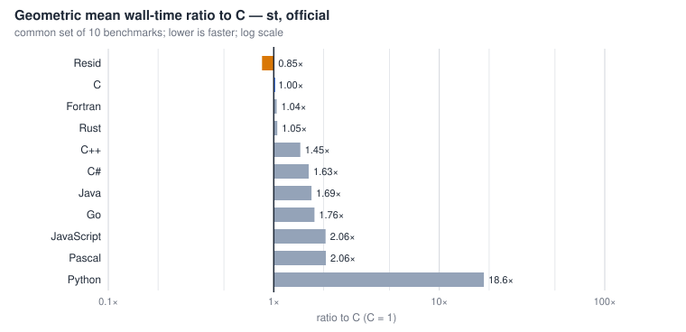

**Geometric mean of CPU time ratio to C.** Common set (10 benchmark(s)): `nbody`, `fannkuch-redux`, `spectral-norm`, `mandelbrot`, `binary-trees`, `fasta`, `k-nucleotide`, `reverse-complement`, `pidigits`, `regex-redux`.

| # | Language | geomean (common set) | geomean (own set) | completed |
| ---: | --- | ---: | ---: | ---: |
| 1 | Resid | 0.97 | 0.97 | 10/10 |
| 2 | C | 1.00 | 1.00 | 10/10 |
| 3 | Fortran | 1.04 | 1.04 | 10/10 |
| 4 | Rust | 1.05 | 1.05 | 10/10 |
| 5 | C++ | 1.44 | 1.44 | 10/10 |
| 6 | C# | 1.62 | 1.62 | 10/10 |
| 7 | Java | 1.70 | 1.70 | 10/10 |
| 8 | Go | 1.76 | 1.76 | 10/10 |
| 9 | JavaScript | 2.04 | 2.04 | 10/10 |
| 10 | Pascal | 2.05 | 2.05 | 10/10 |
| 11 | Python | 18.5 | 18.5 | 10/10 |

**Geometric mean of peak RSS ratio to C.** Common set (10 benchmark(s)): `nbody`, `fannkuch-redux`, `spectral-norm`, `mandelbrot`, `binary-trees`, `fasta`, `k-nucleotide`, `reverse-complement`, `pidigits`, `regex-redux`.

| # | Language | geomean (common set) | geomean (own set) | completed |
| ---: | --- | ---: | ---: | ---: |
| 1 | Resid | 0.81 | 0.81 | 10/10 |
| 2 | Pascal | 0.89 | 0.89 | 10/10 |
| 3 | C | 1.00 | 1.00 | 10/10 |
| 4 | Rust | 1.42 | 1.42 | 10/10 |
| 5 | Fortran | 1.71 | 1.71 | 10/10 |
| 6 | Go | 1.91 | 1.91 | 10/10 |
| 7 | C++ | 1.91 | 1.91 | 10/10 |
| 8 | Python | 4.05 | 4.05 | 10/10 |
| 9 | C# | 7.81 | 7.81 | 10/10 |
| 10 | Java | 11.1 | 11.1 | 10/10 |
| 11 | JavaScript | 13.7 | 13.7 | 10/10 |

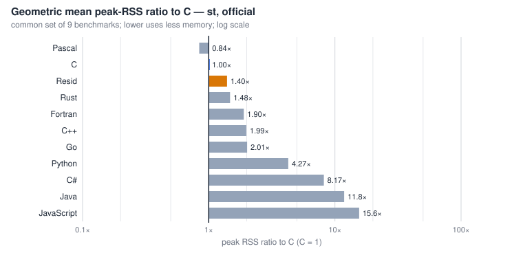

### st — small

**Geometric mean of wall time ratio to C.** Common set (10 benchmark(s)): `nbody`, `fannkuch-redux`, `spectral-norm`, `mandelbrot`, `binary-trees`, `fasta`, `k-nucleotide`, `reverse-complement`, `pidigits`, `regex-redux`.

| # | Language | geomean (common set) | geomean (own set) | completed |
| ---: | --- | ---: | ---: | ---: |
| 1 | Resid | 0.99 | 0.99 | 10/10 |
| 2 | C | 1.00 | 1.00 | 10/10 |
| 3 | Rust | 1.03 | 1.03 | 10/10 |
| 4 | Fortran | 1.04 | 1.04 | 10/10 |
| 5 | C++ | 1.42 | 1.42 | 10/10 |
| 6 | Go | 1.74 | 1.74 | 10/10 |
| 7 | C# | 1.83 | 1.83 | 10/10 |
| 8 | Pascal | 1.94 | 1.94 | 10/10 |
| 9 | JavaScript | 2.14 | 2.14 | 10/10 |
| 10 | Java | 2.59 | 2.59 | 10/10 |
| 11 | Python | 16.0 | 16.0 | 10/10 |

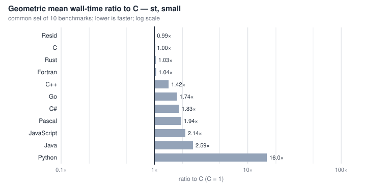

**Geometric mean of CPU time ratio to C.** Common set (10 benchmark(s)): `nbody`, `fannkuch-redux`, `spectral-norm`, `mandelbrot`, `binary-trees`, `fasta`, `k-nucleotide`, `reverse-complement`, `pidigits`, `regex-redux`.

| # | Language | geomean (common set) | geomean (own set) | completed |
| ---: | --- | ---: | ---: | ---: |
| 1 | Resid | 0.99 | 0.99 | 10/10 |
| 2 | C | 1.00 | 1.00 | 10/10 |
| 3 | Rust | 1.03 | 1.03 | 10/10 |
| 4 | Fortran | 1.04 | 1.04 | 10/10 |
| 5 | C++ | 1.42 | 1.42 | 10/10 |
| 6 | Go | 1.74 | 1.74 | 10/10 |
| 7 | C# | 1.83 | 1.83 | 10/10 |
| 8 | Pascal | 1.94 | 1.94 | 10/10 |
| 9 | JavaScript | 2.14 | 2.14 | 10/10 |
| 10 | Java | 2.59 | 2.59 | 10/10 |
| 11 | Python | 16.0 | 16.0 | 10/10 |

**Geometric mean of peak RSS ratio to C.** Common set (10 benchmark(s)): `nbody`, `fannkuch-redux`, `spectral-norm`, `mandelbrot`, `binary-trees`, `fasta`, `k-nucleotide`, `reverse-complement`, `pidigits`, `regex-redux`.

| # | Language | geomean (common set) | geomean (own set) | completed |
| ---: | --- | ---: | ---: | ---: |
| 1 | Resid | 0.61 | 0.61 | 10/10 |
| 2 | Pascal | 0.67 | 0.67 | 10/10 |
| 3 | C | 1.00 | 1.00 | 10/10 |
| 4 | Rust | 1.19 | 1.19 | 10/10 |
| 5 | Fortran | 1.42 | 1.42 | 10/10 |
| 6 | C++ | 1.72 | 1.72 | 10/10 |
| 7 | Go | 1.92 | 1.92 | 10/10 |
| 8 | Python | 3.62 | 3.62 | 10/10 |
| 9 | C# | 8.33 | 8.33 | 10/10 |
| 10 | Java | 13.0 | 13.0 | 10/10 |
| 11 | JavaScript | 15.5 | 15.5 | 10/10 |

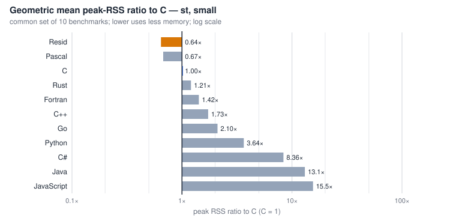

### best — official

**Geometric mean of wall time ratio to C.** Common set (10 benchmark(s)): `nbody`, `fannkuch-redux`, `spectral-norm`, `mandelbrot`, `binary-trees`, `fasta`, `k-nucleotide`, `reverse-complement`, `pidigits`, `regex-redux`.

| # | Language | geomean (common set) | geomean (own set) | completed |
| ---: | --- | ---: | ---: | ---: |
| 1 | Rust | 0.66 | 0.66 | 10/10 |
| 2 | C++ | 0.73 | 0.73 | 10/10 |
| 3 | Resid | 0.83 | 0.83 | 10/10 |
| 4 | C | 1.00 | 1.00 | 10/10 |
| 5 | Fortran | 1.21 | 1.21 | 10/10 |
| 6 | C# | 1.30 | 1.30 | 10/10 |
| 7 | Java | 1.53 | 1.53 | 10/10 |
| 8 | Go | 1.59 | 1.59 | 10/10 |
| 9 | Pascal | 2.24 | 2.24 | 10/10 |
| 10 | JavaScript | 3.59 | 3.59 | 10/10 |
| 11 | Python | 17.3 | 17.3 | 10/10 |

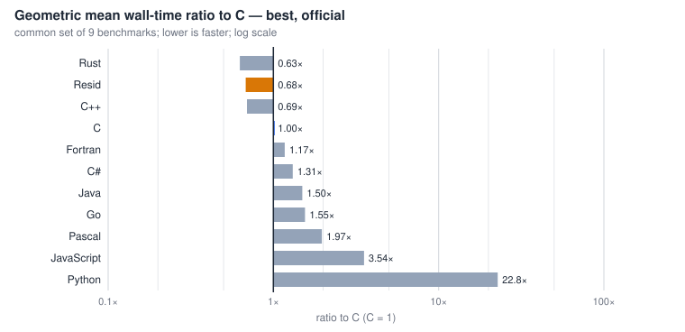

**Geometric mean of CPU time ratio to C.** Common set (10 benchmark(s)): `nbody`, `fannkuch-redux`, `spectral-norm`, `mandelbrot`, `binary-trees`, `fasta`, `k-nucleotide`, `reverse-complement`, `pidigits`, `regex-redux`.

| # | Language | geomean (common set) | geomean (own set) | completed |
| ---: | --- | ---: | ---: | ---: |
| 1 | Rust | 0.91 | 0.91 | 10/10 |
| 2 | C++ | 0.94 | 0.94 | 10/10 |
| 3 | C | 1.00 | 1.00 | 10/10 |
| 4 | Fortran | 1.10 | 1.10 | 10/10 |
| 5 | Resid | 1.19 | 1.19 | 10/10 |
| 6 | C# | 1.29 | 1.29 | 10/10 |
| 7 | Pascal | 1.86 | 1.86 | 10/10 |
| 8 | Go | 1.95 | 1.95 | 10/10 |
| 9 | Java | 2.10 | 2.10 | 10/10 |
| 10 | JavaScript | 3.56 | 3.56 | 10/10 |
| 11 | Python | 21.9 | 21.9 | 10/10 |

**Geometric mean of peak RSS ratio to C.** Common set (10 benchmark(s)): `nbody`, `fannkuch-redux`, `spectral-norm`, `mandelbrot`, `binary-trees`, `fasta`, `k-nucleotide`, `reverse-complement`, `pidigits`, `regex-redux`.

| # | Language | geomean (common set) | geomean (own set) | completed |
| ---: | --- | ---: | ---: | ---: |
| 1 | C | 1.00 | 1.00 | 10/10 |
| 2 | Pascal | 1.16 | 1.16 | 10/10 |
| 3 | Rust | 1.18 | 1.18 | 10/10 |
| 4 | C++ | 1.70 | 1.70 | 10/10 |
| 5 | Fortran | 2.02 | 2.02 | 10/10 |
| 6 | Go | 2.45 | 2.45 | 10/10 |
| 7 | Resid | 3.71 | 3.71 | 10/10 |
| 8 | Python | 3.93 | 3.93 | 10/10 |
| 9 | C# | 5.19 | 5.19 | 10/10 |
| 10 | Java | 10.4 | 10.4 | 10/10 |
| 11 | JavaScript | 18.8 | 18.8 | 10/10 |

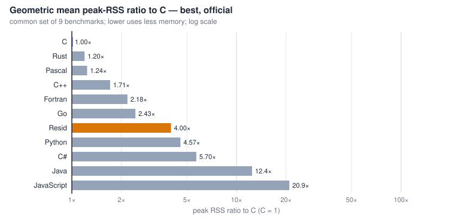

### best — small

**Geometric mean of wall time ratio to C.** Common set (10 benchmark(s)): `nbody`, `fannkuch-redux`, `spectral-norm`, `mandelbrot`, `binary-trees`, `fasta`, `k-nucleotide`, `reverse-complement`, `pidigits`, `regex-redux`.

| # | Language | geomean (common set) | geomean (own set) | completed |
| ---: | --- | ---: | ---: | ---: |
| 1 | Rust | 0.67 | 0.67 | 10/10 |
| 2 | C++ | 0.79 | 0.79 | 10/10 |
| 3 | Resid | 0.86 | 0.86 | 10/10 |
| 4 | C | 1.00 | 1.00 | 10/10 |
| 5 | Fortran | 1.24 | 1.24 | 10/10 |
| 6 | Go | 1.75 | 1.75 | 10/10 |
| 7 | Pascal | 2.56 | 2.56 | 10/10 |
| 8 | C# | 2.61 | 2.61 | 10/10 |
| 9 | Java | 3.39 | 3.39 | 10/10 |
| 10 | JavaScript | 6.22 | 6.22 | 10/10 |
| 11 | Python | 19.6 | 19.6 | 10/10 |

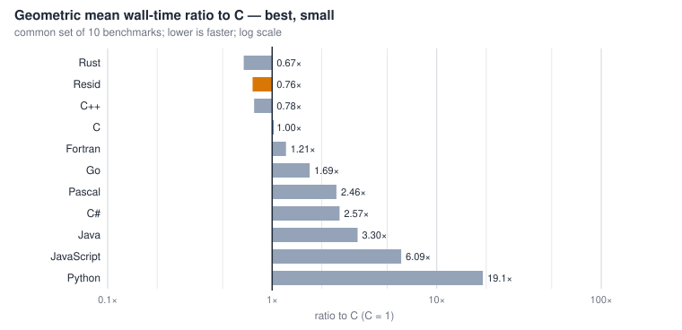

**Geometric mean of CPU time ratio to C.** Common set (10 benchmark(s)): `nbody`, `fannkuch-redux`, `spectral-norm`, `mandelbrot`, `binary-trees`, `fasta`, `k-nucleotide`, `reverse-complement`, `pidigits`, `regex-redux`.

| # | Language | geomean (common set) | geomean (own set) | completed |
| ---: | --- | ---: | ---: | ---: |
| 1 | Rust | 0.79 | 0.79 | 10/10 |
| 2 | C++ | 0.91 | 0.91 | 10/10 |
| 3 | C | 1.00 | 1.00 | 10/10 |
| 4 | Resid | 1.07 | 1.07 | 10/10 |
| 5 | Fortran | 1.17 | 1.17 | 10/10 |
| 6 | Pascal | 1.53 | 1.53 | 10/10 |
| 7 | Go | 1.76 | 1.76 | 10/10 |
| 8 | C# | 1.96 | 1.96 | 10/10 |
| 9 | Java | 4.39 | 4.39 | 10/10 |
| 10 | JavaScript | 5.34 | 5.34 | 10/10 |
| 11 | Python | 22.1 | 22.1 | 10/10 |

**Geometric mean of peak RSS ratio to C.** Common set (10 benchmark(s)): `nbody`, `fannkuch-redux`, `spectral-norm`, `mandelbrot`, `binary-trees`, `fasta`, `k-nucleotide`, `reverse-complement`, `pidigits`, `regex-redux`.

| # | Language | geomean (common set) | geomean (own set) | completed |
| ---: | --- | ---: | ---: | ---: |
| 1 | C | 1.00 | 1.00 | 10/10 |
| 2 | Rust | 1.18 | 1.18 | 10/10 |
| 3 | Pascal | 1.19 | 1.19 | 10/10 |
| 4 | Resid | 1.88 | 1.88 | 10/10 |
| 5 | C++ | 1.92 | 1.92 | 10/10 |
| 6 | Fortran | 1.96 | 1.96 | 10/10 |
| 7 | Go | 3.00 | 3.00 | 10/10 |
| 8 | Python | 4.61 | 4.61 | 10/10 |
| 9 | C# | 7.85 | 7.85 | 10/10 |
| 10 | Java | 13.8 | 13.8 | 10/10 |
| 11 | JavaScript | 30.6 | 30.6 | 10/10 |

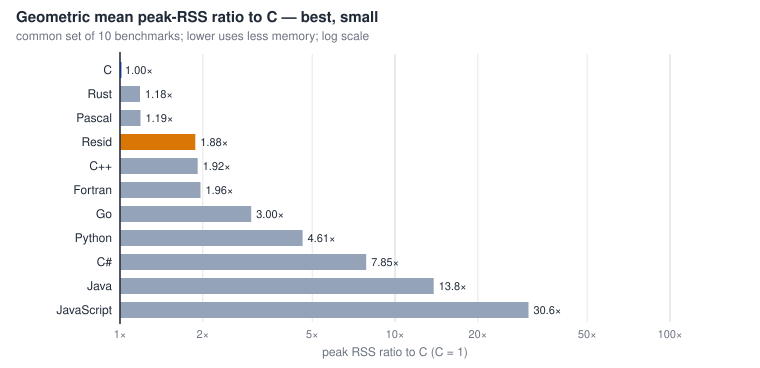

## Matrices

Rows are languages, columns benchmarks. `—` = no completed result (see [Coverage](#coverage)).

### st — official

**Wall-time ratio to C** (median / C median)

| Language | `nbody` | `fannkuch-redux` | `spectral-norm` | `mandelbrot` | `binary-trees` | `fasta` | `k-nucleotide` | `reverse-complement` | `pidigits` | `regex-redux` |
| --- | ---: | ---: | ---: | ---: | ---: | ---: | ---: | ---: | ---: | ---: |
| Resid | 0.77 | 0.58 | 1.50 | 1.02 | 0.32 | 0.96 | 1.14 | 1.96 | 1.09 | 1.48 |
| C | 1.00 | 1.00 | 1.00 | 1.00 | 1.00 | 1.00 | 1.00 | 1.00 | 1.00 | 1.00 |
| C++ | 0.99 | 1.00 | 0.99 | 1.00 | 1.23 | 0.98 | 1.16 | 2.16 | 1.00 | 12.5 |
| Rust | 0.71 | 1.02 | 1.29 | 1.05 | 1.55 | 0.91 | 2.60 | 1.16 | 1.05 | 0.36 |
| Go | 1.03 | 0.92 | 1.30 | 1.03 | 1.83 | 0.96 | 5.23 | 1.12 | 2.06 | 10.5 |
| Java | 1.05 | 0.90 | 1.35 | 1.04 | 0.24 | 1.18 | 10.8 | 2.78 | 4.47 | 4.05 |
| C# | 1.02 | 1.00 | 1.32 | 1.02 | 1.40 | 1.05 | 4.19 | 1.87 | 6.17 | 1.29 |
| JavaScript | 1.13 | 0.97 | 1.40 | 1.00 | 1.38 | 1.32 | 11.7 | 2.87 | 12.0 | 1.09 |
| Python | 76.1 | 15.6 | 131 | 43.7 | 41.4 | 8.87 | 18.3 | 5.65 | 4.61 | 3.86 |
| Fortran | 0.94 | 0.99 | 1.00 | 1.00 | 1.06 | 1.04 | 0.83 | 1.65 | 1.00 | 1.03 |
| Pascal | 1.26 | 1.88 | 1.29 | 2.40 | 1.15 | 1.26 | 3.60 | 3.03 | 1.00 | 11.3 |

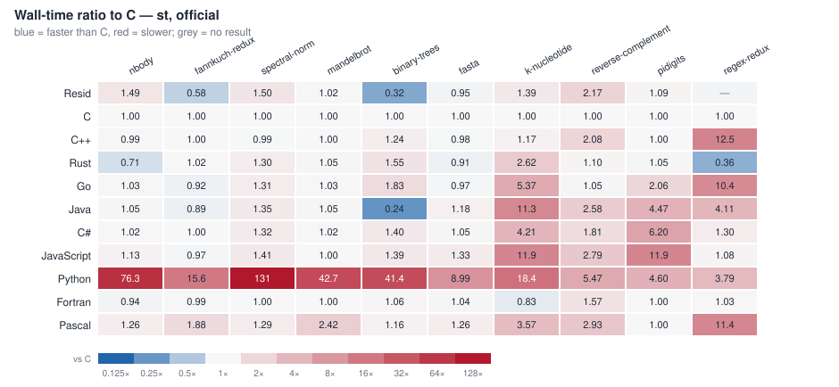

**CPU-time ratio to C** (user + sys)

| Language | `nbody` | `fannkuch-redux` | `spectral-norm` | `mandelbrot` | `binary-trees` | `fasta` | `k-nucleotide` | `reverse-complement` | `pidigits` | `regex-redux` |
| --- | ---: | ---: | ---: | ---: | ---: | ---: | ---: | ---: | ---: | ---: |
| Resid | 0.77 | 0.58 | 1.50 | 1.02 | 0.32 | 0.96 | 1.14 | 1.96 | 1.09 | 1.48 |
| C | 1.00 | 1.00 | 1.00 | 1.00 | 1.00 | 1.00 | 1.00 | 1.00 | 1.00 | 1.00 |
| C++ | 0.99 | 1.00 | 0.99 | 1.00 | 1.23 | 0.98 | 1.16 | 2.17 | 1.00 | 12.5 |
| Rust | 0.71 | 1.02 | 1.29 | 1.05 | 1.55 | 0.91 | 2.60 | 1.16 | 1.05 | 0.36 |
| Go | 1.03 | 0.92 | 1.30 | 1.03 | 1.83 | 0.96 | 5.22 | 1.12 | 2.06 | 10.5 |
| Java | 1.05 | 0.90 | 1.35 | 1.05 | 0.24 | 1.18 | 10.8 | 2.78 | 4.47 | 4.06 |
| C# | 1.02 | 1.00 | 1.31 | 1.02 | 1.40 | 1.05 | 4.18 | 1.88 | 6.16 | 1.29 |
| JavaScript | 1.13 | 0.97 | 1.40 | 1.00 | 1.38 | 1.32 | 11.7 | 2.87 | 11.9 | 1.09 |
| Python | 76.1 | 15.6 | 131 | 43.8 | 41.4 | 8.87 | 18.3 | 5.65 | 4.61 | 3.86 |
| Fortran | 0.94 | 0.99 | 1.00 | 1.00 | 1.06 | 1.04 | 0.83 | 1.65 | 1.00 | 1.03 |
| Pascal | 1.26 | 1.88 | 1.29 | 2.40 | 1.15 | 1.26 | 3.60 | 3.03 | 1.00 | 11.3 |

**Peak-memory ratio to C** (peak RSS)

| Language | `nbody` | `fannkuch-redux` | `spectral-norm` | `mandelbrot` | `binary-trees` | `fasta` | `k-nucleotide` | `reverse-complement` | `pidigits` | `regex-redux` |
| --- | ---: | ---: | ---: | ---: | ---: | ---: | ---: | ---: | ---: | ---: |
| Resid | 0.30 | 0.35 | 1.30 | 0.35 | 1.00 | 0.63 | 1.97 | 1.00 | 0.96 | 2.10 |
| C | 1.00 | 1.00 | 1.00 | 1.00 | 1.00 | 1.00 | 1.00 | 1.00 | 1.00 | 1.00 |
| C++ | 1.83 | 2.20 | 1.80 | 18.0 | 1.01 | 2.26 | 0.97 | 1.01 | 1.73 | 1.28 |
| Rust | 1.01 | 1.24 | 1.04 | 17.1 | 1.00 | 1.33 | 1.01 | 1.00 | 1.14 | 1.00 |
| Go | 1.53 | 1.83 | 2.30 | 1.83 | 1.06 | 1.90 | 2.53 | 1.60 | 3.67 | 1.81 |
| Java | 20.2 | 23.3 | 18.8 | 23.5 | 2.28 | 25.6 | 6.19 | 3.05 | 20.1 | 6.23 |
| C# | 12.0 | 14.4 | 10.4 | 16.3 | 2.13 | 16.0 | 5.67 | 2.02 | 14.4 | 5.13 |
| JavaScript | 26.6 | 29.8 | 25.0 | 47.3 | 5.73 | 32.7 | 5.30 | 1.36 | 42.9 | 4.17 |
| Python | 4.54 | 5.23 | 4.48 | 21.2 | 1.53 | 5.87 | 3.69 | 1.72 | 3.75 | 2.44 |
| Fortran | 1.37 | 1.58 | 1.36 | 17.5 | 1.00 | 1.63 | 2.75 | 1.01 | 1.38 | 0.68 |
| Pascal | 0.28 | 0.35 | 0.28 | 16.2 | 0.99 | 0.38 | 1.04 | 1.03 | 1.12 | 1.62 |

**Median wall time (s)**

| Language | `nbody` | `fannkuch-redux` | `spectral-norm` | `mandelbrot` | `binary-trees` | `fasta` | `k-nucleotide` | `reverse-complement` | `pidigits` | `regex-redux` |
| --- | ---: | ---: | ---: | ---: | ---: | ---: | ---: | ---: | ---: | ---: |
| Resid | 1.451 | 15.13 | 1.169 | 11.16 | 2.156 | 2.335 | 4.755 | 0.388 | 0.433 | 2.372 |
| C | 1.878 | 26.25 | 0.781 | 10.99 | 6.671 | 2.427 | 4.181 | 0.198 | 0.398 | 1.602 |
| C++ | 1.860 | 26.37 | 0.777 | 10.95 | 8.232 | 2.376 | 4.839 | 0.428 | 0.399 | 20.07 |
| Rust | 1.332 | 26.87 | 1.011 | 11.48 | 10.31 | 2.205 | 10.87 | 0.229 | 0.416 | 0.577 |
| Go | 1.943 | 24.23 | 1.019 | 11.27 | 12.20 | 2.336 | 21.85 | 0.221 | 0.820 | 16.77 |
| Java | 1.968 | 23.66 | 1.053 | 11.48 | 1.601 | 2.861 | 45.13 | 0.549 | 1.779 | 6.494 |
| C# | 1.921 | 26.30 | 1.028 | 11.17 | 9.354 | 2.548 | 17.50 | 0.371 | 2.453 | 2.074 |
| JavaScript | 2.122 | 25.58 | 1.094 | 10.99 | 9.233 | 3.213 | 48.97 | 0.567 | 4.757 | 1.752 |
| Python | 142.9 | 410.5 | 102.7 | 480.3 | 276.2 | 21.51 | 76.38 | 1.117 | 1.833 | 6.184 |
| Fortran | 1.766 | 26.00 | 0.779 | 10.99 | 7.087 | 2.521 | 3.482 | 0.326 | 0.398 | 1.656 |
| Pascal | 2.366 | 49.29 | 1.008 | 26.36 | 7.702 | 3.068 | 15.06 | 0.600 | 0.398 | 18.07 |

### st — small

**Wall-time ratio to C** (median / C median)

| Language | `nbody` | `fannkuch-redux` | `spectral-norm` | `mandelbrot` | `binary-trees` | `fasta` | `k-nucleotide` | `reverse-complement` | `pidigits` | `regex-redux` |
| --- | ---: | ---: | ---: | ---: | ---: | ---: | ---: | ---: | ---: | ---: |
| Resid | 0.77 | 0.59 | 1.53 | 1.02 | 0.35 | 0.97 | 1.13 | 1.72 | 1.35 | 1.46 |
| C | 1.00 | 1.00 | 1.00 | 1.00 | 1.00 | 1.00 | 1.00 | 1.00 | 1.00 | 1.00 |
| C++ | 0.99 | 1.03 | 1.01 | 0.99 | 1.18 | 0.99 | 1.15 | 1.91 | 1.02 | 12.1 |
| Rust | 0.71 | 1.06 | 1.31 | 1.04 | 1.41 | 0.92 | 2.53 | 1.07 | 1.05 | 0.37 |
| Go | 1.04 | 0.96 | 1.34 | 1.02 | 1.66 | 0.98 | 5.37 | 0.94 | 2.23 | 10.5 |
| Java | 1.24 | 1.18 | 3.44 | 1.06 | 0.44 | 1.28 | 11.1 | 4.38 | 16.2 | 5.60 |
| C# | 1.11 | 1.11 | 1.87 | 1.04 | 1.15 | 1.13 | 4.56 | 2.48 | 7.86 | 1.56 |
| JavaScript | 1.26 | 1.13 | 2.38 | 1.03 | 0.87 | 1.43 | 11.3 | 3.75 | 10.5 | 1.03 |
| Python | 75.6 | 15.7 | 130 | 42.1 | 10.8 | 8.89 | 16.9 | 5.43 | 4.98 | 3.81 |
| Fortran | 0.94 | 1.01 | 1.01 | 0.99 | 1.07 | 1.04 | 0.83 | 1.63 | 1.01 | 1.02 |
| Pascal | 1.26 | 1.82 | 1.30 | 2.42 | 1.08 | 1.27 | 3.54 | 2.82 | 1.01 | 7.47 |

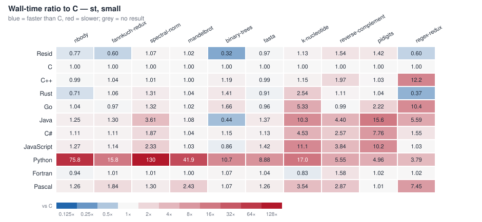

**CPU-time ratio to C** (user + sys)

| Language | `nbody` | `fannkuch-redux` | `spectral-norm` | `mandelbrot` | `binary-trees` | `fasta` | `k-nucleotide` | `reverse-complement` | `pidigits` | `regex-redux` |
| --- | ---: | ---: | ---: | ---: | ---: | ---: | ---: | ---: | ---: | ---: |
| Resid | 0.77 | 0.59 | 1.53 | 1.02 | 0.35 | 0.97 | 1.13 | 1.72 | 1.35 | 1.46 |
| C | 1.00 | 1.00 | 1.00 | 1.00 | 1.00 | 1.00 | 1.00 | 1.00 | 1.00 | 1.00 |
| C++ | 0.99 | 1.03 | 1.01 | 1.00 | 1.19 | 0.99 | 1.15 | 1.92 | 1.02 | 12.1 |
| Rust | 0.71 | 1.06 | 1.31 | 1.04 | 1.41 | 0.92 | 2.53 | 1.07 | 1.05 | 0.37 |
| Go | 1.04 | 0.96 | 1.34 | 1.02 | 1.66 | 0.98 | 5.37 | 0.94 | 2.23 | 10.5 |
| Java | 1.24 | 1.18 | 3.44 | 1.06 | 0.44 | 1.28 | 11.1 | 4.39 | 16.2 | 5.59 |
| C# | 1.11 | 1.11 | 1.87 | 1.04 | 1.14 | 1.13 | 4.55 | 2.48 | 7.88 | 1.56 |
| JavaScript | 1.26 | 1.13 | 2.37 | 1.03 | 0.87 | 1.42 | 11.3 | 3.76 | 10.6 | 1.03 |
| Python | 75.6 | 15.8 | 130 | 42.1 | 10.9 | 8.89 | 16.9 | 5.45 | 4.99 | 3.81 |
| Fortran | 0.94 | 1.01 | 1.01 | 0.99 | 1.07 | 1.04 | 0.83 | 1.64 | 1.01 | 1.02 |
| Pascal | 1.26 | 1.82 | 1.31 | 2.42 | 1.08 | 1.27 | 3.54 | 2.84 | 1.01 | 7.47 |

**Peak-memory ratio to C** (peak RSS)

| Language | `nbody` | `fannkuch-redux` | `spectral-norm` | `mandelbrot` | `binary-trees` | `fasta` | `k-nucleotide` | `reverse-complement` | `pidigits` | `regex-redux` |
| --- | ---: | ---: | ---: | ---: | ---: | ---: | ---: | ---: | ---: | ---: |
| Resid | 0.29 | 0.35 | 0.28 | 0.36 | 1.41 | 0.63 | 1.72 | 0.95 | 0.26 | 1.76 |
| C | 1.00 | 1.00 | 1.00 | 1.00 | 1.00 | 1.00 | 1.00 | 1.00 | 1.00 | 1.00 |
| C++ | 1.82 | 2.19 | 1.73 | 3.09 | 1.23 | 2.26 | 0.88 | 1.52 | 1.94 | 1.44 |
| Rust | 1.05 | 1.24 | 1.00 | 2.17 | 1.03 | 1.30 | 1.09 | 1.02 | 1.16 | 1.21 |
| Go | 1.53 | 1.83 | 1.45 | 1.83 | 1.89 | 1.90 | 2.32 | 1.55 | 4.17 | 1.73 |
| Java | 20.1 | 23.4 | 18.7 | 23.6 | 6.85 | 25.3 | 6.79 | 3.93 | 20.2 | 7.09 |
| C# | 12.0 | 14.3 | 10.3 | 16.1 | 5.41 | 15.8 | 4.58 | 2.05 | 14.1 | 5.02 |
| JavaScript | 26.7 | 29.7 | 24.5 | 32.1 | 10.6 | 32.6 | 7.57 | 2.33 | 26.2 | 7.91 |
| Python | 4.55 | 5.23 | 4.25 | 6.33 | 2.23 | 5.88 | 2.25 | 1.97 | 4.17 | 2.51 |
| Fortran | 1.37 | 1.63 | 1.30 | 2.56 | 1.10 | 1.62 | 1.52 | 1.02 | 1.49 | 1.08 |
| Pascal | 0.29 | 0.35 | 0.28 | 1.26 | 0.83 | 0.37 | 1.05 | 1.10 | 1.18 | 1.26 |

**Median wall time (s)**

| Language | `nbody` | `fannkuch-redux` | `spectral-norm` | `mandelbrot` | `binary-trees` | `fasta` | `k-nucleotide` | `reverse-complement` | `pidigits` | `regex-redux` |
| --- | ---: | ---: | ---: | ---: | ---: | ---: | ---: | ---: | ---: | ---: |
| Resid | 0.146 | 0.096 | 0.040 | 0.714 | 0.055 | 0.235 | 0.492 | 0.039 | 0.019 | 0.241 |
| C | 0.189 | 0.162 | 0.026 | 0.702 | 0.155 | 0.243 | 0.435 | 0.023 | 0.014 | 0.166 |
| C++ | 0.188 | 0.167 | 0.026 | 0.698 | 0.184 | 0.240 | 0.502 | 0.043 | 0.015 | 2.005 |
| Rust | 0.135 | 0.171 | 0.034 | 0.732 | 0.219 | 0.223 | 1.099 | 0.024 | 0.015 | 0.062 |
| Go | 0.197 | 0.155 | 0.035 | 0.717 | 0.259 | 0.238 | 2.338 | 0.021 | 0.032 | 1.733 |
| Java | 0.236 | 0.190 | 0.089 | 0.742 | 0.069 | 0.313 | 4.839 | 0.099 | 0.232 | 0.927 |
| C# | 0.210 | 0.180 | 0.049 | 0.727 | 0.179 | 0.275 | 1.983 | 0.056 | 0.112 | 0.259 |
| JavaScript | 0.239 | 0.182 | 0.062 | 0.721 | 0.136 | 0.347 | 4.920 | 0.085 | 0.151 | 0.171 |
| Python | 14.30 | 2.544 | 3.369 | 29.55 | 1.686 | 2.164 | 7.362 | 0.123 | 0.071 | 0.632 |
| Fortran | 0.178 | 0.163 | 0.026 | 0.697 | 0.166 | 0.254 | 0.361 | 0.037 | 0.014 | 0.170 |
| Pascal | 0.238 | 0.293 | 0.034 | 1.698 | 0.167 | 0.308 | 1.540 | 0.064 | 0.014 | 1.237 |

### best — official

**Wall-time ratio to C** (median / C median)

| Language | `nbody` | `fannkuch-redux` | `spectral-norm` | `mandelbrot` | `binary-trees` | `fasta` | `k-nucleotide` | `reverse-complement` | `pidigits` | `regex-redux` |
| --- | ---: | ---: | ---: | ---: | ---: | ---: | ---: | ---: | ---: | ---: |
| Resid | 1.07 | 0.46 | 0.63 | 0.80 | 0.17 | 0.28 | 1.29 | 2.43 | 1.25 | 3.41 |
| C | 1.00 | 1.00 | 1.00 | 1.00 | 1.00 | 1.00 | 1.00 | 1.00 | 1.00 | 1.00 |
| C++ | 0.96 | 0.60 | 1.07 | 0.71 | 0.12 | 1.08 | 0.58 | 1.15 | 1.09 | 1.04 |
| Rust | 0.99 | 0.45 | 0.89 | 0.76 | 0.09 | 0.94 | 0.51 | 1.05 | 1.02 | 1.04 |
| Go | 1.81 | 2.33 | 3.03 | 2.38 | 0.76 | 1.13 | 1.05 | 1.38 | 1.14 | 2.37 |
| Java | 1.96 | 1.14 | 3.24 | 3.18 | 0.36 | 1.38 | 1.04 | 3.09 | 1.15 | 1.63 |
| C# | 1.51 | 0.81 | 3.17 | 1.44 | 1.08 | 1.06 | 1.29 | 1.12 | 1.14 | 1.34 |
| JavaScript | 2.06 | 1.15 | 3.79 | 3.15 | 0.90 | 1.97 | 6.15 | 21.3 | 12.8 | 4.24 |
| Python | 144 | 29.7 | 381 | 210 | 3.22 | 21.6 | 10.9 | 4.04 | 1.52 | 1.49 |
| Fortran | 1.71 | 1.22 | 1.00 | 2.46 | 0.11 | 1.28 | 2.92 | 2.83 | 1.08 | 1.03 |
| Pascal | 1.90 | 1.81 | 2.03 | 3.48 | 0.13 | 4.51 | 9.44 | 3.65 | 1.09 | 5.92 |

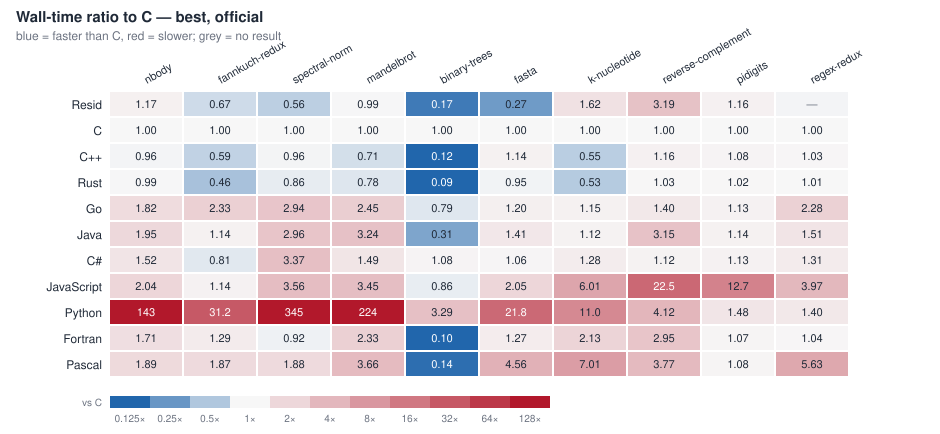

**CPU-time ratio to C** (user + sys)

| Language | `nbody` | `fannkuch-redux` | `spectral-norm` | `mandelbrot` | `binary-trees` | `fasta` | `k-nucleotide` | `reverse-complement` | `pidigits` | `regex-redux` |
| --- | ---: | ---: | ---: | ---: | ---: | ---: | ---: | ---: | ---: | ---: |
| Resid | 1.07 | 1.80 | 0.47 | 0.51 | 0.17 | 1.98 | 1.82 | 11.6 | 1.25 | 1.38 |
| C | 1.00 | 1.00 | 1.00 | 1.00 | 1.00 | 1.00 | 1.00 | 1.00 | 1.00 | 1.00 |
| C++ | 0.96 | 1.61 | 1.06 | 0.67 | 0.24 | 4.42 | 0.52 | 0.86 | 1.09 | 0.92 |
| Rust | 0.99 | 1.71 | 0.87 | 0.79 | 0.19 | 1.87 | 0.65 | 1.67 | 1.02 | 0.89 |
| Go | 1.81 | 2.35 | 0.74 | 2.52 | 1.43 | 4.24 | 3.98 | 3.08 | 1.14 | 1.20 |
| Java | 1.98 | 4.32 | 2.50 | 3.32 | 0.39 | 5.06 | 2.90 | 2.99 | 1.21 | 1.12 |
| C# | 1.51 | 0.81 | 2.75 | 1.40 | 0.85 | 1.08 | 1.45 | 1.77 | 1.15 | 0.98 |
| JavaScript | 2.06 | 4.49 | 2.58 | 3.14 | 0.62 | 6.36 | 5.84 | 16.9 | 12.9 | 0.88 |
| Python | 144 | 106 | 94.2 | 228 | 5.62 | 43.7 | 47.6 | 4.32 | 1.52 | 1.03 |
| Fortran | 1.71 | 4.83 | 1.00 | 0.84 | 0.09 | 1.27 | 1.29 | 2.13 | 1.08 | 1.01 |
| Pascal | 1.90 | 4.69 | 1.98 | 3.38 | 0.10 | 4.51 | 5.62 | 2.75 | 1.09 | 1.10 |

**Peak-memory ratio to C** (peak RSS)

| Language | `nbody` | `fannkuch-redux` | `spectral-norm` | `mandelbrot` | `binary-trees` | `fasta` | `k-nucleotide` | `reverse-complement` | `pidigits` | `regex-redux` |
| --- | ---: | ---: | ---: | ---: | ---: | ---: | ---: | ---: | ---: | ---: |
| Resid | 0.37 | 1.73 | 6.25 | 15.6 | 1.93 | 139 | 2.09 | 7.39 | 0.90 | 2.15 |
| C | 1.00 | 1.00 | 1.00 | 1.00 | 1.00 | 1.00 | 1.00 | 1.00 | 1.00 | 1.00 |
| C++ | 2.34 | 2.37 | 2.03 | 1.06 | 1.70 | 2.97 | 1.20 | 0.96 | 1.65 | 1.79 |
| Rust | 1.29 | 1.37 | 1.19 | 1.01 | 1.49 | 1.67 | 1.04 | 0.94 | 1.06 | 0.96 |
| Go | 3.13 | 3.00 | 3.37 | 1.47 | 1.70 | 10.1 | 1.37 | 1.23 | 2.92 | 2.02 |
| Java | 26.3 | 27.3 | 21.6 | 2.94 | 15.8 | 31.6 | 4.04 | 4.08 | 15.8 | 2.48 |
| C# | 15.7 | 15.2 | 13.7 | 1.97 | 3.12 | 16.4 | 1.48 | 1.18 | 9.65 | 2.57 |
| JavaScript | 34.2 | 152 | 142 | 10.4 | 3.40 | 102 | 3.51 | 1.75 | 43.3 | 8.00 |
| Python | 6.08 | 9.50 | 8.46 | 0.55 | 0.80 | 120 | 2.00 | 2.87 | 5.44 | 1.10 |
| Fortran | 1.77 | 5.46 | 1.59 | 1.03 | 0.38 | 1.67 | 40.6 | 1.85 | 1.32 | 1.11 |
| Pascal | 0.38 | 1.26 | 1.26 | 1.00 | 0.38 | 0.37 | 83.5 | 0.98 | 0.98 | 0.67 |

**Median wall time (s)**

| Language | `nbody` | `fannkuch-redux` | `spectral-norm` | `mandelbrot` | `binary-trees` | `fasta` | `k-nucleotide` | `reverse-complement` | `pidigits` | `regex-redux` |
| --- | ---: | ---: | ---: | ---: | ---: | ---: | ---: | ---: | ---: | ---: |
| Resid | 1.079 | 0.963 | 0.055 | 0.195 | 0.460 | 0.148 | 1.311 | 0.220 | 0.460 | 1.313 |
| C | 1.005 | 2.110 | 0.086 | 0.244 | 2.635 | 0.528 | 1.018 | 0.090 | 0.368 | 0.385 |
| C++ | 0.965 | 1.256 | 0.092 | 0.174 | 0.313 | 0.572 | 0.586 | 0.104 | 0.401 | 0.401 |
| Rust | 0.993 | 0.949 | 0.077 | 0.186 | 0.249 | 0.498 | 0.515 | 0.095 | 0.374 | 0.399 |
| Go | 1.822 | 4.923 | 0.261 | 0.579 | 2.012 | 0.595 | 1.071 | 0.125 | 0.419 | 0.913 |
| Java | 1.969 | 2.396 | 0.280 | 0.775 | 0.959 | 0.727 | 1.060 | 0.279 | 0.424 | 0.625 |
| C# | 1.522 | 1.708 | 0.273 | 0.352 | 2.837 | 0.558 | 1.311 | 0.101 | 0.420 | 0.516 |
| JavaScript | 2.069 | 2.427 | 0.327 | 0.767 | 2.380 | 1.040 | 6.258 | 1.925 | 4.721 | 1.631 |
| Python | 145.2 | 62.64 | 32.86 | 51.18 | 8.492 | 11.42 | 11.09 | 0.364 | 0.558 | 0.572 |
| Fortran | 1.721 | 2.583 | 0.086 | 0.599 | 0.283 | 0.674 | 2.975 | 0.255 | 0.399 | 0.397 |
| Pascal | 1.909 | 3.810 | 0.175 | 0.849 | 0.348 | 2.382 | 9.610 | 0.329 | 0.400 | 2.279 |

### best — small

**Wall-time ratio to C** (median / C median)

| Language | `nbody` | `fannkuch-redux` | `spectral-norm` | `mandelbrot` | `binary-trees` | `fasta` | `k-nucleotide` | `reverse-complement` | `pidigits` | `regex-redux` |
| --- | ---: | ---: | ---: | ---: | ---: | ---: | ---: | ---: | ---: | ---: |
| Resid | 1.04 | 0.46 | 1.15 | 0.71 | 0.17 | 0.28 | 1.24 | 2.02 | 1.59 | 3.08 |
| C | 1.00 | 1.00 | 1.00 | 1.00 | 1.00 | 1.00 | 1.00 | 1.00 | 1.00 | 1.00 |
| C++ | 0.93 | 0.60 | 1.22 | 0.76 | 0.13 | 1.14 | 1.04 | 1.05 | 1.18 | 0.98 |
| Rust | 1.00 | 0.42 | 1.04 | 0.78 | 0.10 | 1.03 | 0.53 | 0.95 | 1.08 | 1.00 |
| Go | 1.75 | 3.06 | 3.68 | 2.44 | 0.79 | 1.25 | 1.26 | 1.36 | 1.50 | 2.16 |
| Java | 2.11 | 6.55 | 28.8 | 5.29 | 0.69 | 2.15 | 1.97 | 4.94 | 2.25 | 2.90 |
| C# | 1.64 | 1.68 | 15.2 | 5.34 | 1.55 | 1.39 | 2.24 | 3.13 | 2.32 | 1.86 |
| JavaScript | 2.16 | 6.54 | 30.4 | 8.49 | 1.37 | 3.15 | 6.37 | 21.4 | 10.9 | 3.73 |
| Python | 136 | 24.1 | 313 | 181 | 2.78 | 22.9 | 9.62 | 7.07 | 4.94 | 2.17 |
| Fortran | 1.64 | 1.53 | 1.02 | 2.65 | 0.13 | 1.29 | 2.25 | 2.69 | 1.15 | 1.09 |
| Pascal | 1.84 | 1.62 | 1.82 | 2.84 | 1.43 | 4.47 | 6.72 | 3.11 | 1.11 | 5.34 |

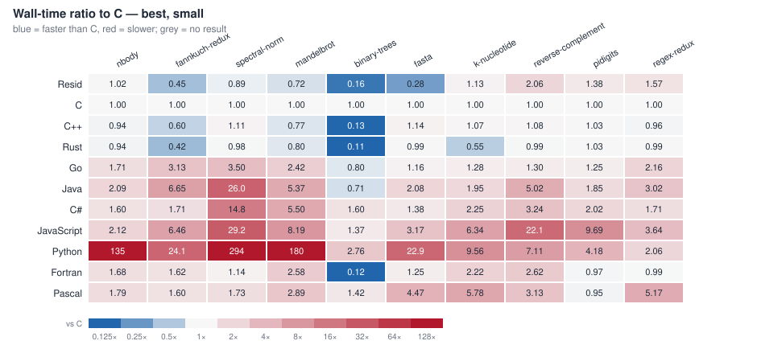

**CPU-time ratio to C** (user + sys)

| Language | `nbody` | `fannkuch-redux` | `spectral-norm` | `mandelbrot` | `binary-trees` | `fasta` | `k-nucleotide` | `reverse-complement` | `pidigits` | `regex-redux` |
| --- | ---: | ---: | ---: | ---: | ---: | ---: | ---: | ---: | ---: | ---: |
| Resid | 1.04 | 1.55 | 0.65 | 0.47 | 0.17 | 1.86 | 1.46 | 6.84 | 1.60 | 0.82 |
| C | 1.00 | 1.00 | 1.00 | 1.00 | 1.00 | 1.00 | 1.00 | 1.00 | 1.00 | 1.00 |
| C++ | 0.93 | 2.19 | 1.10 | 0.72 | 0.24 | 4.59 | 0.57 | 0.59 | 1.18 | 0.58 |
| Rust | 1.00 | 1.43 | 0.93 | 0.73 | 0.18 | 2.01 | 0.51 | 0.89 | 1.08 | 0.56 |
| Go | 1.76 | 1.93 | 0.77 | 2.36 | 1.27 | 4.18 | 3.28 | 2.31 | 1.53 | 0.74 |
| Java | 2.30 | 22.8 | 20.5 | 4.36 | 0.71 | 9.38 | 4.41 | 4.51 | 3.16 | 1.36 |
| C# | 1.65 | 1.07 | 8.56 | 3.88 | 0.93 | 1.41 | 2.13 | 2.91 | 2.43 | 0.73 |
| JavaScript | 2.22 | 16.1 | 15.7 | 5.93 | 1.12 | 11.1 | 5.09 | 13.4 | 11.4 | 0.58 |
| Python | 137 | 78.1 | 83.8 | 186 | 5.22 | 47.1 | 34.0 | 5.02 | 4.97 | 0.79 |
| Fortran | 1.65 | 3.50 | 0.94 | 1.16 | 0.27 | 1.29 | 1.16 | 1.51 | 1.16 | 1.03 |
| Pascal | 1.84 | 3.38 | 1.69 | 2.84 | 0.11 | 4.47 | 3.71 | 1.74 | 1.11 | 0.67 |

**Peak-memory ratio to C** (peak RSS)

| Language | `nbody` | `fannkuch-redux` | `spectral-norm` | `mandelbrot` | `binary-trees` | `fasta` | `k-nucleotide` | `reverse-complement` | `pidigits` | `regex-redux` |
| --- | ---: | ---: | ---: | ---: | ---: | ---: | ---: | ---: | ---: | ---: |
| Resid | 0.38 | 1.37 | 0.82 | 11.0 | 1.52 | 13.8 | 2.40 | 4.50 | 0.26 | 2.00 |
| C | 1.00 | 1.00 | 1.00 | 1.00 | 1.00 | 1.00 | 1.00 | 1.00 | 1.00 | 1.00 |
| C++ | 2.33 | 2.25 | 2.01 | 1.64 | 2.37 | 2.84 | 2.30 | 0.78 | 1.89 | 1.71 |
| Rust | 1.30 | 1.25 | 1.11 | 1.15 | 1.79 | 1.57 | 1.24 | 0.75 | 1.10 | 0.89 |
| Go | 3.13 | 2.82 | 2.51 | 6.03 | 1.89 | 7.34 | 2.27 | 2.08 | 3.22 | 2.10 |
| Java | 26.3 | 25.5 | 20.8 | 14.3 | 18.2 | 28.4 | 6.44 | 4.41 | 16.8 | 5.17 |
| C# | 15.7 | 13.2 | 12.4 | 8.99 | 6.09 | 14.1 | 3.85 | 2.72 | 10.7 | 4.03 |
| JavaScript | 34.2 | 141 | 137 | 96.5 | 12.9 | 76.8 | 10.1 | 4.32 | 26.3 | 9.84 |
| Python | 6.09 | 8.95 | 7.97 | 5.50 | 1.69 | 18.2 | 2.64 | 2.24 | 6.04 | 1.67 |
| Fortran | 1.77 | 1.80 | 1.61 | 1.66 | 0.53 | 1.58 | 51.1 | 1.31 | 1.46 | 1.22 |
| Pascal | 0.36 | 1.25 | 1.20 | 1.06 | 0.47 | 0.35 | 119 | 0.81 | 0.93 | 0.63 |

**Median wall time (s)**

| Language | `nbody` | `fannkuch-redux` | `spectral-norm` | `mandelbrot` | `binary-trees` | `fasta` | `k-nucleotide` | `reverse-complement` | `pidigits` | `regex-redux` |
| --- | ---: | ---: | ---: | ---: | ---: | ---: | ---: | ---: | ---: | ---: |
| Resid | 0.110 | 0.008 | 0.004 | 0.011 | 0.013 | 0.015 | 0.142 | 0.021 | 0.021 | 0.137 |
| C | 0.106 | 0.017 | 0.003 | 0.016 | 0.076 | 0.054 | 0.115 | 0.010 | 0.013 | 0.045 |
| C++ | 0.098 | 0.010 | 0.004 | 0.012 | 0.010 | 0.061 | 0.120 | 0.011 | 0.016 | 0.044 |
| Rust | 0.106 | 0.007 | 0.004 | 0.013 | 0.008 | 0.055 | 0.061 | 0.010 | 0.014 | 0.044 |
| Go | 0.186 | 0.051 | 0.013 | 0.039 | 0.061 | 0.067 | 0.144 | 0.014 | 0.020 | 0.096 |
| Java | 0.223 | 0.110 | 0.101 | 0.085 | 0.053 | 0.116 | 0.226 | 0.051 | 0.030 | 0.129 |
| C# | 0.174 | 0.028 | 0.053 | 0.086 | 0.118 | 0.074 | 0.258 | 0.032 | 0.031 | 0.083 |
| JavaScript | 0.229 | 0.110 | 0.106 | 0.137 | 0.104 | 0.169 | 0.732 | 0.222 | 0.146 | 0.166 |
| Python | 14.45 | 0.404 | 1.093 | 2.908 | 0.212 | 1.230 | 1.105 | 0.073 | 0.066 | 0.097 |
| Fortran | 0.174 | 0.026 | 0.004 | 0.043 | 0.010 | 0.069 | 0.259 | 0.028 | 0.015 | 0.048 |
| Pascal | 0.195 | 0.027 | 0.006 | 0.046 | 0.109 | 0.240 | 0.772 | 0.032 | 0.015 | 0.238 |

### st — source and build

**Gzipped source size (bytes)**

| Language | `nbody` | `fannkuch-redux` | `spectral-norm` | `mandelbrot` | `binary-trees` | `fasta` | `k-nucleotide` | `reverse-complement` | `pidigits` | `regex-redux` |
| --- | ---: | ---: | ---: | ---: | ---: | ---: | ---: | ---: | ---: | ---: |
| Resid | 3,534 | 1,577 | 1,300 | 973 | 1,044 | 1,898 | 1,910 | 1,518 | 1,775 | 710 |
| C | 1,291 | 577 | 544 | 641 | 691 | 1,132 | 1,663 | 933 | 727 | 1,402 |
| C++ | 1,323 | 563 | 553 | 607 | 681 | 1,179 | 1,163 | 895 | 869 | 717 |
| Rust | 1,380 | 634 | 495 | 612 | 649 | 1,405 | 953 | 870 | 824 | 660 |
| Go | 1,189 | 596 | 463 | 576 | 578 | 1,141 | 922 | 773 | 707 | 635 |
| Java | 1,276 | 533 | 491 | 587 | 573 | 1,066 | 944 | 792 | 657 | 702 |
| C# | 1,340 | 548 | 530 | 626 | 607 | 1,127 | 879 | 821 | 592 | 784 |
| JavaScript | 1,137 | 549 | 397 | 538 | 512 | 1,107 | 736 | 669 | 466 | 537 |
| Python | 1,148 | 487 | 437 | 469 | 532 | 1,041 | 631 | 497 | 436 | 521 |
| Fortran | 1,293 | 612 | 600 | 879 | 730 | 1,349 | 2,080 | 1,133 | 977 | 1,822 |
| Pascal | 1,285 | 614 | 523 | 654 | 691 | 1,146 | 1,372 | 822 | 676 | 863 |

**Cold build time (s)**

| Language | `nbody` | `fannkuch-redux` | `spectral-norm` | `mandelbrot` | `binary-trees` | `fasta` | `k-nucleotide` | `reverse-complement` | `pidigits` | `regex-redux` |
| --- | ---: | ---: | ---: | ---: | ---: | ---: | ---: | ---: | ---: | ---: |
| Resid | 2.044 | 2.012 | 2.091 | 2.047 | 2.017 | 2.041 | 2.265 | 2.038 | 2.183 | 3.203 |
| C | 0.059 | 0.045 | 0.061 | 0.040 | 0.098 | 0.046 | 0.074 | 0.048 | 0.041 | 0.053 |
| C++ | 0.132 | 0.148 | 0.175 | 0.109 | 0.111 | 0.173 | 0.344 | 0.207 | 0.135 | 2.188 |
| Rust | 0.095 | 0.098 | 0.105 | 0.098 | 0.077 | 0.121 | 0.172 | 0.110 | 1.777 | 3.326 |
| Go | 0.086 | 0.082 | 0.086 | 0.086 | 0.084 | 0.081 | 0.088 | 0.079 | 0.093 | 0.094 |
| Java | 0.240 | 0.206 | 0.227 | 0.220 | 0.224 | 0.216 | 0.261 | 0.213 | 0.230 | 0.240 |
| C# | 2.458 | 0.871 | 0.840 | 0.847 | 0.838 | 0.847 | 0.853 | 0.830 | 0.849 | 0.842 |
| JavaScript | 0.003 | 0.002 | 0.002 | 0.003 | 0.002 | 0.002 | 0.003 | 0.002 | 0.003 | 0.003 |
| Python | 0.001 | 0.001 | 0.002 | 0.002 | 0.002 | 0.002 | 0.002 | 0.002 | 0.002 | 0.002 |
| Fortran | 0.067 | 0.055 | 0.074 | 0.047 | 0.102 | 0.062 | 0.173 | 0.059 | 0.048 | 0.071 |
| Pascal | 0.028 | 0.025 | 0.030 | 0.043 | 0.028 | 0.045 | 0.440 | 0.045 | 0.053 | 0.060 |

**Main executable size** (only when `cmd` runs `./out/…`; otherwise total `out/` size in italics)

| Language | `nbody` | `fannkuch-redux` | `spectral-norm` | `mandelbrot` | `binary-trees` | `fasta` | `k-nucleotide` | `reverse-complement` | `pidigits` | `regex-redux` |
| --- | ---: | ---: | ---: | ---: | ---: | ---: | ---: | ---: | ---: | ---: |
| Resid | 40.3 KiB | 20.5 KiB | 44.8 KiB | 25.5 KiB | 24.0 KiB | 28.1 KiB | 61.2 KiB | 26.4 KiB | 48.5 KiB | 211.6 KiB |
| C | 16.0 KiB | 15.7 KiB | 15.9 KiB | 15.8 KiB | 19.9 KiB | 16.3 KiB | 16.3 KiB | 16.2 KiB | 16.2 KiB | 16.8 KiB |
| C++ | 15.8 KiB | 16.4 KiB | 16.5 KiB | 16.3 KiB | 20.3 KiB | 17.2 KiB | 27.6 KiB | 17.4 KiB | 16.8 KiB | 169.3 KiB |
| Rust | 4.3 MiB | 4.3 MiB | 4.3 MiB | 4.3 MiB | 4.3 MiB | 4.3 MiB | 4.4 MiB | 4.3 MiB | 466.5 KiB | 2.7 MiB |
| Go | 2.3 MiB | 2.3 MiB | 2.3 MiB | 2.3 MiB | 2.3 MiB | 2.1 MiB | 2.4 MiB | 2.0 MiB | 2.5 MiB | 2.7 MiB |
| Java | *3.1 KiB* | *1.5 KiB* | *1.4 KiB* | *1.7 KiB* | *1.9 KiB* | *2.6 KiB* | *4.3 KiB* | *1.7 KiB* | *2.0 KiB* | *2.2 KiB* |
| C# | 96.0 KiB | 96.0 KiB | 96.0 KiB | 96.0 KiB | 96.0 KiB | 96.0 KiB | 96.0 KiB | 96.0 KiB | 96.0 KiB | 96.0 KiB |
| JavaScript | *0 B* | *0 B* | *0 B* | *0 B* | *0 B* | *0 B* | *0 B* | *0 B* | *0 B* | *0 B* |
| Python | *0 B* | *0 B* | *0 B* | *0 B* | *0 B* | *0 B* | *0 B* | *0 B* | *0 B* | *0 B* |
| Fortran | 16.6 KiB | 16.6 KiB | 16.9 KiB | 16.8 KiB | 21.1 KiB | 16.9 KiB | 21.4 KiB | 16.1 KiB | 17.3 KiB | 17.4 KiB |
| Pascal | 188.6 KiB | 188.4 KiB | 191.2 KiB | 500.9 KiB | 191.1 KiB | 501.5 KiB | 1.1 MiB | 500.9 KiB | 577.1 KiB | 884.7 KiB |

### best — source and build

**Gzipped source size (bytes)**

| Language | `nbody` | `fannkuch-redux` | `spectral-norm` | `mandelbrot` | `binary-trees` | `fasta` | `k-nucleotide` | `reverse-complement` | `pidigits` | `regex-redux` |
| --- | ---: | ---: | ---: | ---: | ---: | ---: | ---: | ---: | ---: | ---: |
| Resid | 3,619 | 2,418 | 2,275 | 2,180 | 945 | 2,410 | 2,065 | 1,888 | 0 | 835 |
| C | 1,889 | 1,905 | 1,689 | 1,659 | 1,055 | 2,717 | 2,619 | 7,321 | 675 | 2,488 |
| C++ | 2,220 | 1,947 | 1,417 | 2,565 | 1,115 | 3,016 | 2,564 | 4,777 | 671 | 4,240 |
| Rust | 2,161 | 1,555 | 1,634 | 1,441 | 958 | 2,741 | 1,660 | 3,250 | 1,032 | 2,887 |
| Go | 1,389 | 1,447 | 716 | 1,571 | 1,885 | 2,038 | 2,290 | 1,397 | 898 | 1,056 |
| Java | 1,630 | 1,473 | 875 | 1,049 | 1,007 | 3,125 | 2,034 | 924 | 2,257 | 3,236 |
| C# | 2,652 | 1,851 | 876 | 1,155 | 869 | 1,633 | 2,199 | 3,565 | 1,997 | 1,994 |
| JavaScript | 1,358 | 1,533 | 1,163 | 1,286 | 868 | 2,254 | 1,900 | 1,578 | 550 | 892 |
| Python | 1,403 | 1,197 | 723 | 1,034 | 699 | 2,122 | 2,088 | 4,705 | 1,012 | 3,595 |
| Fortran | 1,538 | 1,524 | 949 | 1,045 | 2,023 | 1,672 | 2,391 | 1,351 | 1,263 | 3,228 |
| Pascal | 1,525 | 1,412 | 2,019 | 2,452 | 2,910 | 1,303 | 2,130 | 917 | 705 | 1,659 |

**Cold build time (s)**

| Language | `nbody` | `fannkuch-redux` | `spectral-norm` | `mandelbrot` | `binary-trees` | `fasta` | `k-nucleotide` | `reverse-complement` | `pidigits` | `regex-redux` |
| --- | ---: | ---: | ---: | ---: | ---: | ---: | ---: | ---: | ---: | ---: |
| Resid | 2.304 | 2.404 | 2.429 | 2.397 | 2.323 | 2.405 | 2.696 | 2.461 | 2.586 | 3.695 |
| C | 0.168 | 0.075 | 0.184 | 0.121 | 0.111 | 0.061 | 0.207 | 0.196 | 0.038 | 0.059 |
| C++ | 0.291 | 0.454 | 0.200 | 0.260 | 0.324 | 0.437 | 1.921 | 0.362 | 0.259 | 0.741 |
| Rust | 0.107 | 1.847 | 1.821 | 1.800 | 1.954 | 1.028 | 3.231 | 1.797 | 1.760 | 2.344 |
| Go | 0.084 | 0.089 | 0.087 | 0.092 | 0.091 | 0.092 | 0.093 | 0.081 | 0.371 | 0.254 |
| Java | 0.235 | 0.242 | 0.237 | 0.232 | 0.246 | 0.280 | 2.976 | 0.242 | 0.255 | 0.336 |
| C# | 1.045 | 0.901 | 0.860 | 0.909 | 0.883 | 0.868 | 0.943 | 0.895 | 0.857 | 0.903 |
| JavaScript | 0.002 | 0.002 | 0.002 | 0.002 | 0.002 | 0.002 | 0.003 | 0.002 | 0.002 | 0.002 |
| Python | 0.001 | 0.002 | 0.002 | 0.002 | 0.002 | 0.002 | 0.002 | 0.001 | 0.002 | 0.002 |
| Fortran | 0.070 | 0.127 | 0.140 | 0.080 | 0.240 | 0.074 | 0.229 | 0.077 | 0.048 | 0.152 |
| Pascal | 0.040 | 0.050 | 0.067 | 0.067 | 0.068 | 0.026 | 0.449 | 0.025 | 0.049 | 0.044 |

**Main executable size** (only when `cmd` runs `./out/…`; otherwise total `out/` size in italics)

| Language | `nbody` | `fannkuch-redux` | `spectral-norm` | `mandelbrot` | `binary-trees` | `fasta` | `k-nucleotide` | `reverse-complement` | `pidigits` | `regex-redux` |
| --- | ---: | ---: | ---: | ---: | ---: | ---: | ---: | ---: | ---: | ---: |
| Resid | 42.8 KiB | 33.0 KiB | 62.5 KiB | 42.8 KiB | 32.7 KiB | 43.1 KiB | 90.6 KiB | 51.1 KiB | 63.7 KiB | 250.0 KiB |
| C | 15.8 KiB | 16.0 KiB | 16.0 KiB | 20.3 KiB | 24.2 KiB | 16.1 KiB | 24.5 KiB | 17.0 KiB | 16.2 KiB | 17.4 KiB |
| C++ | 15.7 KiB | 20.6 KiB | 20.5 KiB | 16.3 KiB | 27.3 KiB | 41.1 KiB | 188.2 KiB | 22.2 KiB | 154.1 KiB | 89.8 KiB |
| Rust | 4.3 MiB | 587.3 KiB | 612.4 KiB | 578.9 KiB | 608.1 KiB | 513.4 KiB | 739.7 KiB | 569.7 KiB | 453.0 KiB | 655.5 KiB |
| Go | 2.4 MiB | 2.5 MiB | 2.4 MiB | 2.4 MiB | 2.4 MiB | 2.4 MiB | 2.4 MiB | 2.0 MiB | 2.4 MiB | 2.3 MiB |
| Java | *3.9 KiB* | *3.9 KiB* | *2.5 KiB* | *3.1 KiB* | *3.6 KiB* | *10.8 KiB* | *18.1 MiB* | *2.3 KiB* | *18.2 KiB* | *16.6 KiB* |
| C# | 76.4 KiB | 76.4 KiB | 76.4 KiB | 76.4 KiB | 76.4 KiB | 76.4 KiB | 76.4 KiB | 76.4 KiB | 76.4 KiB | 76.4 KiB |
| JavaScript | *0 B* | *0 B* | *0 B* | *0 B* | *0 B* | *0 B* | *0 B* | *0 B* | *0 B* | *0 B* |
| Python | *0 B* | *0 B* | *0 B* | *0 B* | *0 B* | *0 B* | *0 B* | *0 B* | *0 B* | *0 B* |
| Fortran | 16.3 KiB | 21.4 KiB | 25.0 KiB | 16.9 KiB | 34.1 KiB | 16.9 KiB | 25.9 KiB | 17.1 KiB | 17.5 KiB | 31.1 KiB |
| Pascal | 98.0 KiB | 111.0 KiB | 259.1 KiB | 255.0 KiB | 259.0 KiB | 35.5 KiB | 445.7 KiB | 34.7 KiB | 102.3 KiB | 102.4 KiB |

## Resid versus other languages

Each entry is Resid median wall time divided by the other language's median wall time for the same track, benchmark and size: **below 1.00 Resid is faster**, above 1.00 it is slower. The geometric mean is over benchmarks both completed.

### st — official

| vs | `nbody` | `fannkuch-redux` | `spectral-norm` | `mandelbrot` | `binary-trees` | `fasta` | `k-nucleotide` | `reverse-complement` | `pidigits` | `regex-redux` | geomean | wins/losses |
| --- | ---: | ---: | ---: | ---: | ---: | ---: | ---: | ---: | ---: | ---: | ---: | ---: |
| C | **0.77** | **0.58** | 1.50 | 1.02 | **0.32** | **0.96** | 1.14 | 1.96 | 1.09 | 1.48 | 0.97 | 4/6 |
| C++ | **0.78** | **0.57** | 1.50 | 1.02 | **0.26** | **0.98** | **0.98** | **0.91** | 1.09 | **0.12** | 0.68 | 7/3 |
| Rust | 1.09 | **0.56** | 1.16 | **0.97** | **0.21** | 1.06 | **0.44** | 1.70 | 1.04 | 4.11 | 0.93 | 4/6 |
| Go | **0.75** | **0.62** | 1.15 | **0.99** | **0.18** | **1.00** | **0.22** | 1.76 | **0.53** | **0.14** | 0.55 | 8/2 |
| Java | **0.74** | **0.64** | 1.11 | **0.97** | 1.35 | **0.82** | **0.11** | **0.71** | **0.24** | **0.37** | 0.57 | 8/2 |
| C# | **0.76** | **0.58** | 1.14 | **1.00** | **0.23** | **0.92** | **0.27** | 1.05 | **0.18** | 1.14 | 0.60 | 7/3 |
| JavaScript | **0.68** | **0.59** | 1.07 | 1.02 | **0.23** | **0.73** | **0.10** | **0.68** | **0.09** | 1.35 | 0.48 | 7/3 |
| Python | **0.01** | **0.04** | **0.01** | **0.02** | **0.01** | **0.11** | **0.06** | **0.35** | **0.24** | **0.38** | 0.05 | 10/0 |
| Fortran | **0.82** | **0.58** | 1.50 | 1.02 | **0.30** | **0.93** | 1.37 | 1.19 | 1.09 | 1.43 | 0.94 | 4/6 |
| Pascal | **0.61** | **0.31** | 1.16 | **0.42** | **0.28** | **0.76** | **0.32** | **0.65** | 1.09 | **0.13** | 0.47 | 8/2 |

Largest Resid wins: `binary-trees` vs Python (0.01×); `nbody` vs Python (0.01×); `spectral-norm` vs Python (0.01×); `mandelbrot` vs Python (0.02×); `fannkuch-redux` vs Python (0.04×).

Largest Resid losses: `regex-redux` vs Rust (4.11×); `reverse-complement` vs C (1.96×); `reverse-complement` vs Go (1.76×); `reverse-complement` vs Rust (1.70×); `spectral-norm` vs C++ (1.50×).

### st — small

| vs | `nbody` | `fannkuch-redux` | `spectral-norm` | `mandelbrot` | `binary-trees` | `fasta` | `k-nucleotide` | `reverse-complement` | `pidigits` | `regex-redux` | geomean | wins/losses |
| --- | ---: | ---: | ---: | ---: | ---: | ---: | ---: | ---: | ---: | ---: | ---: | ---: |
| C | **0.77** | **0.59** | 1.53 | 1.02 | **0.35** | **0.97** | 1.13 | 1.72 | 1.35 | 1.46 | 0.99 | 4/6 |
| C++ | **0.78** | **0.58** | 1.52 | 1.02 | **0.30** | **0.98** | **0.98** | **0.90** | 1.32 | **0.12** | 0.70 | 7/3 |
| Rust | 1.08 | **0.56** | 1.17 | **0.98** | **0.25** | 1.05 | **0.45** | 1.60 | 1.28 | 3.92 | 0.96 | 4/6 |
| Go | **0.74** | **0.62** | 1.14 | **1.00** | **0.21** | **0.99** | **0.21** | 1.83 | **0.60** | **0.14** | 0.57 | 8/2 |
| Java | **0.62** | **0.50** | **0.44** | **0.96** | **0.79** | **0.75** | **0.10** | **0.39** | **0.08** | **0.26** | 0.38 | 10/0 |
| C# | **0.69** | **0.53** | **0.82** | **0.98** | **0.31** | **0.86** | **0.25** | **0.69** | **0.17** | **0.93** | 0.54 | 10/0 |
| JavaScript | **0.61** | **0.53** | **0.64** | **0.99** | **0.40** | **0.68** | **0.10** | **0.46** | **0.13** | 1.41 | 0.46 | 9/1 |
| Python | **0.01** | **0.04** | **0.01** | **0.02** | **0.03** | **0.11** | **0.07** | **0.32** | **0.27** | **0.38** | 0.06 | 10/0 |
| Fortran | **0.82** | **0.59** | 1.52 | 1.02 | **0.33** | **0.93** | 1.36 | 1.05 | 1.33 | 1.42 | 0.95 | 4/6 |
| Pascal | **0.61** | **0.33** | 1.17 | **0.42** | **0.33** | **0.76** | **0.32** | **0.61** | 1.33 | **0.20** | 0.51 | 8/2 |

Largest Resid wins: `nbody` vs Python (0.01×); `spectral-norm` vs Python (0.01×); `mandelbrot` vs Python (0.02×); `binary-trees` vs Python (0.03×); `fannkuch-redux` vs Python (0.04×).

Largest Resid losses: `regex-redux` vs Rust (3.92×); `reverse-complement` vs Go (1.83×); `reverse-complement` vs C (1.72×); `reverse-complement` vs Rust (1.60×); `spectral-norm` vs C (1.53×).

### best — official

| vs | `nbody` | `fannkuch-redux` | `spectral-norm` | `mandelbrot` | `binary-trees` | `fasta` | `k-nucleotide` | `reverse-complement` | `pidigits` | `regex-redux` | geomean | wins/losses |
| --- | ---: | ---: | ---: | ---: | ---: | ---: | ---: | ---: | ---: | ---: | ---: | ---: |
| C | 1.07 | **0.46** | **0.63** | **0.80** | **0.17** | **0.28** | 1.29 | 2.43 | 1.25 | 3.41 | 0.83 | 5/5 |
| C++ | 1.12 | **0.77** | **0.59** | 1.12 | 1.47 | **0.26** | 2.24 | 2.12 | 1.15 | 3.27 | 1.14 | 3/7 |
| Rust | 1.09 | 1.01 | **0.71** | 1.05 | 1.84 | **0.30** | 2.54 | 2.32 | 1.23 | 3.29 | 1.27 | 2/8 |
| Go | **0.59** | **0.20** | **0.21** | **0.34** | **0.23** | **0.25** | 1.22 | 1.76 | 1.10 | 1.44 | 0.52 | 6/4 |
| Java | **0.55** | **0.40** | **0.20** | **0.25** | **0.48** | **0.20** | 1.24 | **0.79** | 1.09 | 2.10 | 0.55 | 7/3 |
| C# | **0.71** | **0.56** | **0.20** | **0.55** | **0.16** | **0.26** | **1.00** | 2.18 | 1.09 | 2.55 | 0.64 | 7/3 |
| JavaScript | **0.52** | **0.40** | **0.17** | **0.25** | **0.19** | **0.14** | **0.21** | **0.11** | **0.10** | **0.81** | 0.23 | 10/0 |
| Python | **0.01** | **0.02** | **0.00** | **0.00** | **0.05** | **0.01** | **0.12** | **0.60** | **0.82** | 2.30 | 0.05 | 9/1 |
| Fortran | **0.63** | **0.37** | **0.63** | **0.33** | 1.63 | **0.22** | **0.44** | **0.86** | 1.15 | 3.31 | 0.69 | 7/3 |
| Pascal | **0.57** | **0.25** | **0.31** | **0.23** | 1.32 | **0.06** | **0.14** | **0.67** | 1.15 | **0.58** | 0.37 | 8/2 |

Largest Resid wins: `spectral-norm` vs Python (0.00×); `mandelbrot` vs Python (0.00×); `nbody` vs Python (0.01×); `fasta` vs Python (0.01×); `fannkuch-redux` vs Python (0.02×).

Largest Resid losses: `regex-redux` vs C (3.41×); `regex-redux` vs Fortran (3.31×); `regex-redux` vs Rust (3.29×); `regex-redux` vs C++ (3.27×); `regex-redux` vs C# (2.55×).

### best — small

| vs | `nbody` | `fannkuch-redux` | `spectral-norm` | `mandelbrot` | `binary-trees` | `fasta` | `k-nucleotide` | `reverse-complement` | `pidigits` | `regex-redux` | geomean | wins/losses |
| --- | ---: | ---: | ---: | ---: | ---: | ---: | ---: | ---: | ---: | ---: | ---: | ---: |
| C | 1.04 | **0.46** | 1.15 | **0.71** | **0.17** | **0.28** | 1.24 | 2.02 | 1.59 | 3.08 | 0.86 | 4/6 |
| C++ | 1.11 | **0.76** | **0.94** | **0.93** | 1.36 | **0.24** | 1.19 | 1.92 | 1.35 | 3.15 | 1.09 | 4/6 |
| Rust | 1.03 | 1.09 | 1.11 | **0.91** | 1.70 | **0.27** | 2.33 | 2.13 | 1.47 | 3.10 | 1.28 | 2/8 |
| Go | **0.59** | **0.15** | **0.31** | **0.29** | **0.22** | **0.22** | **0.98** | 1.49 | 1.07 | 1.42 | 0.49 | 7/3 |
| Java | **0.49** | **0.07** | **0.04** | **0.13** | **0.25** | **0.13** | **0.63** | **0.41** | **0.71** | 1.06 | 0.26 | 9/1 |
| C# | **0.63** | **0.27** | **0.08** | **0.13** | **0.11** | **0.20** | **0.55** | **0.64** | **0.69** | 1.66 | 0.33 | 9/1 |
| JavaScript | **0.48** | **0.07** | **0.04** | **0.08** | **0.13** | **0.09** | **0.19** | **0.09** | **0.15** | **0.83** | 0.14 | 10/0 |
| Python | **0.01** | **0.02** | **0.00** | **0.00** | **0.06** | **0.01** | **0.13** | **0.29** | **0.32** | 1.42 | 0.04 | 9/1 |
| Fortran | **0.63** | **0.30** | 1.13 | **0.27** | 1.36 | **0.21** | **0.55** | **0.75** | 1.39 | 2.83 | 0.70 | 6/4 |
| Pascal | **0.56** | **0.28** | **0.63** | **0.25** | **0.12** | **0.06** | **0.18** | **0.65** | 1.44 | **0.58** | 0.34 | 9/1 |

Largest Resid wins: `spectral-norm` vs Python (0.00×); `mandelbrot` vs Python (0.00×); `nbody` vs Python (0.01×); `fasta` vs Python (0.01×); `fannkuch-redux` vs Python (0.02×).

Largest Resid losses: `regex-redux` vs C++ (3.15×); `regex-redux` vs Rust (3.10×); `regex-redux` vs C (3.08×); `regex-redux` vs Fortran (2.83×); `k-nucleotide` vs Rust (2.33×).

### Resid cells without a result

Resid completed every benchmark in both tracks and sizes.

## Per-benchmark results

Wall time is the median with its 95% bootstrap CI in brackets; CPU is median user + sys; util = CPU / wall; RSS is median peak resident set size; ratio is wall-time ratio to C of the same track; CV is the coefficient of variation of wall time.

### nbody

**st, official** (argument `50000000`)

| # | Language | wall s [95% CI] | CPU s | util | RSS MiB | vs C | CV | runs | status |
| ---: | --- | ---: | ---: | ---: | ---: | ---: | ---: | ---: | --- |
| 1 | Rust | 1.332 [1.331–1.332] | 1.329 | 100% | 2.3 | 0.71 | 0% | 5/5 | ok |
| 2 | Resid | 1.451 [1.449–1.468] | 1.448 | 100% | 0.7 | 0.77 | 1% | 5/5 | ok |
| 3 | Fortran | 1.766 [1.766–1.769] | 1.763 | 100% | 3.1 | 0.94 | 0% | 5/5 | ok |
| 4 | C++ | 1.860 [1.858–1.860] | 1.856 | 100% | 4.2 | 0.99 | 0% | 5/5 | ok |
| 5 | C | 1.878 [1.876–1.892] | 1.873 | 100% | 2.3 | 1.00 | 0% | 5/5 | ok |
| 6 | C# | 1.921 [1.920–1.922] | 1.917 | 100% | 27.4 | 1.02 | 0% | 5/5 | ok |
| 7 | Go | 1.943 [1.942–1.945] | 1.939 | 100% | 3.5 | 1.03 | 0% | 5/5 | ok |
| 8 | Java | 1.968 [1.966–1.976] | 1.963 | 100% | 46.1 | 1.05 | 0% | 5/5 | ok |
| 9 | JavaScript | 2.122 [2.118–2.135] | 2.118 | 100% | 60.9 | 1.13 | 0% | 5/5 | ok |
| 10 | Pascal | 2.366 [2.366–2.367] | 2.361 | 100% | 0.6 | 1.26 | 0% | 5/5 | ok |
| 11 | Python | 142.9 [141.6–145.0] | 142.6 | 100% | 10.4 | 76.1 | 1% | 3/3 | ok |

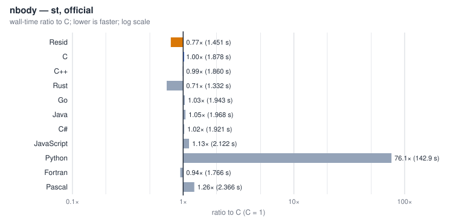

**st, small** (argument `5000000`)

| # | Language | wall s [95% CI] | CPU s | util | RSS MiB | vs C | CV | runs | status |
| ---: | --- | ---: | ---: | ---: | ---: | ---: | ---: | ---: | --- |
| 1 | Rust | 0.135 [0.135–0.135] | 0.134 | 100% | 2.4 | 0.71 | 0% | 5/5 | ok |
| 2 | Resid | 0.146 [0.146–0.146] | 0.146 | 100% | 0.7 | 0.77 | 0% | 5/5 | ok |
| 3 | Fortran | 0.178 [0.178–0.179] | 0.178 | 100% | 3.1 | 0.94 | 0% | 5/5 | ok |
| 4 | C++ | 0.188 [0.188–0.188] | 0.187 | 100% | 4.2 | 0.99 | 0% | 5/5 | ok |
| 5 | C | 0.189 [0.189–0.190] | 0.189 | 100% | 2.3 | 1.00 | 0% | 5/5 | ok |
| 6 | Go | 0.197 [0.197–0.197] | 0.196 | 100% | 3.5 | 1.04 | 0% | 5/5 | ok |
| 7 | C# | 0.210 [0.210–0.221] | 0.210 | 100% | 27.4 | 1.11 | 2% | 5/5 | ok |
| 8 | Java | 0.236 [0.235–0.236] | 0.235 | 100% | 46.0 | 1.24 | 0% | 5/5 | ok |
| 9 | Pascal | 0.238 [0.238–0.238] | 0.238 | 100% | 0.7 | 1.26 | 0% | 5/5 | ok |
| 10 | JavaScript | 0.239 [0.236–0.242] | 0.239 | 100% | 61.0 | 1.26 | 1% | 5/5 | ok |
| 11 | Python | 14.30 [14.16–14.70] | 14.27 | 100% | 10.4 | 75.6 | 2% | 5/5 | ok |

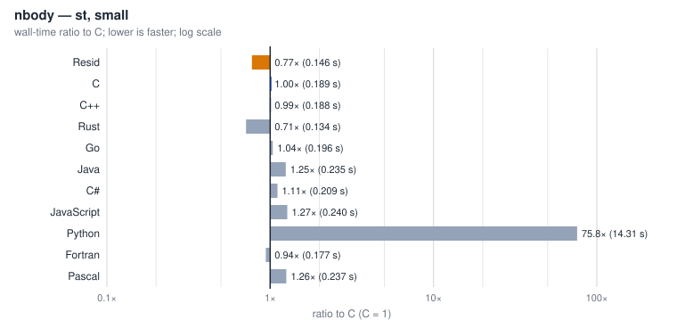

**best, official** (argument `50000000`)

| # | Language | wall s [95% CI] | CPU s | util | RSS MiB | vs C | CV | runs | status |
| ---: | --- | ---: | ---: | ---: | ---: | ---: | ---: | ---: | --- |
| 1 | C++ | 0.965 [0.963–0.972] | 0.963 | 100% | 4.2 | 0.96 | 0% | 5/5 | ok |
| 2 | Rust | 0.993 [0.992–0.996] | 0.990 | 100% | 2.3 | 0.99 | 0% | 5/5 | ok |
| 3 | C | 1.005 [1.004–1.009] | 1.004 | 100% | 1.8 | 1.00 | 0% | 5/5 | ok |
| 4 | Resid | 1.079 [1.075–1.082] | 1.077 | 100% | 0.7 | 1.07 | 0% | 5/5 | ok |
| 5 | C# | 1.522 [1.521–1.522] | 1.520 | 100% | 28.0 | 1.51 | 0% | 5/5 | ok |
| 6 | Fortran | 1.721 [1.719–1.731] | 1.718 | 100% | 3.2 | 1.71 | 0% | 5/5 | ok |
| 7 | Go | 1.822 [1.819–1.828] | 1.820 | 100% | 5.6 | 1.81 | 0% | 5/5 | ok |
| 8 | Pascal | 1.909 [1.906–1.912] | 1.904 | 100% | 0.7 | 1.90 | 0% | 5/5 | ok |
| 9 | Java | 1.969 [1.965–1.980] | 1.985 | 101% | 47.0 | 1.96 | 0% | 5/5 | ok |
| 10 | JavaScript | 2.069 [2.044–2.105] | 2.069 | 100% | 61.1 | 2.06 | 1% | 5/5 | ok |
| 11 | Python | 145.2 [143.5–147.0] | 144.9 | 100% | 10.9 | 144 | 1% | 3/3 | ok |

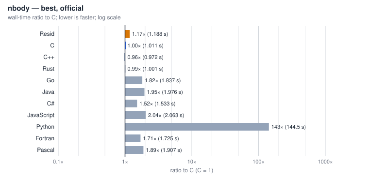

**best, small** (argument `5000000`)

| # | Language | wall s [95% CI] | CPU s | util | RSS MiB | vs C | CV | runs | status |
| ---: | --- | ---: | ---: | ---: | ---: | ---: | ---: | ---: | --- |
| 1 | C++ | 0.098 [0.098–0.102] | 0.098 | 100% | 4.2 | 0.93 | 2% | 5/5 | ok |
| 2 | C | 0.106 [0.103–0.106] | 0.106 | 100% | 1.8 | 1.00 | 1% | 5/5 | ok |
| 3 | Rust | 0.106 [0.101–0.109] | 0.106 | 100% | 2.3 | 1.00 | 3% | 5/5 | ok |
| 4 | Resid | 0.110 [0.109–0.113] | 0.109 | 100% | 0.7 | 1.04 | 1% | 5/5 | ok |
| 5 | C# | 0.174 [0.172–0.178] | 0.174 | 100% | 28.0 | 1.64 | 1% | 5/5 | ok |
| 6 | Fortran | 0.174 [0.174–0.177] | 0.174 | 100% | 3.2 | 1.64 | 1% | 5/5 | ok |
| 7 | Go | 0.186 [0.184–0.189] | 0.186 | 100% | 5.6 | 1.75 | 1% | 5/5 | ok |
| 8 | Pascal | 0.195 [0.191–0.197] | 0.195 | 100% | 0.7 | 1.84 | 1% | 5/5 | ok |
| 9 | Java | 0.223 [0.222–0.224] | 0.243 | 109% | 47.0 | 2.11 | 0% | 5/5 | ok |
| 10 | JavaScript | 0.229 [0.223–0.233] | 0.235 | 102% | 61.1 | 2.16 | 2% | 5/5 | ok |
| 11 | Python | 14.45 [14.22–14.64] | 14.42 | 100% | 10.9 | 136 | 1% | 5/5 | ok |

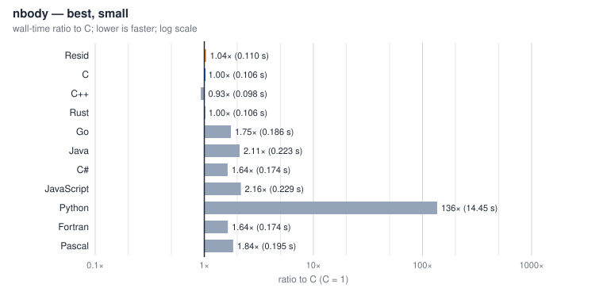

### fannkuch-redux

**st, official** (argument `12`)

| # | Language | wall s [95% CI] | CPU s | util | RSS MiB | vs C | CV | runs | status |
| ---: | --- | ---: | ---: | ---: | ---: | ---: | ---: | ---: | --- |
| 1 | Resid | 15.13 [15.12–15.16] | 15.10 | 100% | 0.7 | 0.58 | 0% | 5/5 | ok |
| 2 | Java | 23.66 [23.09–23.71] | 23.62 | 100% | 44.6 | 0.90 | 1% | 5/5 | ok |
| 3 | Go | 24.23 [24.09–24.45] | 24.18 | 100% | 3.5 | 0.92 | 1% | 5/5 | ok |
| 4 | JavaScript | 25.58 [25.53–25.60] | 25.54 | 100% | 56.9 | 0.97 | 0% | 5/5 | ok |
| 5 | Fortran | 26.00 [25.95–26.39] | 25.95 | 100% | 3.0 | 0.99 | 1% | 5/5 | ok |
| 6 | C | 26.25 [26.18–26.33] | 26.20 | 100% | 1.9 | 1.00 | 0% | 5/5 | ok |
| 7 | C# | 26.30 [26.21–26.32] | 26.25 | 100% | 27.6 | 1.00 | 0% | 5/5 | ok |
| 8 | C++ | 26.37 [26.31–26.41] | 26.32 | 100% | 4.2 | 1.00 | 0% | 5/5 | ok |
| 9 | Rust | 26.87 [26.79–26.98] | 26.82 | 100% | 2.4 | 1.02 | 0% | 5/5 | ok |
| 10 | Pascal | 49.29 [49.21–49.31] | 49.20 | 100% | 0.7 | 1.88 | 0% | 5/5 | ok |
| 11 | Python | 410.5 | 409.7 | 100% | 10.0 | 15.6 | 0% | 1/1 | ok |

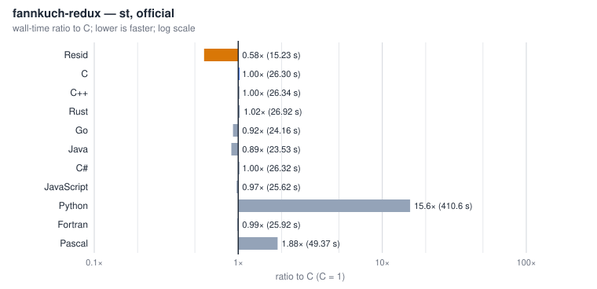

**st, small** (argument `10`)

| # | Language | wall s [95% CI] | CPU s | util | RSS MiB | vs C | CV | runs | status |
| ---: | --- | ---: | ---: | ---: | ---: | ---: | ---: | ---: | --- |
| 1 | Resid | 0.096 [0.096–0.096] | 0.096 | 100% | 0.7 | 0.59 | 0% | 5/5 | ok |
| 2 | Go | 0.155 [0.153–0.157] | 0.154 | 100% | 3.5 | 0.96 | 1% | 5/5 | ok |
| 3 | C | 0.162 [0.161–0.163] | 0.161 | 100% | 1.9 | 1.00 | 1% | 5/5 | ok |
| 4 | Fortran | 0.163 [0.163–0.169] | 0.163 | 100% | 3.1 | 1.01 | 2% | 5/5 | ok |
| 5 | C++ | 0.167 [0.166–0.167] | 0.166 | 100% | 4.2 | 1.03 | 0% | 5/5 | ok |
| 6 | Rust | 0.171 [0.169–0.171] | 0.170 | 100% | 2.4 | 1.06 | 0% | 5/5 | ok |
| 7 | C# | 0.180 [0.179–0.191] | 0.179 | 100% | 27.4 | 1.11 | 3% | 5/5 | ok |
| 8 | JavaScript | 0.182 [0.181–0.184] | 0.182 | 100% | 56.9 | 1.13 | 1% | 5/5 | ok |
| 9 | Java | 0.190 [0.189–0.195] | 0.189 | 100% | 44.8 | 1.18 | 1% | 5/5 | ok |
| 10 | Pascal | 0.293 [0.293–0.295] | 0.293 | 100% | 0.7 | 1.82 | 0% | 5/5 | ok |
| 11 | Python | 2.544 [2.516–2.558] | 2.539 | 100% | 10.0 | 15.7 | 1% | 5/5 | ok |

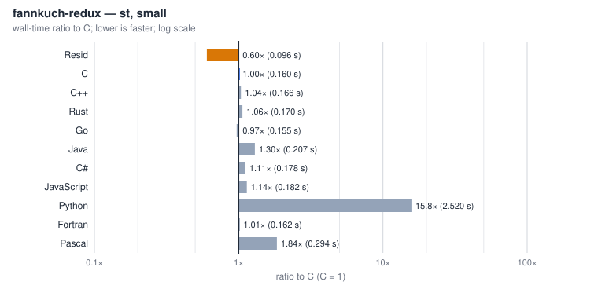

**best, official** (argument `12`)

| # | Language | wall s [95% CI] | CPU s | util | RSS MiB | vs C | CV | runs | status |
| ---: | --- | ---: | ---: | ---: | ---: | ---: | ---: | ---: | --- |
| 1 | Rust | 0.949 [0.915–0.963] | 14.29 | 1506% | 2.6 | 0.45 | 2% | 5/5 | ok |
| 2 | Resid | 0.963 [0.953–0.966] | 14.99 | 1557% | 3.3 | 0.46 | 1% | 5/5 | ok |
| 3 | C++ | 1.256 [1.241–1.266] | 13.42 | 1069% | 4.5 | 0.60 | 1% | 5/5 | ok |
| 4 | C# | 1.708 [1.702–1.709] | 6.744 | 395% | 29.0 | 0.81 | 0% | 5/5 | ok |
| 5 | C | 2.110 [2.106–2.115] | 8.347 | 396% | 1.9 | 1.00 | 0% | 5/5 | ok |
| 6 | Java | 2.396 [2.356–2.505] | 36.02 | 1503% | 52.2 | 1.14 | 2% | 5/5 | ok |
| 7 | JavaScript | 2.427 [2.409–2.441] | 37.48 | 1544% | 290 | 1.15 | 1% | 5/5 | ok |
| 8 | Fortran | 2.583 [2.582–2.660] | 40.32 | 1561% | 10.4 | 1.22 | 2% | 5/5 | ok |
| 9 | Pascal | 3.810 [3.746–3.839] | 39.18 | 1028% | 2.4 | 1.81 | 1% | 5/5 | ok |
| 10 | Go | 4.923 [4.913–4.934] | 19.59 | 398% | 5.7 | 2.33 | 0% | 5/5 | ok |
| 11 | Python | 62.64 [62.15–62.83] | 884.2 | 1412% | 18.2 | 29.7 | 1% | 3/3 | ok |

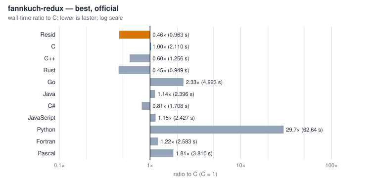

**best, small** (argument `10`)

| # | Language | wall s [95% CI] | CPU s | util | RSS MiB | vs C | CV | runs | status |
| ---: | --- | ---: | ---: | ---: | ---: | ---: | ---: | ---: | --- |
| 1 | Rust | 0.007 [0.007–0.056] | 0.091 | 1288% | 2.6 | 0.42 | 131% | 5/5 | ok |
| 2 | Resid | 0.008 [0.007–0.009] | 0.098 | 1277% | 2.8 | 0.46 | 8% | 5/5 | ok |
| 3 | C++ | 0.010 [0.010–0.011] | 0.139 | 1376% | 4.6 | 0.60 | 3% | 5/5 | ok |
| 4 | C | 0.017 [0.015–0.019] | 0.063 | 378% | 2.0 | 1.00 | 8% | 5/5 | ok |
| 5 | Fortran | 0.026 [0.025–0.028] | 0.222 | 862% | 3.7 | 1.53 | 4% | 5/5 | ok |
| 6 | Pascal | 0.027 [0.026–0.028] | 0.215 | 790% | 2.6 | 1.62 | 2% | 5/5 | ok |
| 7 | C# | 0.028 [0.027–0.039] | 0.068 | 242% | 27.0 | 1.68 | 16% | 5/5 | ok |
| 8 | Go | 0.051 [0.051–0.052] | 0.123 | 239% | 5.8 | 3.06 | 1% | 5/5 | ok |
| 9 | JavaScript | 0.110 [0.104–0.113] | 1.024 | 933% | 288 | 6.54 | 4% | 5/5 | ok |
| 10 | Java | 0.110 [0.083–0.113] | 1.445 | 1315% | 52.0 | 6.55 | 12% | 5/5 | ok |
| 11 | Python | 0.404 [0.395–0.412] | 4.954 | 1226% | 18.3 | 24.1 | 1% | 5/5 | ok |

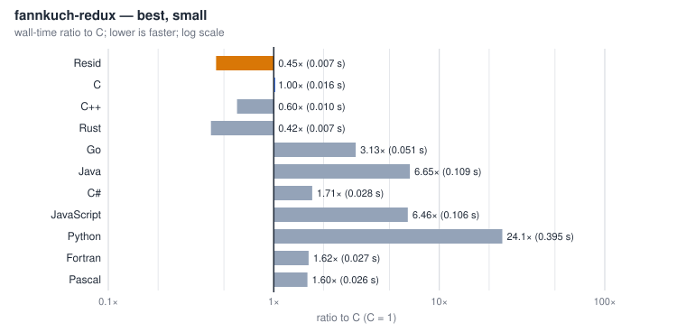

### spectral-norm

**st, official** (argument `5500`)

| # | Language | wall s [95% CI] | CPU s | util | RSS MiB | vs C | CV | runs | status |
| ---: | --- | ---: | ---: | ---: | ---: | ---: | ---: | ---: | --- |
| 1 | C++ | 0.777 [0.777–0.778] | 0.776 | 100% | 4.3 | 0.99 | 0% | 5/5 | ok |
| 2 | Fortran | 0.779 [0.778–0.780] | 0.777 | 100% | 3.3 | 1.00 | 0% | 5/5 | ok |
| 3 | C | 0.781 [0.781–0.783] | 0.780 | 100% | 2.4 | 1.00 | 0% | 5/5 | ok |
| 4 | Pascal | 1.008 [0.999–1.009] | 1.007 | 100% | 0.7 | 1.29 | 0% | 5/5 | ok |
| 5 | Rust | 1.011 [1.009–1.012] | 1.009 | 100% | 2.5 | 1.29 | 0% | 5/5 | ok |
| 6 | Go | 1.019 [1.017–1.020] | 1.017 | 100% | 5.5 | 1.30 | 0% | 5/5 | ok |
| 7 | C# | 1.028 [1.026–1.028] | 1.026 | 100% | 25.0 | 1.32 | 0% | 5/5 | ok |
| 8 | Java | 1.053 [1.052–1.059] | 1.051 | 100% | 45.1 | 1.35 | 0% | 5/5 | ok |
| 9 | JavaScript | 1.094 [1.088–1.125] | 1.091 | 100% | 60.1 | 1.40 | 1% | 5/5 | ok |
| 10 | Resid | 1.169 [1.166–1.174] | 1.167 | 100% | 3.1 | 1.50 | 0% | 5/5 | ok |
| 11 | Python | 102.7 [102.6–102.7] | 102.5 | 100% | 10.8 | 131 | 0% | 3/3 | ok |

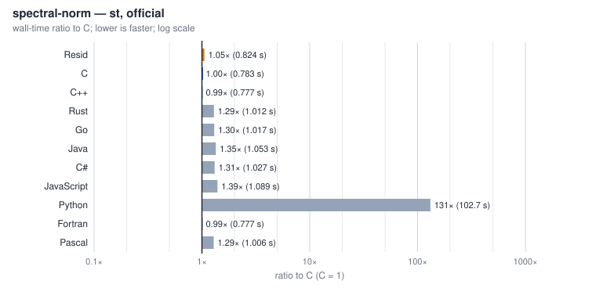

**st, small** (argument `1000`)

| # | Language | wall s [95% CI] | CPU s | util | RSS MiB | vs C | CV | runs | status |
| ---: | --- | ---: | ---: | ---: | ---: | ---: | ---: | ---: | --- |
| 1 | C | 0.026 [0.026–0.026] | 0.026 | 100% | 2.4 | 1.00 | 0% | 5/5 | ok |
| 2 | C++ | 0.026 [0.026–0.026] | 0.026 | 100% | 4.2 | 1.01 | 1% | 5/5 | ok |
| 3 | Fortran | 0.026 [0.026–0.026] | 0.026 | 100% | 3.1 | 1.01 | 0% | 5/5 | ok |
| 4 | Pascal | 0.034 [0.034–0.034] | 0.034 | 100% | 0.7 | 1.30 | 0% | 5/5 | ok |
| 5 | Rust | 0.034 [0.034–0.034] | 0.034 | 100% | 2.4 | 1.31 | 0% | 5/5 | ok |
| 6 | Go | 0.035 [0.034–0.035] | 0.034 | 99% | 3.5 | 1.34 | 1% | 5/5 | ok |
| 7 | Resid | 0.040 [0.040–0.040] | 0.040 | 100% | 0.7 | 1.53 | 0% | 5/5 | ok |
| 8 | C# | 0.049 [0.048–0.098] | 0.048 | 99% | 24.9 | 1.87 | 38% | 5/5 | ok |
| 9 | JavaScript | 0.062 [0.059–0.065] | 0.061 | 99% | 59.2 | 2.38 | 4% | 5/5 | ok |
| 10 | Java | 0.089 [0.088–0.094] | 0.089 | 99% | 45.1 | 3.44 | 3% | 5/5 | ok |
| 11 | Python | 3.369 [3.361–3.414] | 3.362 | 100% | 10.3 | 130 | 1% | 5/5 | ok |

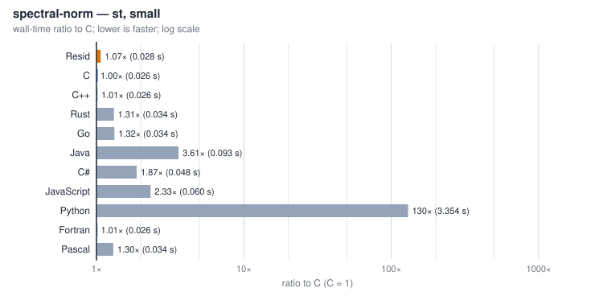

**best, official** (argument `5500`)

| # | Language | wall s [95% CI] | CPU s | util | RSS MiB | vs C | CV | runs | status |
| ---: | --- | ---: | ---: | ---: | ---: | ---: | ---: | ---: | --- |
| 1 | Resid | 0.055 [0.053–0.057] | 0.637 | 1167% | 14.1 | 0.63 | 3% | 5/5 | ok |
| 2 | Rust | 0.077 [0.076–0.077] | 1.185 | 1546% | 2.7 | 0.89 | 0% | 5/5 | ok |
| 3 | Fortran | 0.086 [0.086–0.137] | 1.361 | 1580% | 3.6 | 1.00 | 23% | 5/5 | ok |
| 4 | C | 0.086 [0.086–0.114] | 1.365 | 1583% | 2.3 | 1.00 | 14% | 5/5 | ok |
| 5 | C++ | 0.092 [0.091–0.125] | 1.446 | 1570% | 4.6 | 1.07 | 15% | 5/5 | ok |
| 6 | Pascal | 0.175 [0.170–0.178] | 2.706 | 1547% | 2.8 | 2.03 | 2% | 5/5 | ok |
| 7 | Go | 0.261 [0.257–0.277] | 1.004 | 384% | 7.6 | 3.03 | 3% | 5/5 | ok |
| 8 | C# | 0.273 [0.255–0.300] | 3.755 | 1375% | 31.1 | 3.17 | 6% | 5/5 | ok |
| 9 | Java | 0.280 [0.269–0.305] | 3.416 | 1222% | 48.8 | 3.24 | 5% | 5/5 | ok |
| 10 | JavaScript | 0.327 [0.322–0.336] | 3.517 | 1075% | 322 | 3.79 | 2% | 5/5 | ok |
| 11 | Python | 32.86 [31.67–35.61] | 128.6 | 391% | 19.1 | 381 | 5% | 5/5 | ok |

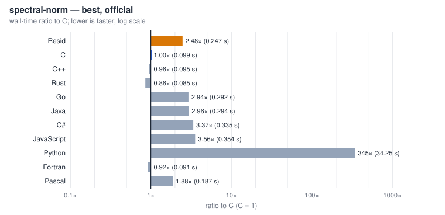

**best, small** (argument `1000`)

| # | Language | wall s [95% CI] | CPU s | util | RSS MiB | vs C | CV | runs | status |
| ---: | --- | ---: | ---: | ---: | ---: | ---: | ---: | ---: | --- |
| 1 | C | 0.003 [0.003–0.004] | 0.049 | 1402% | 2.3 | 1.00 | 3% | 5/5 | ok |
| 2 | Fortran | 0.004 [0.003–0.004] | 0.046 | 1296% | 3.7 | 1.02 | 12% | 5/5 | ok |
| 3 | Rust | 0.004 [0.004–0.015] | 0.045 | 1254% | 2.5 | 1.04 | 87% | 5/5 | ok |
| 4 | Resid | 0.004 [0.004–0.004] | 0.032 | 792% | 1.9 | 1.15 | 7% | 5/5 | ok |
| 5 | C++ | 0.004 [0.004–0.006] | 0.054 | 1260% | 4.6 | 1.22 | 19% | 5/5 | ok |
| 6 | Pascal | 0.006 [0.006–0.006] | 0.083 | 1306% | 2.7 | 1.82 | 2% | 5/5 | ok |
| 7 | Go | 0.013 [0.012–0.014] | 0.038 | 293% | 5.7 | 3.68 | 6% | 5/5 | ok |
| 8 | C# | 0.053 [0.052–0.064] | 0.419 | 792% | 28.3 | 15.2 | 9% | 5/5 | ok |
| 9 | Java | 0.101 [0.073–0.108] | 1.006 | 998% | 47.6 | 28.8 | 14% | 5/5 | ok |
| 10 | JavaScript | 0.106 [0.103–0.114] | 0.769 | 723% | 312 | 30.4 | 4% | 5/5 | ok |
| 11 | Python | 1.093 [1.078–1.097] | 4.107 | 376% | 18.2 | 313 | 1% | 5/5 | ok |

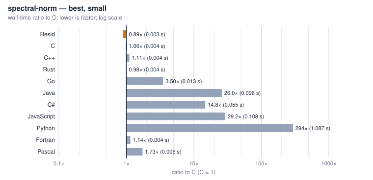

### mandelbrot

**st, official** (argument `16000`)

| # | Language | wall s [95% CI] | CPU s | util | RSS MiB | vs C | CV | runs | status |
| ---: | --- | ---: | ---: | ---: | ---: | ---: | ---: | ---: | --- |
| 1 | C++ | 10.95 [10.95–10.95] | 10.93 | 100% | 34.5 | 1.00 | 0% | 5/5 | ok |
| 2 | C | 10.99 [10.97–11.09] | 10.95 | 100% | 1.9 | 1.00 | 0% | 5/5 | ok |
| 3 | JavaScript | 10.99 [10.99–10.99] | 10.97 | 100% | 90.5 | 1.00 | 0% | 5/5 | ok |
| 4 | Fortran | 10.99 [10.99–11.01] | 10.97 | 100% | 33.6 | 1.00 | 0% | 5/5 | ok |
| 5 | Resid | 11.16 [11.16–11.17] | 11.14 | 100% | 0.7 | 1.02 | 0% | 5/5 | ok |
| 6 | C# | 11.17 [11.17–11.18] | 11.15 | 100% | 31.1 | 1.02 | 0% | 5/5 | ok |
| 7 | Go | 11.27 [11.26–11.32] | 11.24 | 100% | 3.5 | 1.03 | 0% | 5/5 | ok |
| 8 | Java | 11.48 [11.17–11.48] | 11.45 | 100% | 45.1 | 1.04 | 1% | 5/5 | ok |
| 9 | Rust | 11.48 [11.48–11.50] | 11.46 | 100% | 32.8 | 1.05 | 0% | 5/5 | ok |
| 10 | Pascal | 26.36 [26.22–26.51] | 26.31 | 100% | 31.0 | 2.40 | 0% | 5/5 | ok |
| 11 | Python | 480.3 | 479.3 | 100% | 40.6 | 43.7 | 0% | 1/1 | ok |

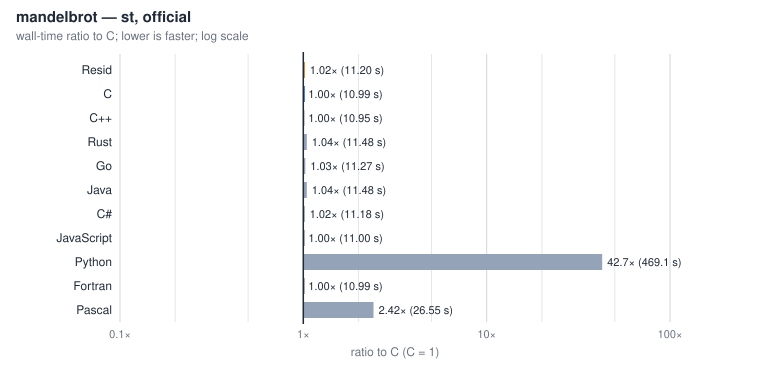

**st, small** (argument `4000`)

| # | Language | wall s [95% CI] | CPU s | util | RSS MiB | vs C | CV | runs | status |
| ---: | --- | ---: | ---: | ---: | ---: | ---: | ---: | ---: | --- |
| 1 | Fortran | 0.697 [0.696–0.697] | 0.695 | 100% | 4.9 | 0.99 | 0% | 5/5 | ok |
| 2 | C++ | 0.698 [0.698–0.699] | 0.697 | 100% | 5.9 | 0.99 | 0% | 5/5 | ok |
| 3 | C | 0.702 [0.701–0.703] | 0.700 | 100% | 1.9 | 1.00 | 0% | 5/5 | ok |
| 4 | Resid | 0.714 [0.712–0.714] | 0.712 | 100% | 0.7 | 1.02 | 0% | 5/5 | ok |
| 5 | Go | 0.717 [0.716–0.717] | 0.715 | 100% | 3.5 | 1.02 | 0% | 5/5 | ok |
| 6 | JavaScript | 0.721 [0.718–0.722] | 0.719 | 100% | 61.4 | 1.03 | 0% | 5/5 | ok |
| 7 | C# | 0.727 [0.727–0.776] | 0.726 | 100% | 30.8 | 1.04 | 3% | 5/5 | ok |
| 8 | Rust | 0.732 [0.731–0.732] | 0.730 | 100% | 4.1 | 1.04 | 0% | 5/5 | ok |
| 9 | Java | 0.742 [0.735–0.760] | 0.740 | 100% | 45.1 | 1.06 | 1% | 5/5 | ok |
| 10 | Pascal | 1.698 [1.696–1.699] | 1.694 | 100% | 2.4 | 2.42 | 0% | 5/5 | ok |
| 11 | Python | 29.55 [29.54–30.36] | 29.50 | 100% | 12.1 | 42.1 | 1% | 5/5 | ok |

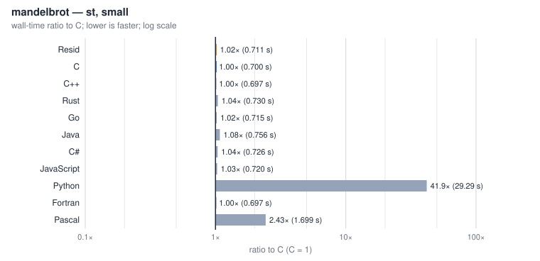

**best, official** (argument `16000`)

| # | Language | wall s [95% CI] | CPU s | util | RSS MiB | vs C | CV | runs | status |
| ---: | --- | ---: | ---: | ---: | ---: | ---: | ---: | ---: | --- |
| 1 | C++ | 0.174 [0.170–0.175] | 2.389 | 1377% | 35.0 | 0.71 | 1% | 5/5 | ok |
| 2 | Rust | 0.186 [0.185–0.189] | 2.797 | 1503% | 33.4 | 0.76 | 1% | 5/5 | ok |
| 3 | Resid | 0.195 [0.187–0.209] | 1.830 | 939% | 518 | 0.80 | 5% | 5/5 | ok |
| 4 | C | 0.244 [0.241–0.255] | 3.559 | 1460% | 33.1 | 1.00 | 2% | 5/5 | ok |
| 5 | C# | 0.352 [0.293–0.352] | 4.987 | 1419% | 65.4 | 1.44 | 8% | 5/5 | ok |
| 6 | Go | 0.579 [0.576–0.585] | 8.961 | 1547% | 48.7 | 2.38 | 1% | 5/5 | ok |
| 7 | Fortran | 0.599 [0.574–0.604] | 2.985 | 498% | 34.0 | 2.46 | 2% | 5/5 | ok |
| 8 | JavaScript | 0.767 [0.759–0.809] | 11.18 | 1459% | 344 | 3.15 | 3% | 5/5 | ok |
| 9 | Java | 0.775 [0.769–0.791] | 11.81 | 1524% | 97.4 | 3.18 | 1% | 5/5 | ok |
| 10 | Pascal | 0.849 [0.765–0.879] | 12.04 | 1419% | 33.0 | 3.48 | 7% | 5/5 | ok |
| 11 | Python | 51.18 [50.68–51.92] | 811.3 | 1585% | 18.2 | 210 | 1% | 5/5 | ok |

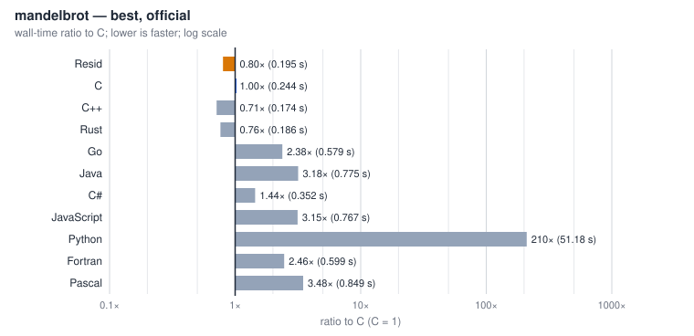

**best, small** (argument `4000`)

| # | Language | wall s [95% CI] | CPU s | util | RSS MiB | vs C | CV | runs | status |
| ---: | --- | ---: | ---: | ---: | ---: | ---: | ---: | ---: | --- |
| 1 | Resid | 0.011 [0.011–0.012] | 0.115 | 1009% | 36.3 | 0.71 | 3% | 5/5 | ok |
| 2 | C++ | 0.012 [0.012–0.016] | 0.175 | 1433% | 5.4 | 0.76 | 14% | 5/5 | ok |
| 3 | Rust | 0.013 [0.012–0.013] | 0.177 | 1410% | 3.8 | 0.78 | 3% | 5/5 | ok |
| 4 | C | 0.016 [0.015–0.016] | 0.244 | 1514% | 3.3 | 1.00 | 3% | 5/5 | ok |
| 5 | Go | 0.039 [0.038–0.040] | 0.575 | 1463% | 20.0 | 2.44 | 2% | 5/5 | ok |
| 6 | Fortran | 0.043 [0.040–0.047] | 0.283 | 665% | 5.5 | 2.65 | 6% | 5/5 | ok |
| 7 | Pascal | 0.046 [0.045–0.048] | 0.692 | 1510% | 3.5 | 2.84 | 3% | 5/5 | ok |
| 8 | Java | 0.085 [0.083–0.091] | 1.063 | 1248% | 47.3 | 5.29 | 3% | 5/5 | ok |
| 9 | C# | 0.086 [0.085–0.097] | 0.947 | 1103% | 29.7 | 5.34 | 6% | 5/5 | ok |
| 10 | JavaScript | 0.137 [0.131–0.139] | 1.446 | 1057% | 319 | 8.49 | 3% | 5/5 | ok |
| 11 | Python | 2.908 [2.891–2.995] | 45.38 | 1560% | 18.2 | 181 | 1% | 5/5 | ok |

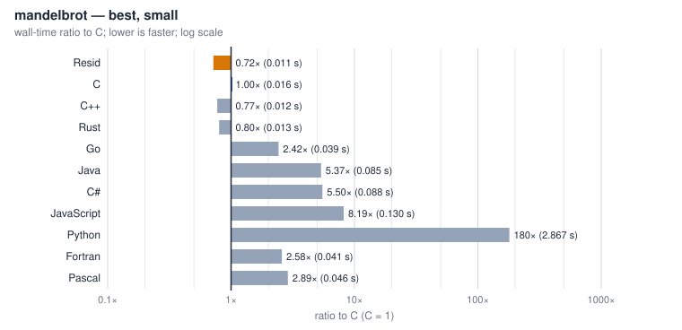

### binary-trees

**st, official** (argument `21`)

| # | Language | wall s [95% CI] | CPU s | util | RSS MiB | vs C | CV | runs | status |
| ---: | --- | ---: | ---: | ---: | ---: | ---: | ---: | ---: | --- |
| 1 | Java | 1.601 [1.599–1.611] | 1.595 | 100% | 587 | 0.24 | 0% | 5/5 | ok |
| 2 | Resid | 2.156 [2.151–2.173] | 2.151 | 100% | 257 | 0.32 | 0% | 5/5 | ok |
| 3 | C | 6.671 [6.629–6.748] | 6.656 | 100% | 258 | 1.00 | 1% | 5/5 | ok |
| 4 | Fortran | 7.087 [6.873–7.193] | 7.072 | 100% | 259 | 1.06 | 2% | 5/5 | ok |
| 5 | Pascal | 7.702 [7.658–7.735] | 7.682 | 100% | 256 | 1.15 | 0% | 5/5 | ok |
| 6 | C++ | 8.232 [8.169–8.456] | 8.213 | 100% | 260 | 1.23 | 2% | 5/5 | ok |
| 7 | JavaScript | 9.233 [9.194–9.257] | 9.200 | 100% | 1478 | 1.38 | 0% | 5/5 | ok |
| 8 | C# | 9.354 [9.302–9.481] | 9.293 | 99% | 549 | 1.40 | 1% | 5/5 | ok |
| 9 | Rust | 10.31 [10.16–10.38] | 10.28 | 100% | 258 | 1.55 | 1% | 5/5 | ok |
| 10 | Go | 12.20 [12.14–12.27] | 12.17 | 100% | 274 | 1.83 | 0% | 5/5 | ok |
| 11 | Python | 276.2 [276.2–276.5] | 275.6 | 100% | 395 | 41.4 | 0% | 3/3 | ok |

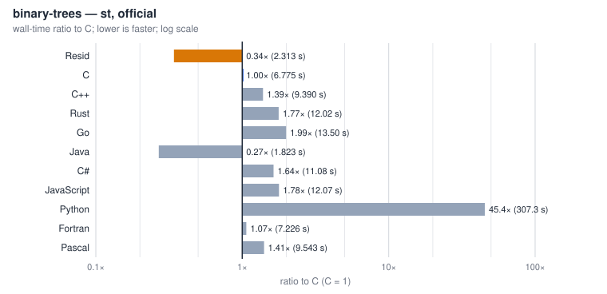

**st, small** (argument `16`)

| # | Language | wall s [95% CI] | CPU s | util | RSS MiB | vs C | CV | runs | status |
| ---: | --- | ---: | ---: | ---: | ---: | ---: | ---: | ---: | --- |
| 1 | Resid | 0.055 [0.054–0.055] | 0.054 | 100% | 14.0 | 0.35 | 0% | 5/5 | ok |
| 2 | Java | 0.069 [0.068–0.070] | 0.069 | 99% | 67.9 | 0.44 | 1% | 5/5 | ok |
| 3 | JavaScript | 0.136 [0.131–0.137] | 0.135 | 99% | 105 | 0.87 | 2% | 5/5 | ok |
| 4 | C | 0.155 [0.154–0.156] | 0.155 | 100% | 9.9 | 1.00 | 1% | 5/5 | ok |
| 5 | Fortran | 0.166 [0.166–0.166] | 0.165 | 100% | 10.9 | 1.07 | 0% | 5/5 | ok |
| 6 | Pascal | 0.167 [0.167–0.168] | 0.167 | 100% | 8.3 | 1.08 | 0% | 5/5 | ok |
| 7 | C# | 0.179 [0.178–0.192] | 0.177 | 99% | 53.7 | 1.15 | 3% | 5/5 | ok |
| 8 | C++ | 0.184 [0.183–0.186] | 0.184 | 100% | 12.2 | 1.18 | 1% | 5/5 | ok |
| 9 | Rust | 0.219 [0.217–0.223] | 0.218 | 100% | 10.2 | 1.41 | 1% | 5/5 | ok |
| 10 | Go | 0.259 [0.258–0.259] | 0.258 | 100% | 18.8 | 1.66 | 0% | 5/5 | ok |
| 11 | Python | 1.686 [1.665–1.715] | 1.682 | 100% | 22.1 | 10.8 | 1% | 5/5 | ok |

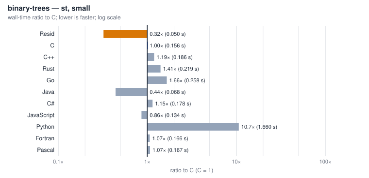

**best, official** (argument `21`)

| # | Language | wall s [95% CI] | CPU s | util | RSS MiB | vs C | CV | runs | status |
| ---: | --- | ---: | ---: | ---: | ---: | ---: | ---: | ---: | --- |
| 1 | Rust | 0.249 [0.210–0.264] | 3.225 | 1293% | 511 | 0.09 | 9% | 5/5 | ok |
| 2 | Fortran | 0.283 [0.265–0.292] | 1.611 | 570% | 132 | 0.11 | 4% | 5/5 | ok |
| 3 | C++ | 0.313 [0.307–0.314] | 4.106 | 1314% | 583 | 0.12 | 1% | 5/5 | ok |
| 4 | Pascal | 0.348 [0.298–0.373] | 1.713 | 492% | 130 | 0.13 | 8% | 5/5 | ok |
| 5 | Resid | 0.460 [0.455–0.482] | 2.927 | 637% | 661 | 0.17 | 3% | 5/5 | ok |
| 6 | Java | 0.959 [0.841–0.987] | 6.651 | 693% | 5426 | 0.36 | 8% | 5/5 | ok |
| 7 | Go | 2.012 [1.920–2.044] | 24.59 | 1222% | 582 | 0.76 | 2% | 5/5 | ok |
| 8 | JavaScript | 2.380 [2.320–2.474] | 10.63 | 447% | 1167 | 0.90 | 3% | 5/5 | ok |
| 9 | C | 2.635 [2.524–2.749] | 17.15 | 651% | 343 | 1.00 | 3% | 5/5 | ok |
| 10 | C# | 2.837 [2.620–2.992] | 14.61 | 515% | 1070 | 1.08 | 5% | 5/5 | ok |
| 11 | Python | 8.492 [8.411–9.067] | 96.45 | 1136% | 275 | 3.22 | 3% | 5/5 | ok |

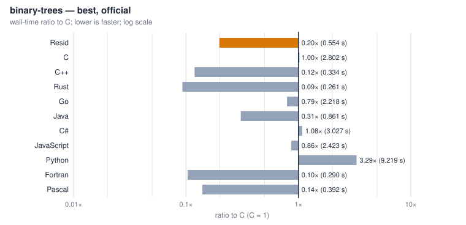

**best, small** (argument `16`)

| # | Language | wall s [95% CI] | CPU s | util | RSS MiB | vs C | CV | runs | status |
| ---: | --- | ---: | ---: | ---: | ---: | ---: | ---: | ---: | --- |
| 1 | Rust | 0.008 [0.008–0.057] | 0.069 | 872% | 27.3 | 0.10 | 124% | 5/5 | ok |
| 2 | C++ | 0.010 [0.010–0.010] | 0.091 | 930% | 36.3 | 0.13 | 3% | 5/5 | ok |
| 3 | Fortran | 0.010 [0.009–0.013] | 0.105 | 1067% | 8.1 | 0.13 | 15% | 5/5 | ok |
| 4 | Resid | 0.013 [0.012–0.014] | 0.066 | 494% | 23.2 | 0.17 | 5% | 5/5 | ok |
| 5 | Java | 0.053 [0.051–0.057] | 0.272 | 515% | 279 | 0.69 | 5% | 5/5 | ok |
| 6 | Go | 0.061 [0.059–0.062] | 0.486 | 803% | 28.8 | 0.79 | 2% | 5/5 | ok |
| 7 | C | 0.076 [0.076–0.077] | 0.382 | 501% | 15.3 | 1.00 | 1% | 5/5 | ok |
| 8 | JavaScript | 0.104 [0.100–0.107] | 0.430 | 413% | 198 | 1.37 | 2% | 5/5 | ok |
| 9 | Pascal | 0.109 [0.108–0.111] | 0.041 | 37% | 7.3 | 1.43 | 1% | 5/5 | ok |
| 10 | C# | 0.118 [0.111–0.124] | 0.355 | 300% | 93.2 | 1.55 | 4% | 5/5 | ok |
| 11 | Python | 0.212 [0.209–0.214] | 1.995 | 940% | 25.8 | 2.78 | 1% | 5/5 | ok |

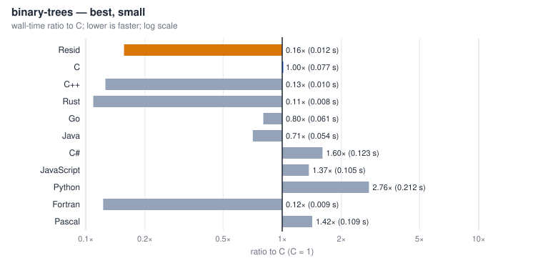

### fasta

**st, official** (argument `25000000`)

| # | Language | wall s [95% CI] | CPU s | util | RSS MiB | vs C | CV | runs | status |
| ---: | --- | ---: | ---: | ---: | ---: | ---: | ---: | ---: | --- |
| 1 | Rust | 2.205 [2.196–2.208] | 2.200 | 100% | 2.4 | 0.91 | 0% | 5/5 | ok |
| 2 | Resid | 2.335 [2.325–2.355] | 2.330 | 100% | 1.1 | 0.96 | 1% | 5/5 | ok |
| 3 | Go | 2.336 [2.330–2.346] | 2.331 | 100% | 3.4 | 0.96 | 0% | 5/5 | ok |
| 4 | C++ | 2.376 [2.370–2.387] | 2.370 | 100% | 4.0 | 0.98 | 0% | 5/5 | ok |
| 5 | C | 2.427 [2.416–2.432] | 2.422 | 100% | 1.8 | 1.00 | 0% | 5/5 | ok |
| 6 | Fortran | 2.521 [2.520–2.529] | 2.516 | 100% | 2.9 | 1.04 | 0% | 5/5 | ok |
| 7 | C# | 2.548 [2.542–2.557] | 2.542 | 100% | 28.6 | 1.05 | 0% | 5/5 | ok |
| 8 | Java | 2.861 [2.611–2.876] | 2.853 | 100% | 45.8 | 1.18 | 4% | 5/5 | ok |
| 9 | Pascal | 3.068 [3.059–3.075] | 3.060 | 100% | 0.7 | 1.26 | 0% | 5/5 | ok |
| 10 | JavaScript | 3.213 [3.205–3.218] | 3.203 | 100% | 58.5 | 1.32 | 0% | 5/5 | ok |
| 11 | Python | 21.51 [21.39–22.84] | 21.47 | 100% | 10.5 | 8.87 | 3% | 5/5 | ok |

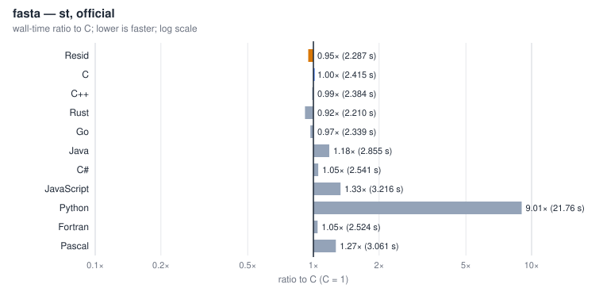

**st, small** (argument `2500000`)

| # | Language | wall s [95% CI] | CPU s | util | RSS MiB | vs C | CV | runs | status |
| ---: | --- | ---: | ---: | ---: | ---: | ---: | ---: | ---: | --- |
| 1 | Rust | 0.223 [0.223–0.224] | 0.223 | 100% | 2.3 | 0.92 | 0% | 5/5 | ok |
| 2 | Resid | 0.235 [0.234–0.237] | 0.234 | 100% | 1.1 | 0.97 | 1% | 5/5 | ok |
| 3 | Go | 0.238 [0.236–0.238] | 0.237 | 100% | 3.4 | 0.98 | 0% | 5/5 | ok |
| 4 | C++ | 0.240 [0.239–0.241] | 0.239 | 100% | 4.0 | 0.99 | 0% | 5/5 | ok |
| 5 | C | 0.243 [0.243–0.244] | 0.243 | 100% | 1.8 | 1.00 | 0% | 5/5 | ok |
| 6 | Fortran | 0.254 [0.253–0.254] | 0.253 | 100% | 2.9 | 1.04 | 0% | 5/5 | ok |
| 7 | C# | 0.275 [0.273–0.327] | 0.274 | 100% | 28.2 | 1.13 | 8% | 5/5 | ok |
| 8 | Pascal | 0.308 [0.306–0.309] | 0.307 | 100% | 0.7 | 1.27 | 0% | 5/5 | ok |
| 9 | Java | 0.313 [0.305–0.335] | 0.312 | 100% | 45.3 | 1.28 | 4% | 5/5 | ok |
| 10 | JavaScript | 0.347 [0.346–0.349] | 0.346 | 100% | 58.2 | 1.43 | 0% | 5/5 | ok |
| 11 | Python | 2.164 [2.154–2.306] | 2.160 | 100% | 10.5 | 8.89 | 3% | 5/5 | ok |

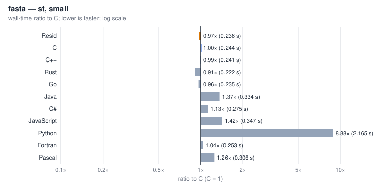

**best, official** (argument `25000000`)

| # | Language | wall s [95% CI] | CPU s | util | RSS MiB | vs C | CV | runs | status |
| ---: | --- | ---: | ---: | ---: | ---: | ---: | ---: | ---: | --- |
| 1 | Resid | 0.148 [0.148–0.192] | 1.043 | 705% | 248 | 0.28 | 14% | 5/5 | ok |
| 2 | Rust | 0.498 [0.497–0.500] | 0.984 | 197% | 3.0 | 0.94 | 0% | 5/5 | ok |
| 3 | C | 0.528 [0.524–0.533] | 0.527 | 100% | 1.8 | 1.00 | 1% | 5/5 | ok |
| 4 | C# | 0.558 [0.554–0.562] | 0.567 | 102% | 29.3 | 1.06 | 0% | 5/5 | ok |
| 5 | C++ | 0.572 [0.568–0.588] | 2.330 | 407% | 5.3 | 1.08 | 1% | 5/5 | ok |
| 6 | Go | 0.595 [0.591–0.607] | 2.237 | 376% | 18.1 | 1.13 | 1% | 5/5 | ok |
| 7 | Fortran | 0.674 [0.664–0.699] | 0.672 | 100% | 3.0 | 1.28 | 2% | 5/5 | ok |
| 8 | Java | 0.727 [0.713–0.749] | 2.669 | 367% | 56.6 | 1.38 | 2% | 5/5 | ok |
| 9 | JavaScript | 1.040 [1.011–1.045] | 3.356 | 323% | 182 | 1.97 | 1% | 5/5 | ok |
| 10 | Pascal | 2.382 [2.377–2.398] | 2.378 | 100% | 0.7 | 4.51 | 0% | 5/5 | ok |
| 11 | Python | 11.42 [11.38–11.42] | 23.02 | 202% | 214 | 21.6 | 0% | 5/5 | ok |


**best, small** (argument `2500000`)

| # | Language | wall s [95% CI] | CPU s | util | RSS MiB | vs C | CV | runs | status |
| ---: | --- | ---: | ---: | ---: | ---: | ---: | ---: | ---: | --- |
| 1 | Resid | 0.015 [0.015–0.016] | 0.100 | 667% | 26.4 | 0.28 | 5% | 5/5 | ok |
| 2 | C | 0.054 [0.053–0.057] | 0.054 | 100% | 1.9 | 1.00 | 3% | 5/5 | ok |
| 3 | Rust | 0.055 [0.051–0.067] | 0.108 | 195% | 3.0 | 1.03 | 11% | 5/5 | ok |
| 4 | C++ | 0.061 [0.059–0.063] | 0.246 | 401% | 5.4 | 1.14 | 3% | 5/5 | ok |
| 5 | Go | 0.067 [0.060–0.073] | 0.224 | 334% | 14.0 | 1.25 | 9% | 5/5 | ok |
| 6 | Fortran | 0.069 [0.067–0.073] | 0.069 | 100% | 3.0 | 1.29 | 4% | 5/5 | ok |
| 7 | C# | 0.074 [0.073–0.085] | 0.076 | 101% | 27.0 | 1.39 | 7% | 5/5 | ok |
| 8 | Java | 0.116 [0.111–0.119] | 0.503 | 435% | 54.3 | 2.15 | 3% | 5/5 | ok |
| 9 | JavaScript | 0.169 [0.160–0.173] | 0.596 | 352% | 147 | 3.15 | 3% | 5/5 | ok |
| 10 | Pascal | 0.240 [0.239–0.242] | 0.240 | 100% | 0.7 | 4.47 | 0% | 5/5 | ok |
| 11 | Python | 1.230 [1.205–1.233] | 2.525 | 205% | 34.8 | 22.9 | 1% | 5/5 | ok |

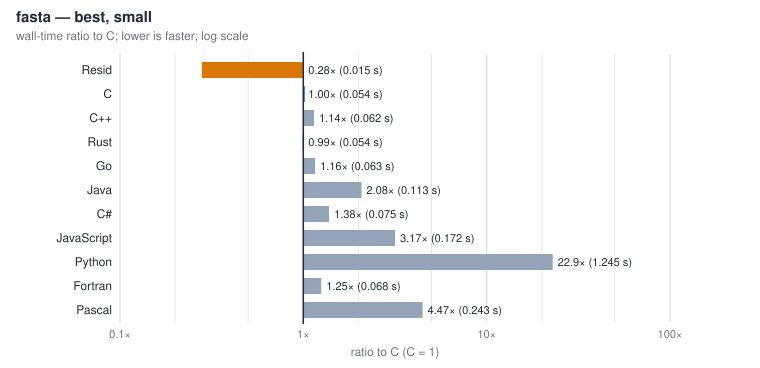

### k-nucleotide

**st, official** (argument `0`, stdin fasta N = 25000000)

| # | Language | wall s [95% CI] | CPU s | util | RSS MiB | vs C | CV | runs | status |
| ---: | --- | ---: | ---: | ---: | ---: | ---: | ---: | ---: | --- |
| 1 | Fortran | 3.482 [3.474–3.487] | 3.474 | 100% | 367 | 0.83 | 0% | 5/5 | ok |
| 2 | C | 4.181 [4.161–4.183] | 4.173 | 100% | 133 | 1.00 | 0% | 5/5 | ok |
| 3 | Resid | 4.755 [4.743–4.763] | 4.743 | 100% | 263 | 1.14 | 0% | 5/5 | ok |
| 4 | C++ | 4.839 [4.811–4.868] | 4.828 | 100% | 129 | 1.16 | 0% | 5/5 | ok |
| 5 | Rust | 10.87 [10.81–12.25] | 10.84 | 100% | 135 | 2.60 | 6% | 5/5 | ok |
| 6 | Pascal | 15.06 [15.02–15.12] | 15.02 | 100% | 139 | 3.60 | 0% | 5/5 | ok |
| 7 | C# | 17.50 [17.27–18.42] | 17.45 | 100% | 757 | 4.19 | 3% | 5/5 | ok |
| 8 | Go | 21.85 [21.72–21.86] | 21.79 | 100% | 338 | 5.23 | 0% | 5/5 | ok |
| 9 | Java | 45.13 [44.78–46.24] | 45.02 | 100% | 826 | 10.8 | 1% | 5/5 | ok |
| 10 | JavaScript | 48.97 [48.66–49.90] | 48.87 | 100% | 707 | 11.7 | 1% | 5/5 | ok |
| 11 | Python | 76.38 [75.67–77.32] | 76.21 | 100% | 493 | 18.3 | 1% | 3/3 | ok |

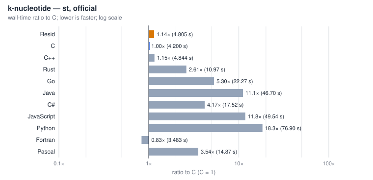

**st, small** (argument `0`, stdin fasta N = 2500000)

| # | Language | wall s [95% CI] | CPU s | util | RSS MiB | vs C | CV | runs | status |
| ---: | --- | ---: | ---: | ---: | ---: | ---: | ---: | ---: | --- |
| 1 | Fortran | 0.361 [0.360–0.362] | 0.360 | 100% | 39.6 | 0.83 | 0% | 5/5 | ok |
| 2 | C | 0.435 [0.431–0.436] | 0.434 | 100% | 26.0 | 1.00 | 0% | 5/5 | ok |
| 3 | Resid | 0.492 [0.490–0.492] | 0.491 | 100% | 44.6 | 1.13 | 0% | 5/5 | ok |
| 4 | C++ | 0.502 [0.500–0.503] | 0.500 | 100% | 22.8 | 1.15 | 0% | 5/5 | ok |
| 5 | Rust | 1.099 [1.098–1.116] | 1.097 | 100% | 28.4 | 2.53 | 1% | 5/5 | ok |
| 6 | Pascal | 1.540 [1.538–1.560] | 1.537 | 100% | 27.2 | 3.54 | 1% | 5/5 | ok |
| 7 | C# | 1.983 [1.981–2.049] | 1.975 | 100% | 119 | 4.56 | 2% | 5/5 | ok |
| 8 | Go | 2.338 [2.310–2.354] | 2.331 | 100% | 60.2 | 5.37 | 1% | 5/5 | ok |
| 9 | Java | 4.839 [4.714–4.930] | 4.827 | 100% | 177 | 11.1 | 2% | 5/5 | ok |
| 10 | JavaScript | 4.920 [4.841–4.954] | 4.908 | 100% | 197 | 11.3 | 1% | 5/5 | ok |
| 11 | Python | 7.362 [7.282–7.449] | 7.346 | 100% | 58.4 | 16.9 | 1% | 5/5 | ok |

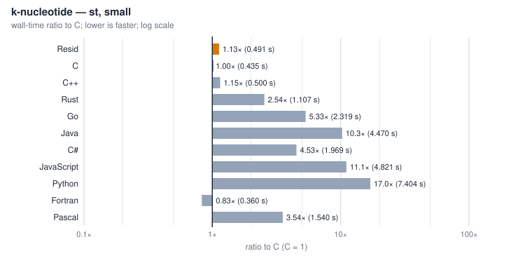

**best, official** (argument `0`, stdin fasta N = 25000000)

| # | Language | wall s [95% CI] | CPU s | util | RSS MiB | vs C | CV | runs | status |
| ---: | --- | ---: | ---: | ---: | ---: | ---: | ---: | ---: | --- |
| 1 | Rust | 0.515 [0.482–1.275] | 2.162 | 420% | 132 | 0.51 | 53% | 5/5 | ok |
| 2 | C++ | 0.586 [0.563–0.601] | 1.744 | 298% | 153 | 0.58 | 2% | 5/5 | ok |
| 3 | C | 1.018 [1.011–1.062] | 3.350 | 329% | 128 | 1.00 | 2% | 5/5 | ok |
| 4 | Java | 1.060 [1.027–1.146] | 9.724 | 917% | 515 | 1.04 | 4% | 5/5 | ok |
| 5 | Go | 1.071 [1.064–1.077] | 13.34 | 1245% | 174 | 1.05 | 0% | 5/5 | ok |
| 6 | Resid | 1.311 [1.257–1.357] | 6.080 | 464% | 267 | 1.29 | 3% | 5/5 | ok |
| 7 | C# | 1.311 [1.298–1.325] | 4.843 | 369% | 189 | 1.29 | 1% | 5/5 | ok |
| 8 | Fortran | 2.975 [2.700–3.001] | 4.322 | 145% | 5175 | 2.92 | 5% | 5/5 | ok |
| 9 | JavaScript | 6.258 [6.232–6.302] | 19.56 | 313% | 448 | 6.15 | 0% | 5/5 | ok |
| 10 | Pascal | 9.610 [9.393–9.913] | 18.84 | 196% | 10656 | 9.44 | 2% | 5/5 | ok |
| 11 | Python | 11.09 [11.05–11.12] | 159.4 | 1437% | 255 | 10.9 | 0% | 5/5 | ok |

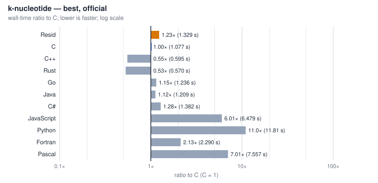

**best, small** (argument `0`, stdin fasta N = 2500000)

| # | Language | wall s [95% CI] | CPU s | util | RSS MiB | vs C | CV | runs | status |
| ---: | --- | ---: | ---: | ---: | ---: | ---: | ---: | ---: | --- |
| 1 | Rust | 0.061 [0.055–0.072] | 0.226 | 370% | 25.3 | 0.53 | 10% | 5/5 | ok |
| 2 | C | 0.115 [0.110–0.116] | 0.446 | 388% | 20.3 | 1.00 | 2% | 5/5 | ok |
| 3 | C++ | 0.120 [0.118–0.122] | 0.256 | 214% | 46.7 | 1.04 | 2% | 5/5 | ok |
| 4 | Resid | 0.142 [0.142–0.151] | 0.649 | 457% | 48.9 | 1.24 | 3% | 5/5 | ok |
| 5 | Go | 0.144 [0.137–0.149] | 1.462 | 1013% | 46.1 | 1.26 | 3% | 5/5 | ok |
| 6 | Java | 0.226 [0.222–0.236] | 1.967 | 871% | 131 | 1.97 | 3% | 5/5 | ok |
| 7 | C# | 0.258 [0.249–0.262] | 0.951 | 369% | 78.2 | 2.24 | 2% | 5/5 | ok |
| 8 | Fortran | 0.259 [0.255–0.278] | 0.516 | 199% | 1040 | 2.25 | 4% | 5/5 | ok |
| 9 | JavaScript | 0.732 [0.730–0.758] | 2.271 | 310% | 206 | 6.37 | 2% | 5/5 | ok |
| 10 | Pascal | 0.772 [0.763–0.873] | 1.653 | 214% | 2419 | 6.72 | 6% | 5/5 | ok |
| 11 | Python | 1.105 [1.086–1.117] | 15.17 | 1373% | 53.7 | 9.62 | 1% | 5/5 | ok |

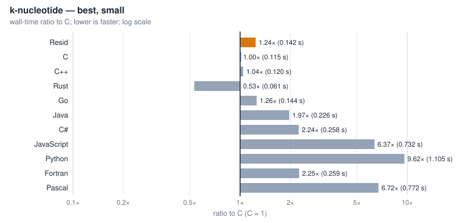

### reverse-complement

**st, official** (argument `0`, stdin fasta N = 25000000)

| # | Language | wall s [95% CI] | CPU s | util | RSS MiB | vs C | CV | runs | status |
| ---: | --- | ---: | ---: | ---: | ---: | ---: | ---: | ---: | --- |
| 1 | C | 0.198 [0.188–0.207] | 0.197 | 100% | 487 | 1.00 | 4% | 5/5 | ok |
| 2 | Go | 0.221 [0.220–0.222] | 0.220 | 100% | 777 | 1.12 | 0% | 5/5 | ok |
| 3 | Rust | 0.229 [0.225–0.236] | 0.228 | 100% | 486 | 1.16 | 2% | 5/5 | ok |
| 4 | Fortran | 0.326 [0.325–0.331] | 0.325 | 100% | 489 | 1.65 | 1% | 5/5 | ok |
| 5 | C# | 0.371 [0.363–0.373] | 0.369 | 100% | 985 | 1.87 | 1% | 5/5 | ok |
| 6 | Resid | 0.388 [0.383–0.425] | 0.386 | 100% | 486 | 1.96 | 5% | 5/5 | ok |
| 7 | C++ | 0.428 [0.427–0.429] | 0.426 | 100% | 489 | 2.16 | 0% | 5/5 | ok |
| 8 | Java | 0.549 [0.523–0.551] | 0.547 | 100% | 1486 | 2.78 | 2% | 5/5 | ok |
| 9 | JavaScript | 0.567 [0.559–0.569] | 0.566 | 100% | 664 | 2.87 | 1% | 5/5 | ok |
| 10 | Pascal | 0.600 [0.598–0.607] | 0.598 | 100% | 503 | 3.03 | 1% | 5/5 | ok |
| 11 | Python | 1.117 [1.112–1.129] | 1.112 | 100% | 836 | 5.65 | 1% | 5/5 | ok |

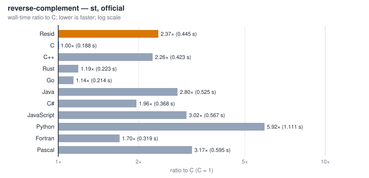

**st, small** (argument `0`, stdin fasta N = 2500000)

| # | Language | wall s [95% CI] | CPU s | util | RSS MiB | vs C | CV | runs | status |
| ---: | --- | ---: | ---: | ---: | ---: | ---: | ---: | ---: | --- |
| 1 | Go | 0.021 [0.021–0.022] | 0.021 | 99% | 80.2 | 0.94 | 2% | 5/5 | ok |
| 2 | C | 0.023 [0.021–0.023] | 0.022 | 99% | 51.7 | 1.00 | 4% | 5/5 | ok |
| 3 | Rust | 0.024 [0.024–0.025] | 0.024 | 99% | 52.7 | 1.07 | 3% | 5/5 | ok |
| 4 | Fortran | 0.037 [0.034–0.039] | 0.037 | 100% | 52.6 | 1.63 | 5% | 5/5 | ok |
| 5 | Resid | 0.039 [0.038–0.044] | 0.039 | 99% | 49.2 | 1.72 | 6% | 5/5 | ok |
| 6 | C++ | 0.043 [0.042–0.044] | 0.043 | 99% | 78.6 | 1.91 | 1% | 5/5 | ok |
| 7 | C# | 0.056 [0.056–0.067] | 0.056 | 99% | 106 | 2.48 | 8% | 5/5 | ok |
| 8 | Pascal | 0.064 [0.064–0.065] | 0.064 | 100% | 57.1 | 2.82 | 1% | 5/5 | ok |
| 9 | JavaScript | 0.085 [0.083–0.087] | 0.085 | 99% | 121 | 3.75 | 2% | 5/5 | ok |
| 10 | Java | 0.099 [0.097–0.105] | 0.099 | 99% | 203 | 4.38 | 3% | 5/5 | ok |
| 11 | Python | 0.123 [0.121–0.125] | 0.123 | 100% | 102 | 5.43 | 1% | 5/5 | ok |

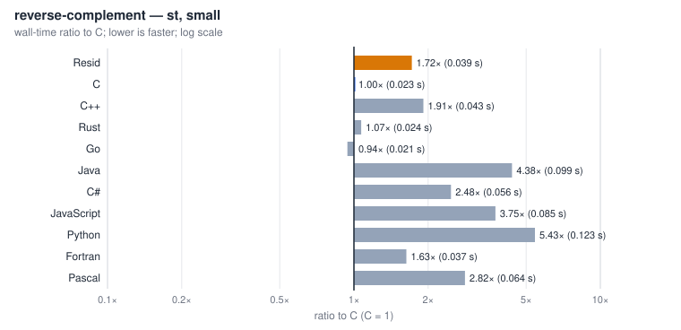

**best, official** (argument `0`, stdin fasta N = 25000000)

| # | Language | wall s [95% CI] | CPU s | util | RSS MiB | vs C | CV | runs | status |
| ---: | --- | ---: | ---: | ---: | ---: | ---: | ---: | ---: | --- |
| 1 | C | 0.090 [0.088–0.091] | 0.120 | 132% | 132 | 1.00 | 1% | 5/5 | ok |
| 2 | Rust | 0.095 [0.093–0.096] | 0.200 | 211% | 125 | 1.05 | 2% | 5/5 | ok |
| 3 | C# | 0.101 [0.097–0.105] | 0.212 | 210% | 156 | 1.12 | 4% | 5/5 | ok |
| 4 | C++ | 0.104 [0.101–0.111] | 0.103 | 100% | 126 | 1.15 | 4% | 5/5 | ok |
| 5 | Go | 0.125 [0.123–0.131] | 0.368 | 295% | 162 | 1.38 | 2% | 5/5 | ok |
| 6 | Resid | 0.220 [0.215–0.224] | 1.392 | 633% | 976 | 2.43 | 2% | 5/5 | ok |
| 7 | Fortran | 0.255 [0.252–0.262] | 0.255 | 100% | 245 | 2.83 | 2% | 5/5 | ok |
| 8 | Java | 0.279 [0.277–0.289] | 0.357 | 128% | 538 | 3.09 | 2% | 5/5 | ok |
| 9 | Pascal | 0.329 [0.326–0.332] | 0.328 | 100% | 130 | 3.65 | 1% | 5/5 | ok |
| 10 | Python | 0.364 [0.356–0.382] | 0.517 | 142% | 379 | 4.04 | 4% | 5/5 | ok |
| 11 | JavaScript | 1.925 [1.911–1.937] | 2.016 | 105% | 231 | 21.3 | 1% | 5/5 | ok |

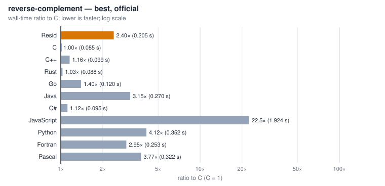

**best, small** (argument `0`, stdin fasta N = 2500000)

| # | Language | wall s [95% CI] | CPU s | util | RSS MiB | vs C | CV | runs | status |
| ---: | --- | ---: | ---: | ---: | ---: | ---: | ---: | ---: | --- |
| 1 | Rust | 0.010 [0.009–0.022] | 0.016 | 166% | 16.4 | 0.95 | 45% | 5/5 | ok |
| 2 | C | 0.010 [0.010–0.011] | 0.018 | 177% | 22.0 | 1.00 | 3% | 5/5 | ok |
| 3 | C++ | 0.011 [0.010–0.014] | 0.011 | 99% | 17.1 | 1.05 | 13% | 5/5 | ok |
| 4 | Go | 0.014 [0.013–0.015] | 0.042 | 301% | 45.8 | 1.36 | 3% | 5/5 | ok |
| 5 | Resid | 0.021 [0.020–0.022] | 0.125 | 601% | 99.0 | 2.02 | 4% | 5/5 | ok |
| 6 | Fortran | 0.028 [0.026–0.028] | 0.028 | 100% | 28.7 | 2.69 | 4% | 5/5 | ok |
| 7 | Pascal | 0.032 [0.032–0.037] | 0.032 | 99% | 17.8 | 3.11 | 7% | 5/5 | ok |
| 8 | C# | 0.032 [0.031–0.044] | 0.053 | 165% | 59.8 | 3.13 | 15% | 5/5 | ok |
| 9 | Java | 0.051 [0.050–0.051] | 0.083 | 162% | 96.9 | 4.94 | 2% | 5/5 | ok |
| 10 | Python | 0.073 [0.070–0.078] | 0.092 | 126% | 49.3 | 7.07 | 4% | 5/5 | ok |
| 11 | JavaScript | 0.222 [0.218–0.227] | 0.245 | 111% | 95.1 | 21.4 | 1% | 5/5 | ok |

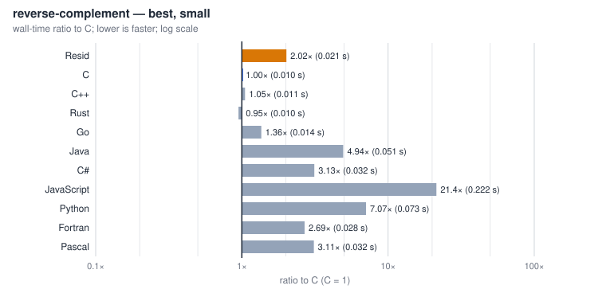

### pidigits

**st, official** (argument `10000`)

| # | Language | wall s [95% CI] | CPU s | util | RSS MiB | vs C | CV | runs | status |
| ---: | --- | ---: | ---: | ---: | ---: | ---: | ---: | ---: | --- |
| 1 | C | 0.398 [0.398–0.398] | 0.397 | 100% | 2.9 | 1.00 | 0% | 5/5 | ok |
| 2 | Fortran | 0.398 [0.398–0.399] | 0.397 | 100% | 4.0 | 1.00 | 0% | 5/5 | ok |
| 3 | Pascal | 0.398 [0.398–0.399] | 0.397 | 100% | 3.2 | 1.00 | 0% | 5/5 | ok |
| 4 | C++ | 0.399 [0.399–0.399] | 0.398 | 100% | 5.0 | 1.00 | 0% | 5/5 | ok |
| 5 | Rust | 0.416 [0.416–0.417] | 0.415 | 100% | 3.3 | 1.05 | 0% | 5/5 | ok |
| 6 | Resid | 0.433 [0.433–0.434] | 0.433 | 100% | 2.8 | 1.09 | 0% | 5/5 | ok |
| 7 | Go | 0.820 [0.818–0.823] | 0.817 | 100% | 10.5 | 2.06 | 0% | 5/5 | ok |
| 8 | Java | 1.779 [1.771–1.783] | 1.774 | 100% | 57.5 | 4.47 | 0% | 5/5 | ok |
| 9 | Python | 1.833 [1.829–1.859] | 1.829 | 100% | 10.8 | 4.61 | 1% | 5/5 | ok |
| 10 | C# | 2.453 [2.448–2.473] | 2.446 | 100% | 41.2 | 6.17 | 0% | 5/5 | ok |
| 11 | JavaScript | 4.757 [4.660–4.878] | 4.742 | 100% | 123 | 12.0 | 2% | 5/5 | ok |

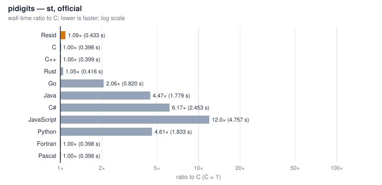

**st, small** (argument `2000`)

| # | Language | wall s [95% CI] | CPU s | util | RSS MiB | vs C | CV | runs | status |
| ---: | --- | ---: | ---: | ---: | ---: | ---: | ---: | ---: | --- |
| 1 | C | 0.014 [0.014–0.014] | 0.014 | 99% | 2.5 | 1.00 | 0% | 5/5 | ok |
| 2 | Pascal | 0.014 [0.014–0.014] | 0.014 | 99% | 3.0 | 1.01 | 0% | 5/5 | ok |
| 3 | Fortran | 0.014 [0.014–0.015] | 0.014 | 100% | 3.7 | 1.01 | 1% | 5/5 | ok |
| 4 | C++ | 0.015 [0.015–0.015] | 0.015 | 99% | 4.8 | 1.02 | 1% | 5/5 | ok |
| 5 | Rust | 0.015 [0.015–0.016] | 0.015 | 99% | 2.9 | 1.05 | 4% | 5/5 | ok |
| 6 | Resid | 0.019 [0.019–0.020] | 0.019 | 100% | 0.7 | 1.35 | 1% | 5/5 | ok |
| 7 | Go | 0.032 [0.032–0.033] | 0.032 | 99% | 10.4 | 2.23 | 1% | 5/5 | ok |
| 8 | Python | 0.071 [0.071–0.072] | 0.071 | 100% | 10.4 | 4.98 | 0% | 5/5 | ok |
| 9 | C# | 0.112 [0.112–0.124] | 0.112 | 100% | 35.2 | 7.86 | 5% | 5/5 | ok |
| 10 | JavaScript | 0.151 [0.146–0.152] | 0.150 | 100% | 65.2 | 10.5 | 2% | 5/5 | ok |
| 11 | Java | 0.232 [0.224–0.234] | 0.230 | 99% | 50.4 | 16.2 | 2% | 5/5 | ok |

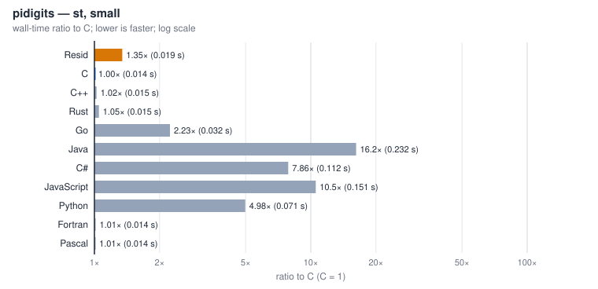

**best, official** (argument `10000`)

| # | Language | wall s [95% CI] | CPU s | util | RSS MiB | vs C | CV | runs | status |
| ---: | --- | ---: | ---: | ---: | ---: | ---: | ---: | ---: | --- |
| 1 | C | 0.368 [0.366–0.371] | 0.367 | 100% | 2.9 | 1.00 | 1% | 5/5 | ok |
| 2 | Rust | 0.374 [0.371–0.377] | 0.373 | 100% | 3.1 | 1.02 | 1% | 5/5 | ok |
| 3 | Fortran | 0.399 [0.398–0.404] | 0.398 | 100% | 3.9 | 1.08 | 1% | 5/5 | ok |
| 4 | Pascal | 0.400 [0.398–0.406] | 0.400 | 100% | 2.9 | 1.09 | 1% | 5/5 | ok |
| 5 | C++ | 0.401 [0.400–0.404] | 0.400 | 100% | 4.8 | 1.09 | 0% | 5/5 | ok |
| 6 | Go | 0.419 [0.417–0.422] | 0.419 | 100% | 8.6 | 1.14 | 0% | 5/5 | ok |
| 7 | C# | 0.420 [0.419–0.421] | 0.421 | 100% | 28.3 | 1.14 | 0% | 5/5 | ok |
| 8 | Java | 0.424 [0.421–0.429] | 0.445 | 105% | 46.4 | 1.15 | 1% | 5/5 | ok |
| 9 | Resid | 0.460 [0.458–0.468] | 0.459 | 100% | 2.6 | 1.25 | 1% | 5/5 | ok |
| 10 | Python | 0.558 [0.554–0.561] | 0.557 | 100% | 15.9 | 1.52 | 1% | 5/5 | ok |
| 11 | JavaScript | 4.721 [4.646–4.949] | 4.731 | 100% | 127 | 12.8 | 3% | 5/5 | ok |

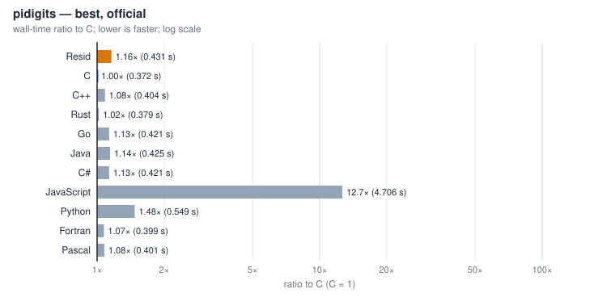

**best, small** (argument `2000`)

| # | Language | wall s [95% CI] | CPU s | util | RSS MiB | vs C | CV | runs | status |
| ---: | --- | ---: | ---: | ---: | ---: | ---: | ---: | ---: | --- |
| 1 | C | 0.013 [0.013–0.015] | 0.013 | 99% | 2.6 | 1.00 | 5% | 5/5 | ok |
| 2 | Rust | 0.014 [0.014–0.026] | 0.014 | 99% | 2.8 | 1.08 | 31% | 5/5 | ok |
| 3 | Pascal | 0.015 [0.014–0.015] | 0.015 | 99% | 2.4 | 1.11 | 2% | 5/5 | ok |
| 4 | Fortran | 0.015 [0.015–0.018] | 0.015 | 100% | 3.7 | 1.15 | 9% | 5/5 | ok |
| 5 | C++ | 0.016 [0.015–0.022] | 0.016 | 99% | 4.8 | 1.18 | 16% | 5/5 | ok |
| 6 | Go | 0.020 [0.019–0.021] | 0.020 | 101% | 8.2 | 1.50 | 5% | 5/5 | ok |
| 7 | Resid | 0.021 [0.020–0.022] | 0.021 | 99% | 0.7 | 1.59 | 3% | 5/5 | ok |
| 8 | Java | 0.030 [0.029–0.031] | 0.042 | 140% | 42.8 | 2.25 | 3% | 5/5 | ok |
| 9 | C# | 0.031 [0.030–0.034] | 0.032 | 103% | 27.3 | 2.32 | 4% | 5/5 | ok |
| 10 | Python | 0.066 [0.065–0.067] | 0.066 | 100% | 15.4 | 4.94 | 2% | 5/5 | ok |
| 11 | JavaScript | 0.146 [0.144–0.151] | 0.151 | 103% | 67.2 | 10.9 | 2% | 5/5 | ok |

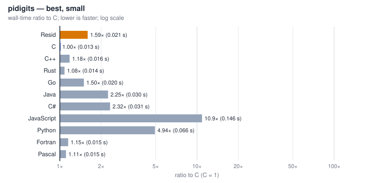

### regex-redux

**st, official** (argument `0`, stdin fasta N = 5000000)

| # | Language | wall s [95% CI] | CPU s | util | RSS MiB | vs C | CV | runs | status |
| ---: | --- | ---: | ---: | ---: | ---: | ---: | ---: | ---: | --- |
| 1 | Rust | 0.577 [0.571–0.581] | 0.575 | 100% | 153 | 0.36 | 1% | 5/5 | ok |
| 2 | C | 1.602 [1.593–1.610] | 1.598 | 100% | 153 | 1.00 | 0% | 5/5 | ok |
| 3 | Fortran | 1.656 [1.653–1.660] | 1.651 | 100% | 104 | 1.03 | 0% | 5/5 | ok |
| 4 | JavaScript | 1.752 [1.750–1.872] | 1.746 | 100% | 636 | 1.09 | 3% | 5/5 | ok |
| 5 | C# | 2.074 [2.072–2.083] | 2.064 | 99% | 783 | 1.29 | 0% | 5/5 | ok |
| 6 | Resid | 2.372 [2.363–2.377] | 2.366 | 100% | 321 | 1.48 | 0% | 5/5 | ok |
| 7 | Python | 6.184 [6.103–6.304] | 6.169 | 100% | 372 | 3.86 | 1% | 5/5 | ok |
| 8 | Java | 6.494 [6.431–6.641] | 6.480 | 100% | 952 | 4.05 | 1% | 5/5 | ok |
| 9 | Go | 16.77 [16.66–16.90] | 16.73 | 100% | 276 | 10.5 | 1% | 5/5 | ok |
| 10 | Pascal | 18.07 [17.96–18.18] | 18.01 | 100% | 247 | 11.3 | 0% | 5/5 | ok |
| 11 | C++ | 20.07 [19.76–20.20] | 20.03 | 100% | 196 | 12.5 | 1% | 5/5 | ok |

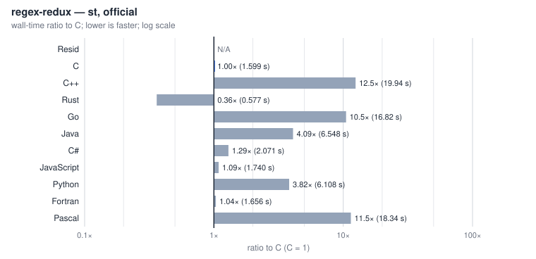

**st, small** (argument `0`, stdin fasta N = 500000)

| # | Language | wall s [95% CI] | CPU s | util | RSS MiB | vs C | CV | runs | status |
| ---: | --- | ---: | ---: | ---: | ---: | ---: | ---: | ---: | --- |
| 1 | Rust | 0.062 [0.061–0.073] | 0.061 | 99% | 24.9 | 0.37 | 8% | 5/5 | ok |
| 2 | C | 0.166 [0.165–0.168] | 0.165 | 100% | 20.6 | 1.00 | 1% | 5/5 | ok |
| 3 | Fortran | 0.170 [0.169–0.170] | 0.169 | 100% | 22.2 | 1.02 | 0% | 5/5 | ok |
| 4 | JavaScript | 0.171 [0.170–0.173] | 0.170 | 99% | 163 | 1.03 | 1% | 5/5 | ok |
| 5 | Resid | 0.241 [0.241–0.243] | 0.241 | 100% | 36.3 | 1.46 | 0% | 5/5 | ok |
| 6 | C# | 0.259 [0.258–0.305] | 0.258 | 100% | 104 | 1.56 | 8% | 5/5 | ok |
| 7 | Python | 0.632 [0.628–0.648] | 0.630 | 100% | 51.8 | 3.81 | 1% | 5/5 | ok |
| 8 | Java | 0.927 [0.917–0.930] | 0.924 | 100% | 146 | 5.60 | 1% | 5/5 | ok |
| 9 | Pascal | 1.237 [1.234–1.242] | 1.235 | 100% | 26.0 | 7.47 | 0% | 5/5 | ok |
| 10 | Go | 1.733 [1.722–1.753] | 1.729 | 100% | 35.7 | 10.5 | 1% | 5/5 | ok |
| 11 | C++ | 2.005 [1.997–2.020] | 2.000 | 100% | 29.7 | 12.1 | 0% | 5/5 | ok |

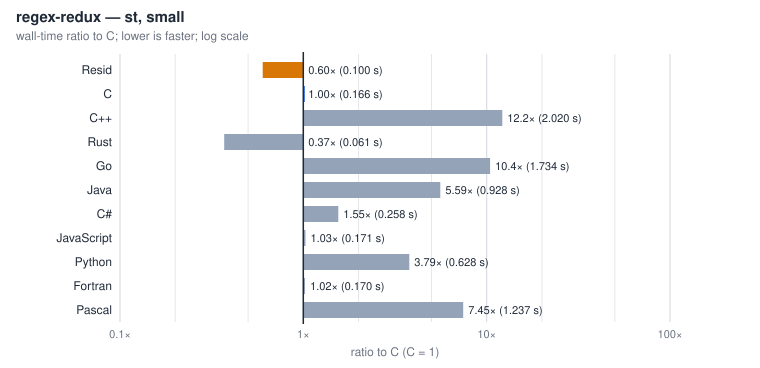

**best, official** (argument `0`, stdin fasta N = 5000000)

| # | Language | wall s [95% CI] | CPU s | util | RSS MiB | vs C | CV | runs | status |
| ---: | --- | ---: | ---: | ---: | ---: | ---: | ---: | ---: | --- |
| 1 | C | 0.385 [0.371–0.421] | 2.066 | 537% | 151 | 1.00 | 6% | 5/5 | ok |
| 2 | Fortran | 0.397 [0.386–0.432] | 2.081 | 525% | 168 | 1.03 | 5% | 5/5 | ok |
| 3 | Rust | 0.399 [0.362–0.408] | 1.830 | 459% | 145 | 1.04 | 5% | 5/5 | ok |
| 4 | C++ | 0.401 [0.397–0.420] | 1.898 | 473% | 271 | 1.04 | 2% | 5/5 | ok |
| 5 | C# | 0.516 [0.510–0.563] | 2.025 | 393% | 388 | 1.34 | 5% | 5/5 | ok |
| 6 | Python | 0.572 [0.541–0.593] | 2.125 | 372% | 166 | 1.49 | 3% | 5/5 | ok |
| 7 | Java | 0.625 [0.608–0.634] | 2.312 | 370% | 375 | 1.63 | 2% | 5/5 | ok |
| 8 | Go | 0.913 [0.902–0.919] | 2.486 | 272% | 304 | 2.37 | 1% | 5/5 | ok |
| 9 | Resid | 1.313 [1.302–1.324] | 2.845 | 217% | 324 | 3.41 | 1% | 5/5 | ok |
| 10 | JavaScript | 1.631 [1.623–1.635] | 1.819 | 112% | 1209 | 4.24 | 0% | 5/5 | ok |
| 11 | Pascal | 2.279 [2.269–2.285] | 2.274 | 100% | 101 | 5.92 | 0% | 5/5 | ok |

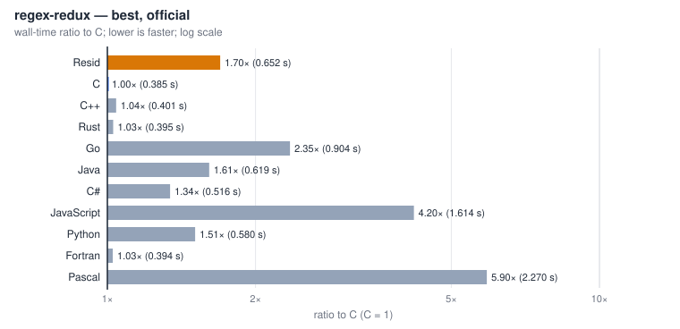

**best, small** (argument `0`, stdin fasta N = 500000)

| # | Language | wall s [95% CI] | CPU s | util | RSS MiB | vs C | CV | runs | status |
| ---: | --- | ---: | ---: | ---: | ---: | ---: | ---: | ---: | --- |
| 1 | C++ | 0.044 [0.043–0.051] | 0.202 | 464% | 33.9 | 0.98 | 7% | 5/5 | ok |
| 2 | Rust | 0.044 [0.041–0.057] | 0.197 | 444% | 17.8 | 1.00 | 14% | 5/5 | ok |
| 3 | C | 0.045 [0.044–0.055] | 0.351 | 789% | 19.9 | 1.00 | 10% | 5/5 | ok |
| 4 | Fortran | 0.048 [0.044–0.053] | 0.363 | 748% | 24.3 | 1.09 | 8% | 5/5 | ok |
| 5 | C# | 0.083 [0.082–0.090] | 0.256 | 309% | 80.1 | 1.86 | 4% | 5/5 | ok |
| 6 | Go | 0.096 [0.093–0.098] | 0.258 | 268% | 41.8 | 2.16 | 2% | 5/5 | ok |
| 7 | Python | 0.097 [0.090–0.099] | 0.278 | 288% | 33.2 | 2.17 | 4% | 5/5 | ok |
| 8 | Java | 0.129 [0.129–0.138] | 0.477 | 370% | 103 | 2.90 | 3% | 5/5 | ok |
| 9 | Resid | 0.137 [0.135–0.152] | 0.289 | 210% | 39.8 | 3.08 | 5% | 5/5 | ok |
| 10 | JavaScript | 0.166 [0.164–0.169] | 0.205 | 123% | 196 | 3.73 | 1% | 5/5 | ok |
| 11 | Pascal | 0.238 [0.236–0.241] | 0.237 | 100% | 12.6 | 5.34 | 1% | 5/5 | ok |

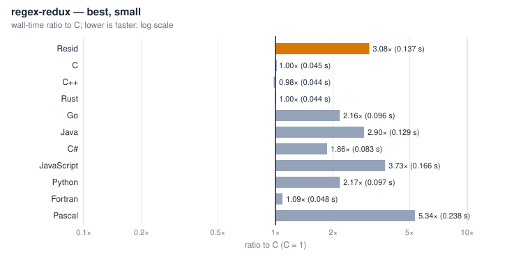

## Coverage

Cell status per track (official size). `ok` = verified output; `N/A` = the cell has an `NA` file; `missing` = no cell yet.

**st, official**

| Language | `nbody` | `fannkuch-redux` | `spectral-norm` | `mandelbrot` | `binary-trees` | `fasta` | `k-nucleotide` | `reverse-complement` | `pidigits` | `regex-redux` |
| --- | ---: | ---: | ---: | ---: | ---: | ---: | ---: | ---: | ---: | ---: |
| Resid | ok | ok | ok | ok | ok | ok | ok | ok | ok | ok |
| C | ok | ok | ok | ok | ok | ok | ok | ok | ok | ok |
| C++ | ok | ok | ok | ok | ok | ok | ok | ok | ok | ok |
| Rust | ok | ok | ok | ok | ok | ok | ok | ok | ok | ok |
| Go | ok | ok | ok | ok | ok | ok | ok | ok | ok | ok |
| Java | ok | ok | ok | ok | ok | ok | ok | ok | ok | ok |
| C# | ok | ok | ok | ok | ok | ok | ok | ok | ok | ok |
| JavaScript | ok | ok | ok | ok | ok | ok | ok | ok | ok | ok |
| Python | ok | ok | ok | ok | ok | ok | ok | ok | ok | ok |
| Fortran | ok | ok | ok | ok | ok | ok | ok | ok | ok | ok |
| Pascal | ok | ok | ok | ok | ok | ok | ok | ok | ok | ok |

**st, small**

| Language | `nbody` | `fannkuch-redux` | `spectral-norm` | `mandelbrot` | `binary-trees` | `fasta` | `k-nucleotide` | `reverse-complement` | `pidigits` | `regex-redux` |
| --- | ---: | ---: | ---: | ---: | ---: | ---: | ---: | ---: | ---: | ---: |
| Resid | ok | ok | ok | ok | ok | ok | ok | ok | ok | ok |
| C | ok | ok | ok | ok | ok | ok | ok | ok | ok | ok |
| C++ | ok | ok | ok | ok | ok | ok | ok | ok | ok | ok |
| Rust | ok | ok | ok | ok | ok | ok | ok | ok | ok | ok |
| Go | ok | ok | ok | ok | ok | ok | ok | ok | ok | ok |
| Java | ok | ok | ok | ok | ok | ok | ok | ok | ok | ok |
| C# | ok | ok | ok | ok | ok | ok | ok | ok | ok | ok |
| JavaScript | ok | ok | ok | ok | ok | ok | ok | ok | ok | ok |
| Python | ok | ok | ok | ok | ok | ok | ok | ok | ok | ok |
| Fortran | ok | ok | ok | ok | ok | ok | ok | ok | ok | ok |
| Pascal | ok | ok | ok | ok | ok | ok | ok | ok | ok | ok |

**best, official**

| Language | `nbody` | `fannkuch-redux` | `spectral-norm` | `mandelbrot` | `binary-trees` | `fasta` | `k-nucleotide` | `reverse-complement` | `pidigits` | `regex-redux` |
| --- | ---: | ---: | ---: | ---: | ---: | ---: | ---: | ---: | ---: | ---: |
| Resid | ok | ok | ok | ok | ok | ok | ok | ok | ok | ok |
| C | ok | ok | ok | ok | ok | ok | ok | ok | ok | ok |
| C++ | ok | ok | ok | ok | ok | ok | ok | ok | ok | ok |
| Rust | ok | ok | ok | ok | ok | ok | ok | ok | ok | ok |
| Go | ok | ok | ok | ok | ok | ok | ok | ok | ok | ok |
| Java | ok | ok | ok | ok | ok | ok | ok | ok | ok | ok |
| C# | ok | ok | ok | ok | ok | ok | ok | ok | ok | ok |
| JavaScript | ok | ok | ok | ok | ok | ok | ok | ok | ok | ok |
| Python | ok | ok | ok | ok | ok | ok | ok | ok | ok | ok |
| Fortran | ok | ok | ok | ok | ok | ok | ok | ok | ok | ok |
| Pascal | ok | ok | ok | ok | ok | ok | ok | ok | ok | ok |

**best, small**

| Language | `nbody` | `fannkuch-redux` | `spectral-norm` | `mandelbrot` | `binary-trees` | `fasta` | `k-nucleotide` | `reverse-complement` | `pidigits` | `regex-redux` |
| --- | ---: | ---: | ---: | ---: | ---: | ---: | ---: | ---: | ---: | ---: |
| Resid | ok | ok | ok | ok | ok | ok | ok | ok | ok | ok |
| C | ok | ok | ok | ok | ok | ok | ok | ok | ok | ok |
| C++ | ok | ok | ok | ok | ok | ok | ok | ok | ok | ok |
| Rust | ok | ok | ok | ok | ok | ok | ok | ok | ok | ok |
| Go | ok | ok | ok | ok | ok | ok | ok | ok | ok | ok |
| Java | ok | ok | ok | ok | ok | ok | ok | ok | ok | ok |
| C# | ok | ok | ok | ok | ok | ok | ok | ok | ok | ok |
| JavaScript | ok | ok | ok | ok | ok | ok | ok | ok | ok | ok |
| Python | ok | ok | ok | ok | ok | ok | ok | ok | ok | ok |
| Fortran | ok | ok | ok | ok | ok | ok | ok | ok | ok | ok |
| Pascal | ok | ok | ok | ok | ok | ok | ok | ok | ok | ok |

`ok?` = completed but no C reference output to verify against; `*` = stale (source changed after the runs).

## Appendix: cell notes and provenance

<details><summary><code>st/nbody/resid</code></summary>

#### nbody (Resid, st)

Port of the n-body description
(https://benchmarksgame-team.pages.debian.net/benchmarksgame/description/nbody.html),
following the operation order of the reference C program (Benchmarks Game,
3-clause BSD) so every floating-point rounding matches.

Deviations and workarounds:

- The five bodies (positions, velocities, masses) are 35 `Float` scalar
  parameters of the tail-recursive `advance` loop instead of an array of
  structs: Resid has no mutable records/arrays and a list or record per
  step would be allocated and never freed (50M steps). The ten pair
  interactions are unrolled mechanically in reference order (i < j).
- `sqrt` is the builtin correctly rounded IEEE square root (one
  `sqrtsd`), as in the C program.
- Resid has no `printf`; `fmt9` formats `%.9f` exactly (fraction scaled by
  1e9 in `Float(128)`, round half to even on the exact binary value).

General Resid constraints that shape this port (see the source header too):

- No mutation or reassignment; every loop is a self tail call (or a tail
  call between functions of identical signature), which the compiler turns
  into a jump/`musttail`, so loops do not grow the stack.
- No `free` and no garbage collector. The compiler releases everything a
  scalar binding's initializer allocates (`Int x = f(...)` runs in a
  scalar scope; the runtime's scope regions are in `runtime/rt/alloc.resid`); anything else allocated per
  iteration stays live for the rest of the run, so hot loops keep their
  state in scalar parameters.
- (Written when `Int * Int` widened to `Int(128)`; the `i64(...)` narrowings
  it needed are now no-ops: every operator keeps the operand width, spec §6.1.)
- (Written when `&&`/`||` evaluated both operands; they short-circuit now,
  spec §30, so the nested `if`s are only a style.)
- Compiled with the default `-O2` (`build/boot/stage2.bin`, which links the
  runtime with `clang -O2`).

Measured (this host, 2026-09-27): size 50000000 1.45 s pinned to CPU 2
(C: 1.87 s), output identical to C. Before the `sqrt` builtin the program
computed the root with Newton iterations and a Dekker correction: 2.81 s.

</details>

<details><summary><code>st/nbody/c</code></summary>

#### nbody — C (gcc) (st track)

Written for this suite (not copied from the Benchmarks Game). Implements the
algorithm from the Benchmarks Game description of nbody: single-threaded, no
SIMD intrinsics, no inline assembly, no `-march=native`.

Build: `gcc -O2` (see `build`).

This cell is the harness reference: every other language's output is compared
against its stdout (sha256).

Verified: output identical to the Benchmarks Game expected output at its test
size, and byte-identical to the C `st` cell at the contract small size.

</details>

<details><summary><code>st/nbody/cpp</code></summary>

#### nbody — C++ (g++) (st track)

Written for this suite (not copied from the Benchmarks Game). Implements the
algorithm from the Benchmarks Game description of nbody: single-threaded, no
SIMD intrinsics, no inline assembly, no `-march=native`.

Build: `g++ -O2 -std=c++17` (see `build`).

Verified: output identical to the Benchmarks Game expected output at its test
size, and byte-identical to the C `st` cell at the contract small size.

</details>

<details><summary><code>st/nbody/rust</code></summary>

#### n-body — Rust, st track

Written for this suite (not copied from the Benchmarks Game); follows the
Benchmarks Game n-body description, single-threaded, no SIMD intrinsics
or `std::arch`, no `target-cpu` flag.

Build: `rustc --edition 2021 -C opt-level=3`.

Standard library only; plain array-of-structs, scalar f64 arithmetic.

Verified: output byte-identical to the Benchmarks Game expected output file
and, at the contract small size, to the C st cell and the Rust/Go best cells.

</details>

<details><summary><code>st/nbody/go</code></summary>

#### n-body — Go, st track

Written for this suite (not copied from the Benchmarks Game); follows the
Benchmarks Game n-body description, single goroutine, no assembly.

Build: `go build` with default flags (go.mod declares `go 1.27`; default
GOAMD64, default GOCACHE).

Standard library only; slice of structs, scalar float64 arithmetic.

Verified: output byte-identical to the Benchmarks Game expected output file
and, at the contract small size, to the C st cell and the Rust/Go best cells.

</details>

<details><summary><code>st/nbody/java</code></summary>

#### nbody / java (st)

Written for this suite from the Benchmarks Game description of the algorithm:
single-threaded, no SIMD (no jdk.incubator.vector), no JNI/FFM.


- Toolchain: OpenJDK 26 `javac -d out`, run with default HotSpot flags (`java -cp out ...`).
- Verified byte-identical against the Benchmarks Game expected output at its
  reference size, and against the `best` java/csharp cells at the contract small size.

</details>

<details><summary><code>st/nbody/csharp</code></summary>

#### nbody / csharp (st)

Written for this suite from the Benchmarks Game description of the algorithm:
single-threaded, no SIMD (no System.Runtime.Intrinsics, no Vector<T>), no unsafe code, no P/Invoke.


- Toolchain: .NET SDK 10, minimal console project (net10.0), `dotnet build -c Release -o out`.
  Default Release settings: workstation GC, TieredCompilation/TieredPGO defaults,
  no ReadyToRun, no NativeAOT. `InvariantGlobalization` is on so the process does not
  depend on ICU being installed (all formatting is culture-invariant anyway).
- `Directory.Build.props` redirects obj/ and bin/ under ./out/ so every build artifact
  stays in out/ as the suite contract requires.
- The harness runs the framework-dependent apphost `./out/<name>` directly (no `dotnet run`).
- Verified byte-identical against the Benchmarks Game expected output at its
  reference size, and against the `best` java/csharp cells at the contract small size.

</details>

<details><summary><code>st/nbody/javascript</code></summary>

#### st / nbody / javascript

Written for this suite. It follows the Benchmarks Game description of nbody, single-threaded (node, no worker_threads).

Algorithm: Plain double-precision loop over body pairs, dt=0.01.

No deviations from the reference algorithm.

</details>

<details><summary><code>st/nbody/python</code></summary>

#### st / nbody / python

Written for this suite. It follows the Benchmarks Game description of nbody, single-threaded (CPython, stdlib only, no multiprocessing or native extensions).

Algorithm: Plain double-precision loop over body pairs, dt=0.01.

No deviations from the reference algorithm.

</details>

<details><summary><code>st/nbody/fortran</code></summary>

#### nbody / fortran / st

Own implementation of the Benchmarks Game n-body algorithm (symplectic Euler, 5 bodies, dt 0.01). Energies printed with `f40.9` then left-trimmed, so the leading `0` of `-0.169...` is kept (gfortran `f0.9` would drop it).

Single-threaded, no SIMD intrinsics. Build: `gfortran -O2` (GCC 16.2.1).

</details>

<details><summary><code>st/nbody/pascal</code></summary>

#### nbody / pascal / st

Own implementation of the Benchmarks Game n-body algorithm (symplectic Euler, 5 bodies, dt 0.01), with doubles throughout.

Free Pascal 3.2.2 stands in for Delphi/Object Pascal. Single-threaded, no SIMD intrinsics. Build: `fpc -O2`.

</details>

<details><summary><code>st/fannkuch-redux/resid</code></summary>

#### fannkuch-redux (Resid, st)

Port of the fannkuch-redux description
(https://benchmarksgame-team.pages.debian.net/benchmarksgame/description/fannkuchredux.html):
permutations generated in the reference order (count[] rotation scheme),
checksum with alternating sign by permutation index, output
`checksum\nPfannkuchen(n) = maxflips`.

Deviations and workarounds:

- No mutable arrays: the permutation (n <= 16) and the count[] array are
  each packed 4 bits per element into one `Int`. A pancake flip of the
  first k+1 elements is done in O(1) with a full 16-nibble reversal
  (shift/mask swaps) and a shift, rather than an element-by-element swap
  loop; rotating perm1's prefix is also O(1). The algorithm (which
  permutations are visited, in which order, and how flips are counted) is
  unchanged.
- The two nested loops of the reference are two mutually tail-calling
  functions with identical signatures (`run`/`next_perm`), which the
  compiler emits as `musttail` calls; nothing is allocated in the main loop.
- The nibble reversal masks the high half after its last `>>`: `>>` on a
  signed Int is arithmetic (spec §6.1), and without the mask a nibble >= 8
  landing at the top sign-extended into the result (wrong from n = 9 on;
  fixed 2026-09-27).
- The final (checksum, maxflips) pair is returned packed as one `Int`
  (`checksum * 256 + maxflips`) to avoid a record allocation.

General Resid constraints that shape this port (see the source header too):

- No mutation or reassignment; every loop is a self tail call (or a tail
  call between functions of identical signature), which the compiler turns
  into a jump/`musttail`, so loops do not grow the stack.
- No `free` and no garbage collector. The compiler releases everything a
  scalar binding's initializer allocates (`Int x = f(...)` runs in a
  scalar scope; the runtime's scope regions are in `runtime/rt/alloc.resid`); anything else allocated per
  iteration stays live for the rest of the run, so hot loops keep their
  state in scalar parameters.
- (Written when `Int * Int` widened to `Int(128)`; the `i64(...)` narrowings
  it needed are now no-ops: every operator keeps the operand width, spec §6.1.)
- (Written when `&&`/`||` evaluated both operands; they short-circuit now,
  spec §30, so the nested `if`s are only a style.)
- Compiled with the default `-O2` (`build/boot/stage2.bin`, which links the
  runtime with `clang -O2`).

Measured (this host): size 10 0.11 s, 7.9 MB peak RSS; size 12
17.7 s, 7.9 MB (checksum 3968050, maxflips 65).

</details>

<details><summary><code>st/fannkuch-redux/c</code></summary>

#### fannkuch-redux — C (gcc) (st track)

Written for this suite (not copied from the Benchmarks Game). Implements the
algorithm from the Benchmarks Game description of fannkuch-redux: single-threaded, no
SIMD intrinsics, no inline assembly, no `-march=native`.

Build: `gcc -O2` (see `build`).

This cell is the harness reference: every other language's output is compared
against its stdout (sha256).

Verified: output identical to the Benchmarks Game expected output at its test
size, and byte-identical to the C `st` cell at the contract small size.

</details>

<details><summary><code>st/fannkuch-redux/cpp</code></summary>

#### fannkuch-redux — C++ (g++) (st track)

Written for this suite (not copied from the Benchmarks Game). Implements the
algorithm from the Benchmarks Game description of fannkuch-redux: single-threaded, no
SIMD intrinsics, no inline assembly, no `-march=native`.

Build: `g++ -O2 -std=c++17` (see `build`).

Verified: output identical to the Benchmarks Game expected output at its test
size, and byte-identical to the C `st` cell at the contract small size.

</details>

<details><summary><code>st/fannkuch-redux/rust</code></summary>

#### fannkuch-redux — Rust, st track

Written for this suite (not copied from the Benchmarks Game); follows the
Benchmarks Game fannkuch-redux description, single-threaded, no SIMD intrinsics
or `std::arch`, no `target-cpu` flag.

Build: `rustc --edition 2021 -C opt-level=3`.

Standard library only; one pass over all n! permutations in the reference generation order.

Verified: output byte-identical to the Benchmarks Game expected output file
and, at the contract small size, to the C st cell and the Rust/Go best cells.

</details>

<details><summary><code>st/fannkuch-redux/go</code></summary>

#### fannkuch-redux — Go, st track

Written for this suite (not copied from the Benchmarks Game); follows the
Benchmarks Game fannkuch-redux description, single goroutine, no assembly.

Build: `go build` with default flags (go.mod declares `go 1.27`; default
GOAMD64, default GOCACHE).

Standard library only; one pass over all n! permutations in the reference generation order.

Verified: output byte-identical to the Benchmarks Game expected output file
and, at the contract small size, to the C st cell and the Rust/Go best cells.

</details>

<details><summary><code>st/fannkuch-redux/java</code></summary>

#### fannkuch-redux / java (st)

Written for this suite from the Benchmarks Game description of the algorithm:
single-threaded, no SIMD (no jdk.incubator.vector), no JNI/FFM.


- Toolchain: OpenJDK 26 `javac -d out`, run with default HotSpot flags (`java -cp out ...`).
- Verified byte-identical against the Benchmarks Game expected output at its
  reference size, and against the `best` java/csharp cells at the contract small size.

</details>

<details><summary><code>st/fannkuch-redux/csharp</code></summary>

#### fannkuch-redux / csharp (st)

Written for this suite from the Benchmarks Game description of the algorithm:
single-threaded, no SIMD (no System.Runtime.Intrinsics, no Vector<T>), no unsafe code, no P/Invoke.


- Toolchain: .NET SDK 10, minimal console project (net10.0), `dotnet build -c Release -o out`.
  Default Release settings: workstation GC, TieredCompilation/TieredPGO defaults,
  no ReadyToRun, no NativeAOT. `InvariantGlobalization` is on so the process does not
  depend on ICU being installed (all formatting is culture-invariant anyway).
- `Directory.Build.props` redirects obj/ and bin/ under ./out/ so every build artifact
  stays in out/ as the suite contract requires.
- The harness runs the framework-dependent apphost `./out/<name>` directly (no `dotnet run`).
- Verified byte-identical against the Benchmarks Game expected output at its
  reference size, and against the `best` java/csharp cells at the contract small size.

</details>

<details><summary><code>st/fannkuch-redux/javascript</code></summary>

#### st / fannkuch-redux / javascript

Written for this suite. It follows the Benchmarks Game description of fannkuch-redux, single-threaded (node, no worker_threads).

Algorithm: Permutation generation in the reference C order, with prefix flips and an alternating-sign checksum.

No deviations from the reference algorithm.

</details>

<details><summary><code>st/fannkuch-redux/python</code></summary>

#### st / fannkuch-redux / python

Written for this suite. It follows the Benchmarks Game description of fannkuch-redux, single-threaded (CPython, stdlib only, no multiprocessing or native extensions).

Algorithm: Permutation generation in the reference C order, with prefix flips and an alternating-sign checksum.

No deviations from the reference algorithm.

</details>

<details><summary><code>st/fannkuch-redux/fortran</code></summary>

#### fannkuch-redux / fortran / st

Own implementation of the reference algorithm (count-array permutation order, alternating-sign checksum).

Single-threaded, no SIMD intrinsics. Build: `gfortran -O2` (GCC 16.2.1).

</details>

<details><summary><code>st/fannkuch-redux/pascal</code></summary>

#### fannkuch-redux / pascal / st

Own implementation of the reference algorithm (count-array permutation order, alternating-sign checksum).

Free Pascal 3.2.2 stands in for Delphi/Object Pascal. Single-threaded, no SIMD intrinsics. Build: `fpc -O2`.

</details>

<details><summary><code>st/spectral-norm/resid</code></summary>

#### spectral-norm (Resid, st)

Port of the spectral-norm description
(https://benchmarksgame-team.pages.debian.net/benchmarksgame/description/spectralnorm.html):
10 rounds of `v = AtA u; u = AtA v`, then `sqrt(u.v / v.v)`, summations in
the same order as the reference C program.

Deviations and workarounds:

- Vectors are `List(Float)` built by tail-recursive `acc.concat([x])`
  loops. Since the flat-list runtime change, such a list is one contiguous
  buffer that the accumulator appends to in place (it is always the
  buffer's tip), and an element read is an indexed load plus an unbox at a
  fixed offset, both inlined into the loop by the LTO link. Each element is
  still a heap-boxed `Float`, and each of the 40 matrix-vector products
  allocates a fresh vector that is never freed.
- `sqrt` is the builtin IEEE square root (used once, at the end).
- No `printf`: `fmt9` formats `%.9f` exactly via `Float(128)`.

General Resid constraints that shape this port (see the source header too):

- No mutation or reassignment; every loop is a self tail call (or a tail
  call between functions of identical signature), which the compiler turns
  into a jump/`musttail`, so loops do not grow the stack.
- No `free` and no garbage collector. The compiler releases everything a
  scalar binding's initializer allocates (`Int x = f(...)` runs in a
  scalar scope; the runtime's scope regions are in `runtime/rt/alloc.resid`); anything else allocated per
  iteration stays live for the rest of the run, so hot loops keep their
  state in scalar parameters.
- (Written when `Int * Int` widened to `Int(128)`; the `i64(...)` narrowings
  it needed are now no-ops: every operator keeps the operand width, spec §6.1.)
- (Written when `&&`/`||` evaluated both operands; they short-circuit now,
  spec §30, so the nested `if`s are only a style.)
- Compiled with the default `-O2` (`build/boot/stage2.bin`, which links the
  runtime with `clang -O2`).

Measured (this host), size 5500: 5.40 s and 116 MB peak RSS with the
original trie-backed lists and a non-LTO link; 1.08 s and 47 MB after the
LTO link and flat lists (C `-O2`: 0.78 s). The remaining gap is mostly
that gcc vectorises the C inner loop's division (`divpd`) over a flat
`double[]`, while Resid's loop reads boxed elements one at a time.

</details>

<details><summary><code>st/spectral-norm/c</code></summary>

#### spectral-norm — C (gcc) (st track)

Written for this suite (not copied from the Benchmarks Game). Implements the
algorithm from the Benchmarks Game description of spectral-norm: single-threaded, no
SIMD intrinsics, no inline assembly, no `-march=native`.

Build: `gcc -O2` (see `build`).

This cell is the harness reference: every other language's output is compared
against its stdout (sha256).

Verified: output identical to the Benchmarks Game expected output at its test
size, and byte-identical to the C `st` cell at the contract small size.

</details>

<details><summary><code>st/spectral-norm/cpp</code></summary>

#### spectral-norm — C++ (g++) (st track)

Written for this suite (not copied from the Benchmarks Game). Implements the
algorithm from the Benchmarks Game description of spectral-norm: single-threaded, no
SIMD intrinsics, no inline assembly, no `-march=native`.

Build: `g++ -O2 -std=c++17` (see `build`).

Verified: output identical to the Benchmarks Game expected output at its test
size, and byte-identical to the C `st` cell at the contract small size.

</details>

<details><summary><code>st/spectral-norm/rust</code></summary>

#### spectral-norm — Rust, st track

Written for this suite (not copied from the Benchmarks Game); follows the
Benchmarks Game spectral-norm description, single-threaded, no SIMD intrinsics
or `std::arch`, no `target-cpu` flag.

Build: `rustc --edition 2021 -C opt-level=3`.

Standard library only; scalar loops, A(i,j) recomputed on the fly.

Verified: output byte-identical to the Benchmarks Game expected output file
and, at the contract small size, to the C st cell and the Rust/Go best cells.

</details>

<details><summary><code>st/spectral-norm/go</code></summary>

#### spectral-norm — Go, st track

Written for this suite (not copied from the Benchmarks Game); follows the
Benchmarks Game spectral-norm description, single goroutine, no assembly.

Build: `go build` with default flags (go.mod declares `go 1.27`; default
GOAMD64, default GOCACHE).

Standard library only; scalar loops, A(i,j) recomputed on the fly.

Verified: output byte-identical to the Benchmarks Game expected output file
and, at the contract small size, to the C st cell and the Rust/Go best cells.

</details>

<details><summary><code>st/spectral-norm/java</code></summary>

#### spectral-norm / java (st)

Written for this suite from the Benchmarks Game description of the algorithm:
single-threaded, no SIMD (no jdk.incubator.vector), no JNI/FFM.


- Toolchain: OpenJDK 26 `javac -d out`, run with default HotSpot flags (`java -cp out ...`).
- Verified byte-identical against the Benchmarks Game expected output at its
  reference size, and against the `best` java/csharp cells at the contract small size.

</details>

<details><summary><code>st/spectral-norm/csharp</code></summary>

#### spectral-norm / csharp (st)

Written for this suite from the Benchmarks Game description of the algorithm:
single-threaded, no SIMD (no System.Runtime.Intrinsics, no Vector<T>), no unsafe code, no P/Invoke.


- Toolchain: .NET SDK 10, minimal console project (net10.0), `dotnet build -c Release -o out`.
  Default Release settings: workstation GC, TieredCompilation/TieredPGO defaults,
  no ReadyToRun, no NativeAOT. `InvariantGlobalization` is on so the process does not
  depend on ICU being installed (all formatting is culture-invariant anyway).
- `Directory.Build.props` redirects obj/ and bin/ under ./out/ so every build artifact
  stays in out/ as the suite contract requires.
- The harness runs the framework-dependent apphost `./out/<name>` directly (no `dotnet run`).
- Verified byte-identical against the Benchmarks Game expected output at its
  reference size, and against the `best` java/csharp cells at the contract small size.

</details>

<details><summary><code>st/spectral-norm/javascript</code></summary>

#### st / spectral-norm / javascript

Written for this suite. It follows the Benchmarks Game description of spectral-norm, single-threaded (node, no worker_threads).

Algorithm: Power method with 10 iterations of AtA*u, A(i,j)=1/((i+j)(i+j+1)/2+i+1).

No deviations from the reference algorithm.

</details>

<details><summary><code>st/spectral-norm/python</code></summary>

#### st / spectral-norm / python

Written for this suite. It follows the Benchmarks Game description of spectral-norm, single-threaded (CPython, stdlib only, no multiprocessing or native extensions).

Algorithm: Power method with 10 iterations of AtA*u, A(i,j)=1/((i+j)(i+j+1)/2+i+1). Uses explicit accumulation loops rather than `sum()`, because `sum()` has used compensated summation since 3.12.

No deviations from the reference algorithm.

</details>

<details><summary><code>st/spectral-norm/fortran</code></summary>

#### spectral-norm / fortran / st

Own implementation of the reference algorithm (10 iterations of AtA*u, A(i,j) = 1/((i+j)(i+j+1)/2+i+1)).

Single-threaded, no SIMD intrinsics. Build: `gfortran -O2` (GCC 16.2.1).

</details>

<details><summary><code>st/spectral-norm/pascal</code></summary>

#### spectral-norm / pascal / st

Own implementation of the reference algorithm. Note: FPC gives untyped float constants the smallest exact type, so `1.0 / int` would be evaluated in single precision; the divisor is cast to `double` explicitly.

Free Pascal 3.2.2 stands in for Delphi/Object Pascal. Single-threaded, no SIMD intrinsics. Build: `fpc -O2`.

</details>

<details><summary><code>st/mandelbrot/resid</code></summary>

#### mandelbrot (Resid, st)

Port of the mandelbrot description
(https://benchmarksgame-team.pages.debian.net/benchmarksgame/description/mandelbrot.html):
plain scalar escape-time loop, 50 iterations, escape when
`Zr^2 + Zi^2 > 4`, `Cr = 2x/w - 1.5`, `Ci = 2y/h - 1`, binary PBM output
(`P4`), rows padded to whole bytes.

Deviations and workarounds:

- Raw output: `print`/`println` write NUL-terminated UTF-8 strings, so they
  cannot emit byte 0 or bytes >= 128. The header is printed with `print`;
  each row's bytes are packed into a `List(Int)` and written with
  `print_bytes` (each element's low 8 bits, as raw bytes, to the same
  stdout stream).
- Memory: a row is built and written inside one scalar binding
  (`Bool ok = emit_row(y, w, fw);`), which the compiler evaluates in a
  scalar scope, so the row's list is released as soon as it has been
  written and peak memory stays at one row.

General Resid constraints that shape this port (see the source header too):

- No mutation or reassignment; every loop is a self tail call (or a tail
  call between functions of identical signature), which the compiler turns
  into a jump/`musttail`, so loops do not grow the stack.
- No `free` and no garbage collector. The compiler releases everything a
  scalar binding's initializer allocates (`Int x = f(...)` runs in a
  scalar scope; the runtime's scope regions are in `runtime/rt/alloc.resid`); anything else allocated per
  iteration stays live for the rest of the run, so hot loops keep their
  state in scalar parameters.
- (Written when `Int * Int` widened to `Int(128)`; the `i64(...)` narrowings
  it needed are now no-ops: every operator keeps the operand width, spec §6.1.)
- (Written when `&&`/`||` evaluated both operands; they short-circuit now,
  spec §30, so the nested `if`s are only a style.)
- Compiled with the default `-O2` (`build/boot/stage2.bin`, which links the
  runtime with `clang -O2`).

Measured (this host, 2026-09-25): size 16000 11.4 s, 2.3 MB peak RSS
(C: 11.0 s, 1.8 MB); size 4000 0.73 s. Output identical to C.

</details>

<details><summary><code>st/mandelbrot/c</code></summary>

#### mandelbrot — C (gcc) (st track)

Written for this suite (not copied from the Benchmarks Game). Implements the
algorithm from the Benchmarks Game description of mandelbrot: single-threaded, no
SIMD intrinsics, no inline assembly, no `-march=native`.

Build: `gcc -O2` (see `build`).

Output is a binary PBM (P4). Built without `-march=native`, so no FMA contraction; pixel values match the reference exactly.

This cell is the harness reference: every other language's output is compared
against its stdout (sha256).

Verified: output identical to the Benchmarks Game expected output at its test
size, and byte-identical to the C `st` cell at the contract small size.

</details>

<details><summary><code>st/mandelbrot/cpp</code></summary>

#### mandelbrot — C++ (g++) (st track)

Written for this suite (not copied from the Benchmarks Game). Implements the
algorithm from the Benchmarks Game description of mandelbrot: single-threaded, no
SIMD intrinsics, no inline assembly, no `-march=native`.

Build: `g++ -O2 -std=c++17` (see `build`).

Output is a binary PBM (P4). Built without `-march=native`, so no FMA contraction; pixel values match the reference exactly.

Verified: output identical to the Benchmarks Game expected output at its test
size, and byte-identical to the C `st` cell at the contract small size.

</details>

<details><summary><code>st/mandelbrot/rust</code></summary>

#### mandelbrot — Rust, st track

Written for this suite (not copied from the Benchmarks Game); follows the
Benchmarks Game mandelbrot description, single-threaded, no SIMD intrinsics
or `std::arch`, no `target-cpu` flag.

Build: `rustc --edition 2021 -C opt-level=3`.

Standard library only; one pixel at a time, 50 iterations, escape test |z|^2 > 4 checked before each iteration (as in the reference C program).

Verified: output byte-identical to the Benchmarks Game expected output file
and, at the contract small size, to the C st cell and the Rust/Go best cells.

</details>

<details><summary><code>st/mandelbrot/go</code></summary>

#### mandelbrot — Go, st track

Written for this suite (not copied from the Benchmarks Game); follows the
Benchmarks Game mandelbrot description, single goroutine, no assembly.

Build: `go build` with default flags (go.mod declares `go 1.27`; default
GOAMD64, default GOCACHE).

Standard library only; one pixel at a time, 50 iterations, escape test |z|^2 > 4 checked before each iteration (as in the reference C program). Default GOAMD64 (v1), so no FMA contraction.

Verified: output byte-identical to the Benchmarks Game expected output file
and, at the contract small size, to the C st cell and the Rust/Go best cells.

</details>

<details><summary><code>st/mandelbrot/java</code></summary>

#### mandelbrot / java (st)

Written for this suite from the Benchmarks Game description of the algorithm:
single-threaded, no SIMD (no jdk.incubator.vector), no JNI/FFM.


- Toolchain: OpenJDK 26 `javac -d out`, run with default HotSpot flags (`java -cp out ...`).
- Verified byte-identical against the Benchmarks Game expected output at its
  reference size, and against the `best` java/csharp cells at the contract small size.

</details>

<details><summary><code>st/mandelbrot/csharp</code></summary>

#### mandelbrot / csharp (st)

Written for this suite from the Benchmarks Game description of the algorithm:
single-threaded, no SIMD (no System.Runtime.Intrinsics, no Vector<T>), no unsafe code, no P/Invoke.


- Toolchain: .NET SDK 10, minimal console project (net10.0), `dotnet build -c Release -o out`.
  Default Release settings: workstation GC, TieredCompilation/TieredPGO defaults,
  no ReadyToRun, no NativeAOT. `InvariantGlobalization` is on so the process does not
  depend on ICU being installed (all formatting is culture-invariant anyway).
- `Directory.Build.props` redirects obj/ and bin/ under ./out/ so every build artifact
  stays in out/ as the suite contract requires.
- The harness runs the framework-dependent apphost `./out/<name>` directly (no `dotnet run`).
- Verified byte-identical against the Benchmarks Game expected output at its
  reference size, and against the `best` java/csharp cells at the contract small size.

</details>

<details><summary><code>st/mandelbrot/javascript</code></summary>

#### st / mandelbrot / javascript

Written for this suite. It follows the Benchmarks Game description of mandelbrot, single-threaded (node, no worker_threads).

Algorithm: 50 iterations, escape when Tr+Ti > 4, 8 pixels per byte, binary PBM.

No deviations from the reference algorithm.

</details>

<details><summary><code>st/mandelbrot/python</code></summary>

#### st / mandelbrot / python

Written for this suite. It follows the Benchmarks Game description of mandelbrot, single-threaded (CPython, stdlib only, no multiprocessing or native extensions).

Algorithm: 50 iterations, escape when Tr+Ti > 4, 8 pixels per byte, binary PBM.

No deviations from the reference algorithm.

</details>

<details><summary><code>st/mandelbrot/fortran</code></summary>

#### mandelbrot / fortran / st

Own implementation of the reference algorithm (50 iterations, escape |z|^2 > 4, rows padded to whole bytes). The binary PBM goes to stdout through libc `write(2)` bound with iso_c_binding, since Fortran formatted I/O cannot emit raw bytes portably.

Single-threaded, no SIMD intrinsics. Build: `gfortran -O2` (GCC 16.2.1).

</details>

<details><summary><code>st/mandelbrot/pascal</code></summary>

#### mandelbrot / pascal / st

Own implementation of the reference algorithm (50 iterations, escape |z|^2 > 4, rows padded to whole bytes). The header goes through `Write`, and the pixel buffer goes out with `FileWrite(StdOutputHandle, ...)`.

Free Pascal 3.2.2 stands in for Delphi/Object Pascal. Single-threaded, no SIMD intrinsics. Build: `fpc -O2`.

</details>

<details><summary><code>st/binary-trees/resid</code></summary>

#### binary-trees (Resid, st)

Port of the binary-trees description
(https://benchmarksgame-team.pages.debian.net/benchmarksgame/description/binarytrees.html):
stretch tree of depth max+1, one long-lived tree of depth max, then
2^(max-d+4) trees of each depth d = 4, 6, ..., max, each allocated
bottom-up, walked for its node count, and discarded.

Deviations and workarounds:

- Resid has no garbage collector and never frees on its own. Each
  short-lived tree is built and checked in one scalar binding
  (`Int c = check(bottom_up(d, Leaf));`). The compiler evaluates such a
  binding in a scalar scope: every allocation made while computing a plain
  `Int` is released as soon as the `Int` is known, because an immutable
  value allocated there cannot be reachable from it. The long-lived tree is
  bound to a `Tree` and lives until exit. No runtime calls appear in the
  program.
- Sum-type variants carry a single payload (a two-field variant like
  `Node(Tree, Tree)` is not accepted), so a node is `Node(Pair)` with a
  `{ Tree l; Tree r; }` record. A variant whose payload is a record stores
  the record's fields inline, so each node is one 32-byte block (16-byte
  header plus the two child pointers), the same footprint as a malloc'd C
  node.
- The children of a bottom node are one shared `Leaf` value per tree (the
  counterpart of the C programs' NULL child pointers) instead of two fresh
  allocations; this cut run time by about 40%.
- The per-depth lines are accumulated into one string and printed with a
  single call (`print` flushes on every call); the bytes are identical.

Measured on this host (2026-09-25): size 21 (official) 2.2 s / 265 MB
peak RSS (C: 6.7 s / 264 MB); size 16 0.06 s / 18 MB. Output identical to
C.

</details>

<details><summary><code>st/binary-trees/c</code></summary>

#### binary-trees — C (gcc) (st track)

Written for this suite (not copied from the Benchmarks Game). Implements the
algorithm from the Benchmarks Game description of binary-trees: single-threaded, no
SIMD intrinsics, no inline assembly, no `-march=native`.

Build: `gcc -O2` (see `build`).

Memory: every node is allocated with `malloc` and released with `free` (no pools or arenas).

This cell is the harness reference: every other language's output is compared
against its stdout (sha256).

Verified: output identical to the Benchmarks Game expected output at its test
size, and byte-identical to the C `st` cell at the contract small size.

</details>

<details><summary><code>st/binary-trees/cpp</code></summary>

#### binary-trees — C++ (g++) (st track)

Written for this suite (not copied from the Benchmarks Game). Implements the
algorithm from the Benchmarks Game description of binary-trees: single-threaded, no
SIMD intrinsics, no inline assembly, no `-march=native`.

Build: `g++ -O2 -std=c++17` (see `build`).

Memory: every node is allocated with `new` and released with `delete` (no pools or arenas).

Verified: output identical to the Benchmarks Game expected output at its test
size, and byte-identical to the C `st` cell at the contract small size.

</details>

<details><summary><code>st/binary-trees/rust</code></summary>

#### binary-trees — Rust, st track

Written for this suite (not copied from the Benchmarks Game); follows the
Benchmarks Game binary-trees description, single-threaded, no SIMD intrinsics
or `std::arch`, no `target-cpu` flag.

Build: `rustc --edition 2021 -C opt-level=3`.

Standard library only; every node is a separate `Box` allocation from the global allocator (no arena/pool), trees dropped after checking.

Verified: output byte-identical to the Benchmarks Game expected output file
and, at the contract small size, to the C st cell and the Rust/Go best cells.

</details>

<details><summary><code>st/binary-trees/go</code></summary>

#### binary-trees — Go, st track

Written for this suite (not copied from the Benchmarks Game); follows the
Benchmarks Game binary-trees description, single goroutine, no assembly.

Build: `go build` with default flags (go.mod declares `go 1.27`; default
GOAMD64, default GOCACHE).

Standard library only; every node is a separate heap allocation reclaimed by the garbage collector (default GOGC). The program itself runs on one goroutine; the Go runtime's concurrent GC still uses its own background threads (default GOMAXPROCS), as Java's default GC does in the Java st cell.

Verified: output byte-identical to the Benchmarks Game expected output file
and, at the contract small size, to the C st cell and the Rust/Go best cells.

</details>

<details><summary><code>st/binary-trees/java</code></summary>

#### binary-trees / java (st)

Written for this suite from the Benchmarks Game description of the algorithm:
single-threaded, no SIMD (no jdk.incubator.vector), no JNI/FFM.


- Toolchain: OpenJDK 26 `javac -d out`, run with default HotSpot flags (`java -cp out ...`).
- Verified byte-identical against the Benchmarks Game expected output at its
  reference size, and against the `best` java/csharp cells at the contract small size.

</details>

<details><summary><code>st/binary-trees/csharp</code></summary>

#### binary-trees / csharp (st)

Written for this suite from the Benchmarks Game description of the algorithm:
single-threaded, no SIMD (no System.Runtime.Intrinsics, no Vector<T>), no unsafe code, no P/Invoke.


- Toolchain: .NET SDK 10, minimal console project (net10.0), `dotnet build -c Release -o out`.
  Default Release settings: workstation GC, TieredCompilation/TieredPGO defaults,
  no ReadyToRun, no NativeAOT. `InvariantGlobalization` is on so the process does not
  depend on ICU being installed (all formatting is culture-invariant anyway).
- `Directory.Build.props` redirects obj/ and bin/ under ./out/ so every build artifact
  stays in out/ as the suite contract requires.
- The harness runs the framework-dependent apphost `./out/<name>` directly (no `dotnet run`).
- Verified byte-identical against the Benchmarks Game expected output at its
  reference size, and against the `best` java/csharp cells at the contract small size.

</details>

<details><summary><code>st/binary-trees/javascript</code></summary>

#### st / binary-trees / javascript

Written for this suite. It follows the Benchmarks Game description of binary-trees, single-threaded (node, no worker_threads).

Algorithm: Allocates full binary trees of node objects and recursively counts their nodes. No pooling.

No deviations from the reference algorithm.

</details>

<details><summary><code>st/binary-trees/python</code></summary>

#### st / binary-trees / python

Written for this suite. It follows the Benchmarks Game description of binary-trees, single-threaded (CPython, stdlib only, no multiprocessing or native extensions).

Algorithm: Allocates full binary trees of node objects and recursively counts their nodes. No pooling.

No deviations from the reference algorithm.

</details>

<details><summary><code>st/binary-trees/fortran</code></summary>

#### binary-trees / fortran / st

Own implementation of the reference algorithm. Each node is allocated with `allocate` and freed with `deallocate`; there is no pool or arena.

Single-threaded, no SIMD intrinsics. Build: `gfortran -O2` (GCC 16.2.1).

</details>

<details><summary><code>st/binary-trees/pascal</code></summary>

#### binary-trees / pascal / st

Own implementation of the reference algorithm. Each node is allocated with `New` and released with `Dispose` (default FPC heap manager); there is no pool.

Free Pascal 3.2.2 stands in for Delphi/Object Pascal. Single-threaded, no SIMD intrinsics. Build: `fpc -O2`.

</details>

<details><summary><code>st/fasta/resid</code></summary>

#### fasta (Resid, st)

Port of the fasta description
(https://benchmarksgame-team.pages.debian.net/benchmarksgame/description/fasta.html):
ALU repeated for 2n characters, then 3n IUB and 5n Homo sapiens characters
from the benchmark LCG (IM = 139968, IA = 3877, IC = 29573, seed 42),
cumulative-probability lookup (first entry with `r < cumulative p`), 60
characters per line.

Deviations and workarounds:

- `print` flushes stdout on every call, so output is accumulated in the
  runtime string builder (`str_sb_new`/`str_sb_append_cp`/`str_sb_finish`)
  and printed in blocks of 16384 lines (~1 MB).
- The cumulative tables are passed as `Float` scalar parameters and the
  lookup is an unrolled chain of `if`s (no list lookups, no allocation in
  the inner loop).
- `print(str_sb_finish(sb))` is compiled to one runtime call that writes
  the builder's buffer and frees it (the finished string is a temporary no
  other expression can see), so each ~1 MB block is released after it is
  written and peak memory stays at one block.

General Resid constraints that shape this port (see the source header too):

- No mutation or reassignment; every loop is a self tail call (or a tail
  call between functions of identical signature), which the compiler turns
  into a jump/`musttail`, so loops do not grow the stack.
- No `free` and no garbage collector. The compiler releases everything a
  scalar binding's initializer allocates (`Int x = f(...)` runs in a
  scalar scope; the runtime's scope regions are in `runtime/rt/alloc.resid`); anything else allocated per
  iteration stays live for the rest of the run, so hot loops keep their
  state in scalar parameters.
- (Written when `Int * Int` widened to `Int(128)`; the `i64(...)` narrowings
  it needed are now no-ops: every operator keeps the operand width, spec §6.1.)
- (Written when `&&`/`||` evaluated both operands; they short-circuit now,
  spec §30, so the nested `if`s are only a style.)
- Compiled with the default `-O2` (`build/boot/stage2.bin`, which links the
  runtime with `clang -O2`).

Measured (this host, 2026-09-25): size 25000000 2.26 s, 3.2 MB peak RSS
(C: 2.36 s, 1.7 MB); size 2500000 0.23 s. Output identical to C.

</details>

<details><summary><code>st/fasta/c</code></summary>

#### fasta — C (gcc) (st track)

Written for this suite (not copied from the Benchmarks Game). Implements the
algorithm from the Benchmarks Game description of fasta: single-threaded, no
SIMD intrinsics, no inline assembly, no `-march=native`.

Build: `gcc -O2` (see `build`).

Random selection uses a linear scan over the cumulative probabilities in `double`, as in the description. This output also serves as the stdin input for k-nucleotide, reverse-complement and regex-redux.

This cell is the harness reference: every other language's output is compared
against its stdout (sha256).

Verified: output identical to the Benchmarks Game expected output at its test
size, and byte-identical to the C `st` cell at the contract small size.

</details>

<details><summary><code>st/fasta/cpp</code></summary>

#### fasta — C++ (g++) (st track)

Written for this suite (not copied from the Benchmarks Game). Implements the
algorithm from the Benchmarks Game description of fasta: single-threaded, no
SIMD intrinsics, no inline assembly, no `-march=native`.

Build: `g++ -O2 -std=c++17` (see `build`).

Random selection uses a linear scan over the cumulative probabilities in `double`, as in the description. This output also serves as the stdin input for k-nucleotide, reverse-complement and regex-redux.

Verified: output identical to the Benchmarks Game expected output at its test
size, and byte-identical to the C `st` cell at the contract small size.

</details>

<details><summary><code>st/fasta/rust</code></summary>

#### fasta — Rust, st track

Written for this suite (not copied from the Benchmarks Game); follows the
Benchmarks Game fasta description, single-threaded, no SIMD intrinsics
or `std::arch`, no `target-cpu` flag.

Build: `rustc --edition 2021 -C opt-level=3`.

Standard library only; f64 LCG output, cumulative-probability linear search, buffered stdout.

Verified: output byte-identical to the Benchmarks Game expected output file
and, at the contract small size, to the C st cell and the Rust/Go best cells.

</details>

<details><summary><code>st/fasta/go</code></summary>

#### fasta — Go, st track

Written for this suite (not copied from the Benchmarks Game); follows the
Benchmarks Game fasta description, single goroutine, no assembly.

Build: `go build` with default flags (go.mod declares `go 1.27`; default
GOAMD64, default GOCACHE).

Standard library only; float64 LCG output, cumulative-probability linear search, bufio stdout.

Verified: output byte-identical to the Benchmarks Game expected output file
and, at the contract small size, to the C st cell and the Rust/Go best cells.

</details>

<details><summary><code>st/fasta/java</code></summary>

#### fasta / java (st)

Written for this suite from the Benchmarks Game description of the algorithm:
single-threaded, no SIMD (no jdk.incubator.vector), no JNI/FFM.


- Toolchain: OpenJDK 26 `javac -d out`, run with default HotSpot flags (`java -cp out ...`).
- Verified byte-identical against the Benchmarks Game expected output at its
  reference size, and against the `best` java/csharp cells at the contract small size.

</details>

<details><summary><code>st/fasta/csharp</code></summary>

#### fasta / csharp (st)

Written for this suite from the Benchmarks Game description of the algorithm:
single-threaded, no SIMD (no System.Runtime.Intrinsics, no Vector<T>), no unsafe code, no P/Invoke.


- Toolchain: .NET SDK 10, minimal console project (net10.0), `dotnet build -c Release -o out`.
  Default Release settings: workstation GC, TieredCompilation/TieredPGO defaults,
  no ReadyToRun, no NativeAOT. `InvariantGlobalization` is on so the process does not
  depend on ICU being installed (all formatting is culture-invariant anyway).
- `Directory.Build.props` redirects obj/ and bin/ under ./out/ so every build artifact
  stays in out/ as the suite contract requires.
- The harness runs the framework-dependent apphost `./out/<name>` directly (no `dotnet run`).
- Verified byte-identical against the Benchmarks Game expected output at its
  reference size, and against the `best` java/csharp cells at the contract small size.

</details>

<details><summary><code>st/fasta/javascript</code></summary>

#### st / fasta / javascript

Written for this suite. It follows the Benchmarks Game description of fasta, single-threaded (node, no worker_threads).

Algorithm: LCG random numbers (IM=139968, IA=3877, IC=29573, seed 42) with linear cumulative-probability lookup, 60-column lines.

No deviations from the reference algorithm.

</details>

<details><summary><code>st/fasta/python</code></summary>

#### st / fasta / python

Written for this suite. It follows the Benchmarks Game description of fasta, single-threaded (CPython, stdlib only, no multiprocessing or native extensions).

Algorithm: LCG random numbers (IM=139968, IA=3877, IC=29573, seed 42) with linear cumulative-probability lookup, 60-column lines.

No deviations from the reference algorithm.

</details>

<details><summary><code>st/fasta/fortran</code></summary>

#### fasta / fortran / st

Own implementation of the reference algorithm (LCG seed 42, IM 139968, IA 3877, IC 29573; double-precision cumulative probabilities; 60-column lines). Output is buffered in 64 KiB and flushed with libc `write(2)`.

Single-threaded, no SIMD intrinsics. Build: `gfortran -O2` (GCC 16.2.1).

</details>

<details><summary><code>st/fasta/pascal</code></summary>

#### fasta / pascal / st

Own implementation of the reference algorithm (LCG seed 42, double-precision cumulative probabilities, 60-column lines). Output is buffered in 64 KiB and flushed with `FileWrite`.

Free Pascal 3.2.2 stands in for Delphi/Object Pascal. Single-threaded, no SIMD intrinsics. Build: `fpc -O2`.

</details>

<details><summary><code>st/k-nucleotide/resid</code></summary>

#### k-nucleotide (Resid, st)

Port of the k-nucleotide description
(https://benchmarksgame-team.pages.debian.net/benchmarksgame/description/knucleotide.html):
read the FASTA input, take the ">THREE" sequence, count every k-nucleotide
for k = 1, 2, 3, 4, 6, 12, 18 in a hashtable (one table per k), print the
1- and 2-mer frequencies sorted by descending frequency (ties
alphabetical) and the counts of the five given fragments.

How it is written:

- One `Map(Int, Int)` per k, keyed by the k-mer's 2-bit-per-base code
  (A=0, C=1, T=2, G=3, computed branch-free as `(c >> 1) & 3`; k <= 18
  fits in 36 bits). Frequency ties are broken by alphabetical rank
  (`alpha_rank`), so the output order matches the reference.
- `count` walks the sequence text with `str_char_at`, skipping line
  breaks, and threads the table through a self tail call, consuming it only
  with `m.insert(..)`. The compiler proves that shape (a linear
  accumulator) and runs the loop over one privately owned table that is
  updated in place and frozen when returned; the caller only ever sees an
  immutable map. `m.get(k) else { 0 }` on an Int-keyed map is a single
  probe with no allocation, and the following insert reuses that probe.
- The input is read whole with `filesystem.read_all("/dev/stdin")`, which
  is why peak memory includes the full input text (the C program keeps only
  the sequence).

History: the first port could not use `Map` at all (every update copied a
trie path and nothing was freed, ~100 GB at the official size) and counted
k >= 3 by matching only the requested fragment. Measured on this host at the
official size: that version 57.6 s / 688 MB; this one 4.85 s / 268 MB
(C `-O2`: 4.18 s / 132 MB). Output byte-identical to the C program.

</details>

<details><summary><code>st/k-nucleotide/c</code></summary>

#### k-nucleotide — C (gcc) (st track)

Written for this suite (not copied from the Benchmarks Game). Implements the
algorithm from the Benchmarks Game description of k-nucleotide: single-threaded, no
SIMD intrinsics, no inline assembly, no `-march=native`.

Build: `gcc -O2` (see `build`).

Hash table: a small open-addressing table (linear probing, keys packed two bits per nucleotide into a 64-bit integer), since C has no standard hash table. A fresh table is built for each k, as the description requires.

This cell is the harness reference: every other language's output is compared
against its stdout (sha256).

Verified: output identical to the Benchmarks Game expected output at its test
size, and byte-identical to the C `st` cell at the contract small size.

</details>

<details><summary><code>st/k-nucleotide/cpp</code></summary>

#### k-nucleotide — C++ (g++) (st track)

Written for this suite (not copied from the Benchmarks Game). Implements the
algorithm from the Benchmarks Game description of k-nucleotide: single-threaded, no
SIMD intrinsics, no inline assembly, no `-march=native`.

Build: `g++ -O2 -std=c++17` (see `build`).

Hash table: `std::unordered_map<uint64_t, uint32_t>`, keys packed two bits per nucleotide. A fresh table is built for each k.

Verified: output identical to the Benchmarks Game expected output at its test
size, and byte-identical to the C `st` cell at the contract small size.

</details>

<details><summary><code>st/k-nucleotide/rust</code></summary>

#### k-nucleotide — Rust, st track

Written for this suite (not copied from the Benchmarks Game); follows the
Benchmarks Game k-nucleotide description, single-threaded, no SIMD intrinsics
or `std::arch`, no `target-cpu` flag.

Build: `rustc --edition 2021 -C opt-level=3`.

Standard library only; `std::collections::HashMap<&[u8], u32>` (default SipHash hasher) rebuilt for each k.

Verified: output byte-identical to the Benchmarks Game expected output file
and, at the contract small size, to the C st cell and the Rust/Go best cells.

</details>

<details><summary><code>st/k-nucleotide/go</code></summary>

#### k-nucleotide — Go, st track

Written for this suite (not copied from the Benchmarks Game); follows the
Benchmarks Game k-nucleotide description, single goroutine, no assembly.

Build: `go build` with default flags (go.mod declares `go 1.27`; default
GOAMD64, default GOCACHE).

Standard library only; built-in `map[string]int` rebuilt for each k.

Verified: output byte-identical to the Benchmarks Game expected output file
and, at the contract small size, to the C st cell and the Rust/Go best cells.

</details>

<details><summary><code>st/k-nucleotide/java</code></summary>

#### k-nucleotide / java (st)

Written for this suite from the Benchmarks Game description of the algorithm:
single-threaded, no SIMD (no jdk.incubator.vector), no JNI/FFM.
Hash table: java.util.HashMap<String, Counter> keyed by substring (no fastutil, no bit-packed keys).

- Toolchain: OpenJDK 26 `javac -d out`, run with default HotSpot flags (`java -cp out ...`).
- Verified byte-identical against the Benchmarks Game expected output at its
  reference size, and against the `best` java/csharp cells at the contract small size.

</details>

<details><summary><code>st/k-nucleotide/csharp</code></summary>

#### k-nucleotide / csharp (st)

Written for this suite from the Benchmarks Game description of the algorithm:
single-threaded, no SIMD (no System.Runtime.Intrinsics, no Vector<T>), no unsafe code, no P/Invoke.
Hash table: System.Collections.Generic.Dictionary<string, Counter> keyed by substring (no bit-packed keys, no third-party collections).

- Toolchain: .NET SDK 10, minimal console project (net10.0), `dotnet build -c Release -o out`.
  Default Release settings: workstation GC, TieredCompilation/TieredPGO defaults,
  no ReadyToRun, no NativeAOT. `InvariantGlobalization` is on so the process does not
  depend on ICU being installed (all formatting is culture-invariant anyway).
- `Directory.Build.props` redirects obj/ and bin/ under ./out/ so every build artifact
  stays in out/ as the suite contract requires.
- The harness runs the framework-dependent apphost `./out/<name>` directly (no `dotnet run`).
- Verified byte-identical against the Benchmarks Game expected output at its
  reference size, and against the `best` java/csharp cells at the contract small size.

</details>

<details><summary><code>st/k-nucleotide/javascript</code></summary>

#### st / k-nucleotide / javascript

Written for this suite. It follows the Benchmarks Game description of k-nucleotide, single-threaded (node, no worker_threads).

Algorithm: Hash table (Map/dict) keyed by k-length substrings of sequence THREE, uppercased. Sorted by count descending, then key.

No deviations from the reference algorithm.

</details>

<details><summary><code>st/k-nucleotide/python</code></summary>

#### st / k-nucleotide / python

Written for this suite. It follows the Benchmarks Game description of k-nucleotide, single-threaded (CPython, stdlib only, no multiprocessing or native extensions).

Algorithm: Hash table (Map/dict) keyed by k-length substrings of sequence THREE, uppercased. Sorted by count descending, then key.

No deviations from the reference algorithm.

</details>

<details><summary><code>st/k-nucleotide/fortran</code></summary>

#### k-nucleotide / fortran / st

Own implementation. Fortran has no standard or customary hash table library, so the program carries a small open-addressing hash table (linear probing, keys packed 2 bits per base into int64). One table is built per frame length (1, 2, 3, 4, 6, 12, 18), one after the other. Stdin is read whole with libc `read(2)`. Ignores argv.

Single-threaded, no SIMD intrinsics. Build: `gfortran -O2` (GCC 16.2.1).

</details>

<details><summary><code>st/k-nucleotide/pascal</code></summary>

#### k-nucleotide / pascal / st

Own implementation. The hash table is the RTL's `Generics.Collections.TDictionary<QWord, LongInt>` (rtl-generics ships with FPC), with keys packed 2 bits per base. Frames are counted one after the other. Stdin is read with `ReadLn` and a 64 KiB text buffer. Ignores argv.

Free Pascal 3.2.2 stands in for Delphi/Object Pascal. Single-threaded, no SIMD intrinsics. Build: `fpc -O2`.

</details>

<details><summary><code>st/reverse-complement/resid</code></summary>

#### reverse-complement (Resid, st)

Port of the reverse-complement description
(https://benchmarksgame-team.pages.debian.net/benchmarksgame/description/revcomp.html):
read the FASTA file from stdin; for each sequence write its header line and
then the reverse complement (IUPAC table, upper- and lower-case input,
upper-case output), 60 bases per line.

Notes:

- The file is read whole with `filesystem.read_all("/dev/stdin")` (a
  regular file is read at its stat size; a pipe is read to end of file).
- The text is never split into lines. Sequence boundaries come from
  `str_index_of` (headers are found as `"\n>"`), and each body is walked
  backwards in place with `str_char_at`, skipping its newlines. On an
  all-ASCII string `str_char_at` is a compare and a byte load, and it
  inlines into the loop under the default LTO build.
- The complement is a lookup string over the printable ASCII codes
  (`comp_table`, the table of `complement` spelled out); other codes go
  through `complement`.
- Output goes to one `StrBuf`. The compiler keeps a StrBuf in registers
  ({cur, lim}; it is linear, so it needs no handle), so an ASCII
  `push_char` is a bounds test and a byte store; `print(sb.finish())`
  writes the buffer without measuring it again. The whole output is
  printed once (`print` flushes on every call).
- In the tail-recursive loop the text is a parameter passed back
  unchanged, so the compiler reads its all-ASCII length once at entry and
  each `str_char_at` is a bounds test and a byte load.
- Peak memory is the input text plus the output text, the same as the C
  program.

Measured on this host (2026-09-27), 254 MB input (fasta 25000000,
official): 0.32 s pinned to CPU 2 (C: 0.19 s; 0.44 s before StrBuf in
registers and loop string views). Output byte-identical to the C cell.

</details>

<details><summary><code>st/reverse-complement/c</code></summary>

#### reverse-complement — C (gcc) (st track)

Written for this suite (not copied from the Benchmarks Game). Implements the
algorithm from the Benchmarks Game description of reverse-complement: single-threaded, no
SIMD intrinsics, no inline assembly, no `-march=native`.

Build: `gcc -O2` (see `build`).

This cell is the harness reference: every other language's output is compared
against its stdout (sha256).

Verified: output identical to the Benchmarks Game expected output at its test
size, and byte-identical to the C `st` cell at the contract small size.

</details>

<details><summary><code>st/reverse-complement/cpp</code></summary>

#### reverse-complement — C++ (g++) (st track)

Written for this suite (not copied from the Benchmarks Game). Implements the
algorithm from the Benchmarks Game description of reverse-complement: single-threaded, no
SIMD intrinsics, no inline assembly, no `-march=native`.

Build: `g++ -O2 -std=c++17` (see `build`).

Verified: output identical to the Benchmarks Game expected output at its test
size, and byte-identical to the C `st` cell at the contract small size.

</details>

<details><summary><code>st/reverse-complement/rust</code></summary>

#### reverse-complement — Rust, st track

Written for this suite (not copied from the Benchmarks Game); follows the
Benchmarks Game reverse-complement description, single-threaded, no SIMD intrinsics
or `std::arch`, no `target-cpu` flag.

Build: `rustc --edition 2021 -C opt-level=3`.

Standard library only; reads all of stdin, reverses and complements each sequence via a 256-byte lookup table, re-wraps at 60 columns.

Verified: output byte-identical to the Benchmarks Game expected output file
and, at the contract small size, to the C st cell and the Rust/Go best cells.

</details>

<details><summary><code>st/reverse-complement/go</code></summary>

#### reverse-complement — Go, st track

Written for this suite (not copied from the Benchmarks Game); follows the
Benchmarks Game reverse-complement description, single goroutine, no assembly.

Build: `go build` with default flags (go.mod declares `go 1.27`; default
GOAMD64, default GOCACHE).

Standard library only; reads all of stdin, reverses and complements each sequence via a 256-byte lookup table, re-wraps at 60 columns.

Verified: output byte-identical to the Benchmarks Game expected output file
and, at the contract small size, to the C st cell and the Rust/Go best cells.

</details>

<details><summary><code>st/reverse-complement/java</code></summary>

#### reverse-complement / java (st)

Written for this suite from the Benchmarks Game description of the algorithm:
single-threaded, no SIMD (no jdk.incubator.vector), no JNI/FFM.


- Toolchain: OpenJDK 26 `javac -d out`, run with default HotSpot flags (`java -cp out ...`).
- Verified byte-identical against the Benchmarks Game expected output at its
  reference size, and against the `best` java/csharp cells at the contract small size.

</details>

<details><summary><code>st/reverse-complement/csharp</code></summary>

#### reverse-complement / csharp (st)

Written for this suite from the Benchmarks Game description of the algorithm:
single-threaded, no SIMD (no System.Runtime.Intrinsics, no Vector<T>), no unsafe code, no P/Invoke.


- Toolchain: .NET SDK 10, minimal console project (net10.0), `dotnet build -c Release -o out`.
  Default Release settings: workstation GC, TieredCompilation/TieredPGO defaults,
  no ReadyToRun, no NativeAOT. `InvariantGlobalization` is on so the process does not
  depend on ICU being installed (all formatting is culture-invariant anyway).
- `Directory.Build.props` redirects obj/ and bin/ under ./out/ so every build artifact
  stays in out/ as the suite contract requires.
- The harness runs the framework-dependent apphost `./out/<name>` directly (no `dotnet run`).
- Verified byte-identical against the Benchmarks Game expected output at its
  reference size, and against the `best` java/csharp cells at the contract small size.

</details>

<details><summary><code>st/reverse-complement/javascript</code></summary>

#### st / reverse-complement / javascript

Written for this suite. It follows the Benchmarks Game description of reverse-complement, single-threaded (node, no worker_threads).

Algorithm: Reads all of stdin, then per sequence complements through a lookup table, reverses, and writes 60-column lines.

No deviations from the reference algorithm.

</details>

<details><summary><code>st/reverse-complement/python</code></summary>

#### st / reverse-complement / python

Written for this suite. It follows the Benchmarks Game description of reverse-complement, single-threaded (CPython, stdlib only, no multiprocessing or native extensions).

Algorithm: Reads all of stdin, then per sequence complements through a lookup table, reverses, and writes 60-column lines.

No deviations from the reference algorithm.

</details>

<details><summary><code>st/reverse-complement/fortran</code></summary>

#### reverse-complement / fortran / st

Own implementation of the reference algorithm (IUB complement table, 60-column lines). Stdin is read whole with libc `read(2)`, output goes out with libc `write(2)`. Ignores argv.

Single-threaded, no SIMD intrinsics. Build: `gfortran -O2` (GCC 16.2.1).

</details>

<details><summary><code>st/reverse-complement/pascal</code></summary>

#### reverse-complement / pascal / st

Own implementation of the reference algorithm. Stdin is read whole with `FileRead`, output goes out with `FileWrite`. Ignores argv.

Free Pascal 3.2.2 stands in for Delphi/Object Pascal. Single-threaded, no SIMD intrinsics. Build: `fpc -O2`.

</details>

<details><summary><code>st/pidigits/resid</code></summary>

#### pidigits (Resid, st)

Port of the pidigits description
(https://benchmarksgame-team.pages.debian.net/benchmarksgame/description/pidigits.html):
the streaming spigot of the reference programs (numer/accum/denom;
next_term, digit when extract_digit(3) == extract_digit(4), eliminate_digit),
printed 10 digits per line with `\t:N`, the last line space-padded.

Deviations and workarounds:

- **Bignum.** Resid has no arbitrary-precision integers, but `Dec(N)` is
  an exact decimal for any N (spec §6.6a), and the runtime stores a value
  as a base-10^19 coefficient sized by the digits it actually has, so
  `Dec(1000000)` integers act as bignums (the numbers reach about 146000
  digits at N = 10000, far below the 1000000-digit precision, so nothing
  is ever rounded). Multiplying by a small integer, adding and comparing
  are single linear passes.
- **Fewer passes, same arithmetic.** numer is carried doubled
  (`n2 = 2*numer`) so `accum + 2*numer` is one add, and eliminate_digit's
  `accum *= 10; numer *= 10` is left pending and folded into the next
  next_term's multipliers. Both are exact rewrites of the reference steps.
- **Digit extraction.** `(3*numer + accum) / denom` and the same with 4
  are estimated from 34-digit roundings of the three numbers (`d34`, O(1)
  on the runtime representation) and a `Dec(34)` division, and verified
  exactly with full-width multiply/compare when the estimate is within
  1e-9 of an integer; `numer > accum` is decided the same way. This
  replaces GMP's `mpz_tdiv_q`; results are exact.
- **Memory.** Resid never frees, so iterations run in blocks of 16 inside
  runtime arena scopes (`resid_bulk_push`/`resid_bulk_pop`), 32 blocks per
  outer scope. `resid_dec_persist` copies the three live numbers into the
  enclosing scope before each pop.

Measured on this host (2026-09-25), N = 10000 (official): 0.41 s / 23 MB
peak RSS (C/GMP: 0.40 s / 15 MB); N = 2000: 0.02 s. Output byte-identical to
the C cell at N = 1, 27, 30, 1234, 2000, 9999 and 10000.

</details>

<details><summary><code>st/pidigits/c</code></summary>

#### pidigits — C (gcc) (st track)

Written for this suite (not copied from the Benchmarks Game). Implements the
algorithm from the Benchmarks Game description of pidigits: single-threaded, no
SIMD intrinsics, no inline assembly, no `-march=native`.

Build: `gcc -O2` (see `build`).

Bignum library: GMP through its C API (`mpz_*`, `-lgmp`), step-by-step spigot exactly as in the description (no gmpxx).

This cell is the harness reference: every other language's output is compared
against its stdout (sha256).

Verified: output identical to the Benchmarks Game expected output at its test
size, and byte-identical to the C `st` cell at the contract small size.

</details>

<details><summary><code>st/pidigits/cpp</code></summary>

#### pidigits — C++ (g++) (st track)

Written for this suite (not copied from the Benchmarks Game). Implements the
algorithm from the Benchmarks Game description of pidigits: single-threaded, no
SIMD intrinsics, no inline assembly, no `-march=native`.

Build: `g++ -O2 -std=c++17` (see `build`).

Bignum library: GMP through its C API (`mpz_*`, `-lgmp`), step-by-step spigot exactly as in the description (no gmpxx).

Verified: output identical to the Benchmarks Game expected output at its test
size, and byte-identical to the C `st` cell at the contract small size.

</details>

<details><summary><code>st/pidigits/rust</code></summary>

#### pidigits — Rust, st track

Written for this suite (not copied from the Benchmarks Game); follows the
Benchmarks Game pidigits description, single-threaded, no SIMD intrinsics
or `std::arch`, no `target-cpu` flag.

Build: `cargo build --release (opt-level=3, default codegen-units)`.

Cargo project. Bignum crate: `rug` 1.30 (GMP bindings, same library as the Benchmarks Game C programs), with `gmp-mpfr-sys` feature `use-system-libs` so it links the host's libgmp instead of building a bundled copy. Only the integer feature is enabled. Cargo.lock is committed; build uses `--locked` and `--target-dir out/target`.

Verified: output byte-identical to the Benchmarks Game expected output file
and, at the contract small size, to the C st cell and the Rust/Go best cells.

</details>

<details><summary><code>st/pidigits/go</code></summary>

#### pidigits — Go, st track

Written for this suite (not copied from the Benchmarks Game); follows the
Benchmarks Game pidigits description, single goroutine, no assembly.

Build: `go build` with default flags (go.mod declares `go 1.27`; default
GOAMD64, default GOCACHE).

Bignum library: standard library `math/big` (pure Go, no GMP).

Verified: output byte-identical to the Benchmarks Game expected output file
and, at the contract small size, to the C st cell and the Rust/Go best cells.

</details>

<details><summary><code>st/pidigits/java</code></summary>

#### pidigits / java (st)

Written for this suite from the Benchmarks Game description of the algorithm:
single-threaded, no SIMD (no jdk.incubator.vector), no JNI/FFM.
Bignum: java.math.BigInteger (the standard library).

- Toolchain: OpenJDK 26 `javac -d out`, run with default HotSpot flags (`java -cp out ...`).
- Verified byte-identical against the Benchmarks Game expected output at its
  reference size, and against the `best` java/csharp cells at the contract small size.

</details>

<details><summary><code>st/pidigits/csharp</code></summary>

#### pidigits / csharp (st)

Written for this suite from the Benchmarks Game description of the algorithm:
single-threaded, no SIMD (no System.Runtime.Intrinsics, no Vector<T>), no unsafe code, no P/Invoke.
Bignum: System.Numerics.BigInteger (the standard library).

- Toolchain: .NET SDK 10, minimal console project (net10.0), `dotnet build -c Release -o out`.
  Default Release settings: workstation GC, TieredCompilation/TieredPGO defaults,
  no ReadyToRun, no NativeAOT. `InvariantGlobalization` is on so the process does not
  depend on ICU being installed (all formatting is culture-invariant anyway).
- `Directory.Build.props` redirects obj/ and bin/ under ./out/ so every build artifact
  stays in out/ as the suite contract requires.
- The harness runs the framework-dependent apphost `./out/<name>` directly (no `dotnet run`).
- Verified byte-identical against the Benchmarks Game expected output at its
  reference size, and against the `best` java/csharp cells at the contract small size.

</details>

<details><summary><code>st/pidigits/javascript</code></summary>

#### st / pidigits / javascript

Written for this suite. It follows the Benchmarks Game description of pidigits, single-threaded (node, no worker_threads).

Algorithm: Step-by-step unbounded spigot (the Gibbons/Ledrug algorithm from the reference C/GMP program), using the language bignum. Bignum: BigInt.

No deviations from the reference algorithm.

</details>

<details><summary><code>st/pidigits/python</code></summary>

#### st / pidigits / python

Written for this suite. It follows the Benchmarks Game description of pidigits, single-threaded (CPython, stdlib only, no multiprocessing or native extensions).

Algorithm: Step-by-step unbounded spigot (the Gibbons/Ledrug algorithm from the reference C/GMP program), using the language bignum. Bignum: built-in int.

No deviations from the reference algorithm.

</details>

<details><summary><code>st/pidigits/fortran</code></summary>

#### pidigits / fortran / st

Own implementation of the reference spigot algorithm, using GMP's mpz C API bound through iso_c_binding (`__gmpz_*` symbols, `mpz_t` declared as a bind(C) struct). Links `-lgmp`.

Single-threaded, no SIMD intrinsics. Build: `gfortran -O2` (GCC 16.2.1).

</details>

<details><summary><code>st/pidigits/pascal</code></summary>

#### pidigits / pascal / st

Own implementation of the reference spigot algorithm, using FPC's bundled `gmp` unit (thin bindings to GMP's mpz API; links libgmp).

Free Pascal 3.2.2 stands in for Delphi/Object Pascal. Single-threaded, no SIMD intrinsics. Build: `fpc -O2`.

</details>

<details><summary><code>st/regex-redux/resid</code></summary>

#### regex-redux (Resid, st)

Port of the regex-redux description
(https://benchmarksgame-team.pages.debian.net/benchmarksgame/description/regexredux.html)
on the standard library's `lib/regex.resid`: strip the headers and line
breaks with `>.*\n|\n`, count the nine variant patterns, then apply the five
IUB substitutions in order.

How it is written:

- Every pattern here has no assertions, so `regex_compile` builds the whole
  DFA up front (forward for the match end, reverse for its start) and a
  search is a tail-recursive walk that indexes a flat transition list per
  codepoint. No backtracking and no per-character allocation.
- `regex_count` and `regex_replace_all` reuse one compiled pattern over the
  whole text; replacements build the result with a string builder.
- The input is read whole with `filesystem.read_all("/dev/stdin")`.

Measured on this host at the official size (fasta 5000000): 2.4 s and
320 MB peak RSS (C with PCRE2 JIT: 1.7 s, 152 MB). Replacing and counting
over a whole-DFA pattern is a loop that carries only integers and the
builder, and gaps go into the builder with `str_sb_append_slice`, so a
match costs no allocation. Output byte-identical to the C program.

</details>

<details><summary><code>st/regex-redux/c</code></summary>

#### regex-redux — C (gcc) (st track)

Written for this suite (not copied from the Benchmarks Game). Implements the
algorithm from the Benchmarks Game description of regex-redux: single-threaded, no
SIMD intrinsics, no inline assembly, no `-march=native`.

Build: `gcc -O2` (see `build`).

Regex library: PCRE2 (`-lpcre2-8`) with JIT compilation, matching and replacing one pattern at a time on one thread.

This cell is the harness reference: every other language's output is compared
against its stdout (sha256).

Verified: output identical to the Benchmarks Game expected output at its test
size, and byte-identical to the C `st` cell at the contract small size.

</details>

<details><summary><code>st/regex-redux/cpp</code></summary>

#### regex-redux — C++ (g++) (st track)

Written for this suite (not copied from the Benchmarks Game). Implements the
algorithm from the Benchmarks Game description of regex-redux: single-threaded, no
SIMD intrinsics, no inline assembly, no `-march=native`.

Build: `g++ -O2 -std=c++17` (see `build`).

Regex library: `std::regex` (ECMAScript grammar, libstdc++). It finishes the contract small size (fasta 500000 output as input) in about 2 s and the official size (fasta 5000000 input) in about 26 s on this host, so PCRE2 was not needed. The first clean-up pattern is written `>[^\n]*\n|\n` (equivalent to the reference `>.*\n|\n`, since ECMAScript `.` never matches a newline).

Verified: output identical to the Benchmarks Game expected output at its test
size, and byte-identical to the C `st` cell at the contract small size.

</details>

<details><summary><code>st/regex-redux/rust</code></summary>

#### regex-redux — Rust, st track

Written for this suite (not copied from the Benchmarks Game); follows the
Benchmarks Game regex-redux description, single-threaded, no SIMD intrinsics
or `std::arch`, no `target-cpu` flag.

Build: `cargo build --release (opt-level=3, default codegen-units)`.

Cargo project. Regex engine: `regex` crate 1.x (`regex::bytes::Regex`), the customary Rust regex library. Patterns compiled and applied sequentially on one thread. Cargo.lock is committed; build uses `--locked` and `--target-dir out/target`.

Verified: output byte-identical to the Benchmarks Game expected output file
and, at the contract small size, to the C st cell and the Rust/Go best cells.

</details>

<details><summary><code>st/regex-redux/go</code></summary>

#### regex-redux — Go, st track

Written for this suite (not copied from the Benchmarks Game); follows the
Benchmarks Game regex-redux description, single goroutine, no assembly.

Build: `go build` with default flags (go.mod declares `go 1.27`; default
GOAMD64, default GOCACHE).

Regex engine: standard library `regexp` (RE2-style automata), patterns applied sequentially on one goroutine.

Verified: output byte-identical to the Benchmarks Game expected output file
and, at the contract small size, to the C st cell and the Rust/Go best cells.

</details>

<details><summary><code>st/regex-redux/java</code></summary>

#### regex-redux / java (st)

Written for this suite from the Benchmarks Game description of the algorithm:
single-threaded, no SIMD (no jdk.incubator.vector), no JNI/FFM.
Regex: java.util.regex (the standard library), patterns compiled with default flags, sequential matching and replacement.

- Toolchain: OpenJDK 26 `javac -d out`, run with default HotSpot flags (`java -cp out ...`).
- Verified byte-identical against the Benchmarks Game expected output at its
  reference size, and against the `best` java/csharp cells at the contract small size.

</details>

<details><summary><code>st/regex-redux/csharp</code></summary>

#### regex-redux / csharp (st)

Written for this suite from the Benchmarks Game description of the algorithm:
single-threaded, no SIMD (no System.Runtime.Intrinsics, no Vector<T>), no unsafe code, no P/Invoke.
Regex: System.Text.RegularExpressions with RegexOptions.Compiled (IL-compiled, still the standard managed engine), which is what the Benchmarks Game C# programs use and what idiomatic C# would pick for patterns applied to megabytes of text. No NonBacktracking, no source generator, no PCRE.

- Toolchain: .NET SDK 10, minimal console project (net10.0), `dotnet build -c Release -o out`.
  Default Release settings: workstation GC, TieredCompilation/TieredPGO defaults,
  no ReadyToRun, no NativeAOT. `InvariantGlobalization` is on so the process does not
  depend on ICU being installed (all formatting is culture-invariant anyway).
- `Directory.Build.props` redirects obj/ and bin/ under ./out/ so every build artifact
  stays in out/ as the suite contract requires.
- The harness runs the framework-dependent apphost `./out/<name>` directly (no `dotnet run`).
- Verified byte-identical against the Benchmarks Game expected output at its
  reference size, and against the `best` java/csharp cells at the contract small size.

</details>

<details><summary><code>st/regex-redux/javascript</code></summary>

#### st / regex-redux / javascript

Written for this suite. It follows the Benchmarks Game description of regex-redux, single-threaded (node, no worker_threads).

Algorithm: Strips headers and newlines, counts 9 variant patterns, then applies the 5 IUB substitutions in order. Regex: built-in RegExp.

No deviations from the reference algorithm.

</details>

<details><summary><code>st/regex-redux/python</code></summary>

#### st / regex-redux / python

Written for this suite. It follows the Benchmarks Game description of regex-redux, single-threaded (CPython, stdlib only, no multiprocessing or native extensions).

Algorithm: Strips headers and newlines, counts 9 variant patterns, then applies the 5 IUB substitutions in order. Regex: `re` module.

No deviations from the reference algorithm.

</details>

<details><summary><code>st/regex-redux/fortran</code></summary>

#### regex-redux / fortran / st

Own implementation. Fortran has no regex library of its own, so this binds the PCRE2 8-bit C API (`pcre2_compile_8`, `pcre2_jit_compile_8`, `pcre2_match_8`, `pcre2_substitute_8`) through iso_c_binding. That is the same library the C programs use. Patterns are JIT-compiled, as in the C PCRE2 programs. Matches are counted with a `pcre2_match` loop, and replacements use `pcre2_substitute` with `PCRE2_SUBSTITUTE_GLOBAL`. Links `-lpcre2-8`. Ignores argv.

Single-threaded, no SIMD intrinsics. Build: `gfortran -O2` (GCC 16.2.1).

</details>

<details><summary><code>st/regex-redux/pascal</code></summary>

#### regex-redux / pascal / st

Own implementation using the FPC-bundled `RegExpr` unit (`TRegExpr`), which is Free Pascal's customary regex library. It is a backtracking interpreter with no JIT. Matches are counted with `Exec`/`ExecNext`, and replacements use `TRegExpr.Replace`. Ignores argv.

Free Pascal 3.2.2 stands in for Delphi/Object Pascal. Single-threaded, no SIMD intrinsics. Build: `fpc -O2`.

</details>

<details><summary><code>best/nbody/resid</code></summary>

#### nbody (Resid, best)

The st program (`../../../st/nbody/resid/`, see its NOTES.md for the
algorithm and every workaround), with each step's ten pair distances,
square roots and magnitudes computed in vectors (spec §46): pairs 0-3 and
4-7 in two `Vec(Float, 4)` and pairs 8-9 in a `Vec(Float, 2)`, each lane
the reference's `dx*dx + dy*dy + dz*dz`, `sqrt` and `0.01 / (d2 * dist)`.
The velocity and position updates stay scalar, in the reference's order,
so the output is identical to C. Compiled with `-O3 -march=native`, like
the other languages' best cells.

Layouts measured on this host (2026-09-27), n = 50000000:

| layout | time |
| --- | ---: |
| scalar (the st program) | 1.18 s |
| pair math in 4 + 4 + 2 lanes (this cell) | 1.08 s |
| pair math in 2 x 5 lanes / 8 + 2 lanes | 1.16 s / 1.29 s |
| a Vec(Float, 4) per body (x, y, z, 0) | 1.53 s |
| structure of arrays, bodies in Vec(Float, 8) lanes | 1.26 s |

The time step is one dependency chain through a square root and a
division, so the whole-vector layouts pay the 512-bit latencies of this
CPU; the 256-bit groups keep the rest in scalar registers.

</details>

<details><summary><code>best/nbody/c</code></summary>

#### nbody — C gcc (best track)

Source: Benchmarks Game C gcc #9 program `nbody-gcc-9`, https://benchmarksgame-team.pages.debian.net/benchmarksgame/program/nbody-gcc-9.html
Contributors (per the source header): Miles
License: revised BSD license (3-clause BSD), as for all Computer Language
Benchmarks Game programs. Source file is copied unmodified from the program
page unless noted below.

Selection: fastest C gcc program on the n-body page (AVX, vrsqrtps + refinement).

Build command (see `build`): `gcc -pipe -Wall -O3 -fomit-frame-pointer -march=native -o out/nbody nbody.c` (the Benchmarks Game flags, with `-march=ivybridge`
replaced by `-march=native`).

Deviations: none.

Verified: output identical to the Benchmarks Game expected output at its
test size, and byte-identical (sha256) to the C `st` cell at the contract
small size.

</details>

<details><summary><code>best/nbody/cpp</code></summary>

#### nbody — C++ g++ (best track)

Source: Benchmarks Game C++ g++ #0 program `nbody-gpp-0`, https://benchmarksgame-team.pages.debian.net/benchmarksgame/program/nbody-gpp-0.html
Contributors (per the source header): Miles (C), ported to C++ by François-David Collin
License: revised BSD license (3-clause BSD), as for all Computer Language
Benchmarks Game programs. Source file is copied unmodified from the program
page unless noted below.

Selection: fastest C++ g++ program on the n-body page (AVX intrinsics).

Build command (see `build`): `g++ -pipe -O3 -fomit-frame-pointer -march=native -std=c++17 -o out/nbody nbody.cpp` (the Benchmarks Game flags, with `-march=ivybridge`
replaced by `-march=native`).

Deviations: none.

Verified: output identical to the Benchmarks Game expected output at its
test size, and byte-identical (sha256) to the C `st` cell at the contract
small size.

</details>

<details><summary><code>best/nbody/rust</code></summary>

#### nbody — Rust, best track

Source: https://benchmarksgame-team.pages.debian.net/benchmarksgame/program/nbody-rust-9.html
(the fastest Rust program on the Benchmarks Game nbody page at time of
adaptation, 2.19s there). Benchmarks Game programs are distributed under
the revised BSD license (3-clause BSD):
https://benchmarksgame-team.pages.debian.net/benchmarksgame/license.html

Source copied verbatim; no code changes. rustc 1.98 warns that `mem::uninitialized` is used on SIMD/array types that "do not permit being left uninitialized" (UB lint); left as is, since output is verified correct.

Program: single-threaded, hand-written AVX `std::arch::x86_64` intrinsics (`__m256d`), converted from C #9.

Build: `rustc -C opt-level=3 -C target-cpu=native -C codegen-units=1` (std only, no Cargo).
Benchmarks Game original command line: `rustc -C opt-level=3 -C target-cpu=ivybridge -C codegen-units=1 ...` (rustc 1.84.1). Deviation: the CPU
target is this host's (`-C target-cpu=native`) instead of the Benchmarks Game host's.

Dependencies: none (std only).

Verified: output byte-identical to the Benchmarks Game expected output file
and, at the contract small size, sha256-identical to the st cell.

</details>

<details><summary><code>best/nbody/go</code></summary>

#### nbody — Go, best track

Source: https://benchmarksgame-team.pages.debian.net/benchmarksgame/program/nbody-go-3.html
(the fastest Go program on the Benchmarks Game nbody page at time of
adaptation, 6.39s there). Benchmarks Game programs are distributed under
the revised BSD license (3-clause BSD):
https://benchmarksgame-team.pages.debian.net/benchmarksgame/license.html

Source copied verbatim; no code changes.

Program: single goroutine, scalar float64, positions and velocities in separate arrays with velocity of body i accumulated in locals.

Build: `GOAMD64=v3 go build` (go.mod declares `go 1.27`).
Benchmarks Game original command line: `go build` with GOAMD64=v2 (go 1.23.1). Deviation: the CPU
target is this host's (`GOAMD64=v3`) instead of the Benchmarks Game host's.

Dependencies: none (std only).

Verified: output byte-identical to the Benchmarks Game expected output file
and, at the contract small size, sha256-identical to the st cell.

</details>

<details><summary><code>best/nbody/java</code></summary>

#### nbody / java (best)

Source: https://benchmarksgame-team.pages.debian.net/benchmarksgame/program/nbody-javavm-4.html
(Benchmarks Game, revised BSD license — https://benchmarksgame-team.pages.debian.net/benchmarksgame/license.html).
Chosen as the fastest Java (HotSpot, "javavm") program by elapsed time on the
Benchmarks Game "fastest" page. Program text copied verbatim unless noted.

- Build: `javac -d out` (OpenJDK 26; Benchmarks Game used JDK 23).
- Run flags (as on the Benchmarks Game): none (`java -cp out nbody`). Single-threaded, scalar.

</details>

<details><summary><code>best/nbody/csharp</code></summary>

#### nbody / csharp (best)

Source: https://benchmarksgame-team.pages.debian.net/benchmarksgame/program/nbody-csharpcore-9.html
(Benchmarks Game, revised BSD license — https://benchmarksgame-team.pages.debian.net/benchmarksgame/license.html).
Chosen as the fastest C# (.NET, "csharpcore") program by elapsed time on the
Benchmarks Game "fastest" page. Program text copied verbatim into Program.cs.

- Project: mirrors the Benchmarks Game Include/csharpcore/program.csproj settings shown on
  the program page (OutputType Exe, ImplicitUsings, Nullable, AllowUnsafeBlocks,
  ServerGarbageCollection=true, ConcurrentGarbageCollection=true, PublishAot=false) with
  TargetFramework net10.0 instead of net9.0. Added InvariantGlobalization (no ICU dependency)
  and NoWarn for nullable warnings only.
- Build: `dotnet build -r linux-x64 -c Release -o out` (as upstream, plus -o out);
  `Directory.Build.props` keeps obj/ and bin/ under out/. Runs the apphost `./out/<name>`.
- Program characteristics: single-threaded, AVX (System.Runtime.Intrinsics.X86 Vector256), unsafe.

</details>

<details><summary><code>best/nbody/javascript</code></summary>

#### best / nbody / javascript

Source: https://benchmarksgame-team.pages.debian.net/benchmarksgame/program/nbody-node-6.html
(Benchmarks Game program `nbody-node-6`, author credits are in the file header.)

License: revised BSD license (3-clause BSD), per the Benchmarks Game.

Run: `node`. Single-threaded.

Adaptations for node 26:
- None. The source is verbatim apart from removing a leading blank line.

</details>

<details><summary><code>best/nbody/python</code></summary>

#### best / nbody / python

Source: https://benchmarksgame-team.pages.debian.net/benchmarksgame/program/nbody-python3-1.html
(Benchmarks Game program `nbody-python3-1`, author credits are in the file header.)

License: revised BSD license (3-clause BSD), per the Benchmarks Game.

Run: `python3 -OO` (as on the Benchmarks Game). Single-threaded.

Adaptations for CPython 3.14:
- None. The source is verbatim apart from removing a leading blank line.

</details>

<details><summary><code>best/nbody/fortran</code></summary>

#### nbody / fortran / best

Source: nbody Intel Fortran program (contributed by Simon Geard, translated from Mark C. Williams' nbody.java)
https://benchmarksgame-team.pages.debian.net/benchmarksgame/program/nbody-ifx-1.html

Benchmarks Game programs are distributed under the revised BSD license (3-clause BSD), https://benchmarksgame-team.pages.debian.net/benchmarksgame/license.html.

Unmodified source. The fastest Benchmarks Game entry under ifx is `nbody-ifx-5` (rsqrt plus one Newton step), but built with gfortran it measured about 1.5x slower than `ifx-1` on this host. Of the six ifx programs rebuilt with gfortran, `ifx-1` was the fastest (`ifx-6` was about the same). Build: `gfortran -O3 -march=native` (Benchmarks Game used `ifx -O3 -march=ivybridge -ipo -static`).

The Benchmarks Game only has Intel Fortran (ifx) entries; they are built here with gfortran 16.2.1.

</details>

<details><summary><code>best/nbody/pascal</code></summary>

#### nbody / pascal / best

Source: n-body Free Pascal #2
https://benchmarksgame-team.pages.debian.net/benchmarksgame/program/nbody-fpascal-2.html

Benchmarks Game programs are distributed under the revised BSD license (3-clause BSD), https://benchmarksgame-team.pages.debian.net/benchmarksgame/license.html.

Unmodified source; single-threaded, as in the Benchmarks Game.

Build: Benchmarks Game flags, `fpc -XXs -O3 -Ci- -Cr- -g- -CpCOREAVX -CfAVX -Tlinux` (Free Pascal 3.2.2, the same version the Benchmarks Game uses; it stands in for Delphi/Object Pascal).

</details>

<details><summary><code>best/fannkuch-redux/resid</code></summary>

#### fannkuch-redux (Resid, best)

The single-threaded program (`../../../st/fannkuch-redux/resid/`, see its NOTES.md for
the algorithm and every workaround) made parallel: the n * (n-1) blocks of (n-2)! permutations, one per pair of top-level rotations, run on concurrent `spawn` regions (132 at n = 12, so 16 hardware threads stay busy to the end); block (k1, k2) starts from the identity with the first n elements rotated k1 times and then the first n-1 rotated k2 times, and since (n-2)! is even each block's local sign parity is the global one, so the checksums add and the flip counts take the maximum. Within a block the permutation is a `Vec(Int(8), 16)` (spec §46): a flip
of the first k + 1 elements is one byte shuffle (pshufb) with the index
vector `select(l <= k, k - l, l)`, and the next-permutation rotation is
another. Compiled with `-O3 -march=native`, like the other languages'
best cells.

`spawn` regions run concurrently and are joined before the scope that
started them ends (spec §19). Measured on this host (2026-09-27): 15.2 s -> 0.98 s at 12 (1.41 s with the nibble-packed permutation, 1.92 s with n blocks)
(single-threaded -> this program). Output identical to C.

</details>

<details><summary><code>best/fannkuch-redux/c</code></summary>

#### fannkuch-redux — C gcc (best track)

Source: Benchmarks Game C gcc #6 program `fannkuchredux-gcc-6`, https://benchmarksgame-team.pages.debian.net/benchmarksgame/program/fannkuchredux-gcc-6.html
Contributors (per the source header): Ilya Kurdyukov, based on C++ g++ #6 by Andrei Simion et al.
License: revised BSD license (3-clause BSD), as for all Computer Language
Benchmarks Game programs. Source file is copied unmodified from the program
page unless noted below.

Selection: fastest C gcc program on the fannkuch-redux page (pthreads, SSE4.1).

Build command (see `build`): `gcc -pipe -Wall -O3 -fomit-frame-pointer -march=native -pthread -o out/fannkuch-redux fannkuch-redux.c` (the Benchmarks Game flags, with `-march=ivybridge`
replaced by `-march=native`).

Deviations: none.

Verified: output identical to the Benchmarks Game expected output at its
test size, and byte-identical (sha256) to the C `st` cell at the contract
small size.

</details>

<details><summary><code>best/fannkuch-redux/cpp</code></summary>

#### fannkuch-redux — C++ g++ (best track)

Source: Benchmarks Game C++ g++ #6 program `fannkuchredux-gpp-6`, https://benchmarksgame-team.pages.debian.net/benchmarksgame/program/fannkuchredux-gpp-6.html
Contributors (per the source header): Andrei Simion (with patch from Vincent Yu), based on C++ g++ #5 by Dave Compton
License: revised BSD license (3-clause BSD), as for all Computer Language
Benchmarks Game programs. Source file is copied unmodified from the program
page unless noted below.

Selection: fastest C++ g++ program on the fannkuch-redux page (OpenMP, SSE).

Build command (see `build`): `g++ -pipe -O3 -fomit-frame-pointer -march=native -std=c++17 -fopenmp -o out/fannkuch-redux fannkuch-redux.cpp` (the Benchmarks Game flags, with `-march=ivybridge`
replaced by `-march=native`).

Deviations: none.

Verified: output identical to the Benchmarks Game expected output at its
test size, and byte-identical (sha256) to the C `st` cell at the contract
small size.

</details>

<details><summary><code>best/fannkuch-redux/rust</code></summary>

#### fannkuch-redux — Rust, best track

Source: https://benchmarksgame-team.pages.debian.net/benchmarksgame/program/fannkuchredux-rust-6.html
(the fastest Rust program on the Benchmarks Game fannkuch-redux page at time of
adaptation, 3.81s there). Benchmarks Game programs are distributed under
the revised BSD license (3-clause BSD):
https://benchmarksgame-team.pages.debian.net/benchmarksgame/license.html

Source copied verbatim; no code changes.

Program: rayon parallel over permutation blocks, SSSE3 `_mm_shuffle_epi8` byte shuffles for flips.

Build: Cargo project, `cargo build --release --locked` with `[profile.release] opt-level=3, codegen-units=1` and `RUSTFLAGS="-C target-cpu=native"`; target dir `out/target`; Cargo.lock committed; crates fetched from crates.io on first build. Edition 2015 (the Benchmarks Game invokes rustc without `--edition`).
Benchmarks Game original command line: `rustc -C opt-level=3 -C target-cpu=ivybridge -C codegen-units=1 ...` (rustc 1.84.1). Deviation: the CPU
target is this host's (`-C target-cpu=native`) instead of the Benchmarks Game host's.

Dependencies: rayon 1.12.0 (lockfile).

Verified: output byte-identical to the Benchmarks Game expected output file
and, at the contract small size, sha256-identical to the st cell.

</details>

<details><summary><code>best/fannkuch-redux/go</code></summary>

#### fannkuch-redux — Go, best track

Source: https://benchmarksgame-team.pages.debian.net/benchmarksgame/program/fannkuchredux-go-3.html
(the fastest Go program on the Benchmarks Game fannkuch-redux page at time of
adaptation, 8.36s there). Benchmarks Game programs are distributed under
the revised BSD license (3-clause BSD):
https://benchmarksgame-team.pages.debian.net/benchmarksgame/license.html

Source copied verbatim; no code changes.

Program: parallel over permutation blocks with GOMAXPROCS fixed at 4 by the program, atomic work distribution, stack-allocated permutation arrays.

Build: `GOAMD64=v3 go build` (go.mod declares `go 1.27`).
Benchmarks Game original command line: `go build` with GOAMD64=v2 (go 1.23.1). Deviation: the CPU
target is this host's (`GOAMD64=v3`) instead of the Benchmarks Game host's.

Dependencies: none (std only).

Verified: output byte-identical to the Benchmarks Game expected output file
and, at the contract small size, sha256-identical to the st cell.

</details>

<details><summary><code>best/fannkuch-redux/java</code></summary>

#### fannkuch-redux / java (best)

Source: https://benchmarksgame-team.pages.debian.net/benchmarksgame/program/fannkuchredux-javavm-1.html
(Benchmarks Game, revised BSD license — https://benchmarksgame-team.pages.debian.net/benchmarksgame/license.html).
Chosen as the fastest Java (HotSpot, "javavm") program by elapsed time on the
Benchmarks Game "fastest" page. Program text copied verbatim unless noted.

- Build: `javac -d out` (OpenJDK 26; Benchmarks Game used JDK 23).
- Run flags (as on the Benchmarks Game): none (`java -cp out fannkuchredux`). Multithreaded.

</details>

<details><summary><code>best/fannkuch-redux/csharp</code></summary>

#### fannkuch-redux / csharp (best)

Source: https://benchmarksgame-team.pages.debian.net/benchmarksgame/program/fannkuchredux-csharpcore-5.html
(Benchmarks Game, revised BSD license — https://benchmarksgame-team.pages.debian.net/benchmarksgame/license.html).
Chosen as the fastest C# (.NET, "csharpcore") program by elapsed time on the
Benchmarks Game "fastest" page. Program text copied verbatim into Program.cs.

- Project: mirrors the Benchmarks Game Include/csharpcore/program.csproj settings shown on
  the program page (OutputType Exe, ImplicitUsings, Nullable, AllowUnsafeBlocks,
  ServerGarbageCollection=true, ConcurrentGarbageCollection=true, PublishAot=false) with
  TargetFramework net10.0 instead of net9.0. Added InvariantGlobalization (no ICU dependency)
  and NoWarn for nullable warnings only.
- Build: `dotnet build -r linux-x64 -c Release -o out` (as upstream, plus -o out);
  `Directory.Build.props` keeps obj/ and bin/ under out/. Runs the apphost `./out/<name>`.
- Program characteristics: multithreaded, SIMD intrinsics (Vector128/X86 shuffles).
- Deviation: upstream program gives a wrong checksum at the tiny reference size n=7
  (236 vs 228; max-flips correct). Correct at the contract small size 10 (73196 / 38) and
  official size 12 (3968050 / 65), which is where the harness runs it.

</details>

<details><summary><code>best/fannkuch-redux/javascript</code></summary>

#### best / fannkuch-redux / javascript

Source: https://benchmarksgame-team.pages.debian.net/benchmarksgame/program/fannkuchredux-node-5.html
(Benchmarks Game program `fannkuchredux-node-5`, author credits are in the file header.)

License: revised BSD license (3-clause BSD), per the Benchmarks Game.

Run: `node`. Multi-threaded (worker_threads).

Adaptations for node 26:
- None. The source is verbatim apart from removing a leading blank line.

</details>

<details><summary><code>best/fannkuch-redux/python</code></summary>

#### best / fannkuch-redux / python

Source: https://benchmarksgame-team.pages.debian.net/benchmarksgame/program/fannkuchredux-python3-4.html
(Benchmarks Game program `fannkuchredux-python3-4`, author credits are in the file header.)

License: revised BSD license (3-clause BSD), per the Benchmarks Game.

Run: `python3 -OO` (as on the Benchmarks Game). Multi-process (multiprocessing).

Adaptations for CPython 3.14:
- Added `multiprocessing.set_start_method('fork')` under the `__main__` guard. CPython 3.14 defaults to `forkserver` on Linux; the Benchmarks Game ran on 3.13, where `fork` was the default. This program also works under `forkserver`, so the change only restores the start method (and startup cost) it was measured with.

</details>

<details><summary><code>best/fannkuch-redux/fortran</code></summary>

#### fannkuch-redux / fortran / best

Source: fannkuch-redux Intel Fortran #3 (Andrei Jirnyi), OpenMP
https://benchmarksgame-team.pages.debian.net/benchmarksgame/program/fannkuchredux-ifx-3.html

Benchmarks Game programs are distributed under the revised BSD license (3-clause BSD), https://benchmarksgame-team.pages.debian.net/benchmarksgame/license.html.

Unmodified source. Build: `gfortran -O3 -march=native -fopenmp` (Benchmarks Game: `ifx -O3 -march=ivybridge -ipo -static -qopenmp`).

The Benchmarks Game only has Intel Fortran (ifx) entries; they are built here with gfortran 16.2.1.

</details>

<details><summary><code>best/fannkuch-redux/pascal</code></summary>

#### fannkuch-redux / pascal / best

Source: fannkuch-redux Free Pascal (Jean de La Taille), multi-threaded with BeginThread
https://benchmarksgame-team.pages.debian.net/benchmarksgame/program/fannkuchredux-fpascal-1.html

Benchmarks Game programs are distributed under the revised BSD license (3-clause BSD), https://benchmarksgame-team.pages.debian.net/benchmarksgame/license.html.

Unmodified source.

Build: Benchmarks Game flags, `fpc -XXs -O3 -Ci- -Cr- -g- -CpCOREAVX -CfAVX -Tlinux` (Free Pascal 3.2.2, the same version the Benchmarks Game uses; it stands in for Delphi/Object Pascal).

</details>

<details><summary><code>best/spectral-norm/resid</code></summary>

#### spectral-norm (Resid, best)

The single-threaded program's algorithm (`../../../st/spectral-norm/resid/`,
see its NOTES.md), made parallel: each matrix-vector product is cut into 16
row chunks computed by concurrent `spawn` regions. Inside a chunk, 8 rows
are computed at once as 8 independent sums (each in the reference order
over j), which clang's SLP vectorizer packs into AVX-512 registers with
`-march=native`, like the other languages' best cells. Every row is summed in the reference order, so the result is
identical to the single-threaded program.

Measured on this host (2026-09-27): 0.055 s at 5500 (was 0.24 s with one
row at a time and Int indices). Output identical to C.

</details>

<details><summary><code>best/spectral-norm/c</code></summary>

#### spectral-norm — C gcc (best track)

Source: Benchmarks Game C gcc #6 program `spectralnorm-gcc-6`, https://benchmarksgame-team.pages.debian.net/benchmarksgame/program/spectralnorm-gcc-6.html
Contributors (per the source header): Miles
License: revised BSD license (3-clause BSD), as for all Computer Language
Benchmarks Game programs. Source file is copied unmodified from the program
page unless noted below.

Selection: fastest C gcc program on the spectral-norm page (OpenMP, AVX).

Build command (see `build`): `gcc -pipe -Wall -O3 -fomit-frame-pointer -march=native -fopenmp -o out/spectral-norm spectral-norm.c` (the Benchmarks Game flags, with `-march=ivybridge`
replaced by `-march=native`).

Deviations: none.

Verified: output identical to the Benchmarks Game expected output at its
test size, and byte-identical (sha256) to the C `st` cell at the contract
small size.

</details>

<details><summary><code>best/spectral-norm/cpp</code></summary>

#### spectral-norm — C++ g++ (best track)

Source: Benchmarks Game C++ g++ #6 program `spectralnorm-gpp-6`, https://benchmarksgame-team.pages.debian.net/benchmarksgame/program/spectralnorm-gpp-6.html
Contributors (per the source header): Sebastien Loisel (C), Jon Harrop (C++), The Anh Tran (OpenMP, SSE), Krzysztof Jakubowski (SSE)
License: revised BSD license (3-clause BSD), as for all Computer Language
Benchmarks Game programs. Source file is copied unmodified from the program
page unless noted below.

Selection: fastest C++ g++ program on the spectral-norm page (OpenMP, SSE2).

Build command (see `build`): `g++ -pipe -O3 -fomit-frame-pointer -march=native -fopenmp -o out/spectral-norm spectral-norm.cpp` (the Benchmarks Game flags, with `-march=ivybridge`
replaced by `-march=native`).

Deviations: none.

Verified: output identical to the Benchmarks Game expected output at its
test size, and byte-identical (sha256) to the C `st` cell at the contract
small size.

</details>

<details><summary><code>best/spectral-norm/rust</code></summary>

#### spectral-norm — Rust, best track

Source: https://benchmarksgame-team.pages.debian.net/benchmarksgame/program/spectralnorm-rust-6.html
(the fastest Rust program on the Benchmarks Game spectral-norm page at time of
adaptation, 0.72s there). Benchmarks Game programs are distributed under
the revised BSD license (3-clause BSD):
https://benchmarksgame-team.pages.debian.net/benchmarksgame/license.html

Source copied verbatim; no code changes.

Program: rayon parallel rows, SSE2 `F64x2` wrapper over `std::arch` intrinsics. (#6 ties #1/#2/#4/#5 at 0.72s; #6 is listed first.)

Build: Cargo project, `cargo build --release --locked` with `[profile.release] opt-level=3, codegen-units=1` and `RUSTFLAGS="-C target-cpu=native"`; target dir `out/target`; Cargo.lock committed; crates fetched from crates.io on first build. Edition 2015 (the Benchmarks Game invokes rustc without `--edition`).
Benchmarks Game original command line: `rustc -C opt-level=3 -C target-cpu=ivybridge -C codegen-units=1 ...` (rustc 1.84.1). Deviation: the CPU
target is this host's (`-C target-cpu=native`) instead of the Benchmarks Game host's.

Dependencies: rayon 1.12.0 (lockfile).

Verified: output byte-identical to the Benchmarks Game expected output file
and, at the contract small size, sha256-identical to the st cell.

</details>

<details><summary><code>best/spectral-norm/go</code></summary>

#### spectral-norm — Go, best track

Source: https://benchmarksgame-team.pages.debian.net/benchmarksgame/program/spectralnorm-go-4.html
(the fastest Go program on the Benchmarks Game spectral-norm page at time of
adaptation, 1.43s there). Benchmarks Game programs are distributed under
the revised BSD license (3-clause BSD):
https://benchmarksgame-team.pages.debian.net/benchmarksgame/license.html

Source copied verbatim; no code changes.

Program: rows split across NumCPU goroutines (GOMAXPROCS = NumCPU).

Build: `GOAMD64=v3 go build` (go.mod declares `go 1.27`).
Benchmarks Game original command line: `go build` with GOAMD64=v2 (go 1.23.1). Deviation: the CPU
target is this host's (`GOAMD64=v3`) instead of the Benchmarks Game host's.

Dependencies: none (std only).

Verified: output byte-identical to the Benchmarks Game expected output file
and, at the contract small size, sha256-identical to the st cell.

</details>

<details><summary><code>best/spectral-norm/java</code></summary>

#### spectral-norm / java (best)

Source: https://benchmarksgame-team.pages.debian.net/benchmarksgame/program/spectralnorm-javavm-3.html
(Benchmarks Game, revised BSD license — https://benchmarksgame-team.pages.debian.net/benchmarksgame/license.html).
Chosen as the fastest Java (HotSpot, "javavm") program by elapsed time on the
Benchmarks Game "fastest" page. Program text copied verbatim unless noted.

- Build: `javac -d out` (OpenJDK 26; Benchmarks Game used JDK 23).
- Run flags (as on the Benchmarks Game): none (`java -cp out spectralnorm`). Multithreaded.

</details>

<details><summary><code>best/spectral-norm/csharp</code></summary>

#### spectral-norm / csharp (best)

Source: https://benchmarksgame-team.pages.debian.net/benchmarksgame/program/spectralnorm-csharpcore-5.html
(Benchmarks Game, revised BSD license — https://benchmarksgame-team.pages.debian.net/benchmarksgame/license.html).
Chosen as the fastest C# (.NET, "csharpcore") program by elapsed time on the
Benchmarks Game "fastest" page. Program text copied verbatim into Program.cs.

- Project: mirrors the Benchmarks Game Include/csharpcore/program.csproj settings shown on
  the program page (OutputType Exe, ImplicitUsings, Nullable, AllowUnsafeBlocks,
  ServerGarbageCollection=true, ConcurrentGarbageCollection=true, PublishAot=false) with
  TargetFramework net10.0 instead of net9.0. Added InvariantGlobalization (no ICU dependency)
  and NoWarn for nullable warnings only.
- Build: `dotnet build -r linux-x64 -c Release -o out` (as upstream, plus -o out);
  `Directory.Build.props` keeps obj/ and bin/ under out/. Runs the apphost `./out/<name>`.
- Program characteristics: multithreaded (Parallel.For), AVX intrinsics, unsafe.

</details>

<details><summary><code>best/spectral-norm/javascript</code></summary>

#### best / spectral-norm / javascript

Source: https://benchmarksgame-team.pages.debian.net/benchmarksgame/program/spectralnorm-node-6.html
(Benchmarks Game program `spectralnorm-node-6`, author credits are in the file header.)

License: revised BSD license (3-clause BSD), per the Benchmarks Game.

Run: `node`. Multi-threaded (worker_threads).

Adaptations for node 26:
- None. The source is verbatim apart from removing a leading blank line.

</details>

<details><summary><code>best/spectral-norm/python</code></summary>

#### best / spectral-norm / python

Source: https://benchmarksgame-team.pages.debian.net/benchmarksgame/program/spectralnorm-python3-4.html
(Benchmarks Game program `spectralnorm-python3-4`, author credits are in the file header.)

License: revised BSD license (3-clause BSD), per the Benchmarks Game.

Run: `python3 -OO` (as on the Benchmarks Game). Multi-process (multiprocessing).

Adaptations for CPython 3.14:
- Added `multiprocessing.set_start_method('fork')` under the `__main__` guard. CPython 3.14 defaults to `forkserver` on Linux; the Benchmarks Game ran on 3.13, where `fork` was the default. This program also works under `forkserver`, so the change only restores the start method (and startup cost) it was measured with.

</details>

<details><summary><code>best/spectral-norm/fortran</code></summary>

#### spectral-norm / fortran / best

Source: spectral-norm Intel Fortran #3 (Brian Taylor, from the OpenMP C version), OpenMP
https://benchmarksgame-team.pages.debian.net/benchmarksgame/program/spectralnorm-ifx-3.html

Benchmarks Game programs are distributed under the revised BSD license (3-clause BSD), https://benchmarksgame-team.pages.debian.net/benchmarksgame/license.html.

Unmodified source. Build: `gfortran -O3 -march=native -fopenmp`. At the small size (1000), OpenMP start-up and barrier cost is a large share of the total run time.

The Benchmarks Game only has Intel Fortran (ifx) entries; they are built here with gfortran 16.2.1.

</details>

<details><summary><code>best/spectral-norm/pascal</code></summary>

#### spectral-norm / pascal / best

Source: spectral-norm Free Pascal #2 (Ian Osgood, Vincent Snijders, Peter Blackman), multi-threaded with MTProcs
https://benchmarksgame-team.pages.debian.net/benchmarksgame/program/spectralnorm-fpascal-2.html

Benchmarks Game programs are distributed under the revised BSD license (3-clause BSD), https://benchmarksgame-team.pages.debian.net/benchmarksgame/license.html.

Program source unmodified. It uses the Lazarus `MTProcs` unit (multithreadprocs package), which ships with Lazarus rather than FPC and is not installed here. The local `mtprocs.pas` is a stand-in written for this suite. It provides `ProcThreadPool.DoParallel(proc, start, end, data)` with the same signature and semantics: a persistent pool of one worker per online CPU (via `sysconf`, because FPC 3.2.2's `TThread.ProcessorCount` returns 1 on Linux), with indices handed out through an atomic counter.

Build: Benchmarks Game flags, `fpc -XXs -O3 -Ci- -Cr- -g- -CpCOREAVX -CfAVX -Tlinux` (Free Pascal 3.2.2, the same version the Benchmarks Game uses; it stands in for Delphi/Object Pascal).

</details>

<details><summary><code>best/mandelbrot/resid</code></summary>

#### mandelbrot (Resid, best)

The st program's algorithm (`../../../st/mandelbrot/resid/`, see its
NOTES.md for the output workarounds), made data-parallel and parallel:

- **32 pixels in lockstep.** `iterv` iterates 32 pixels of a row as four
  `Vec(Float, 8)` (spec §46), AVX-512 registers with `-march=native`; the
  inside/outside byte comes from a lane mask (`bits()`, bit-reversed).
- **No per-step escape test.** For |c| < 2 an orbit with |z| > 2 grows
  without bound, so "escaped at some step" equals "not |z_50|^2 <= 4"
  (an overflow to inf or NaN compares false), the test of the fastest C
  programs. Every 5 steps the block stops once all 16 pixels have
  escaped. Results are identical to the per-step test.
- **Bands in parallel.** The image is cut into bands of 16 rows, computed
  in waves of 64 concurrent `spawn` regions, started through a recursion
  that waits for each band on the way back so the bands print in order.

Output is byte-identical to the C st program (checked at 17, 40, 203, 1000
and 16000). Measured on this host (2026-09-27): 0.18 s at 16000 (0.25 s
with 16 scalar lanes, 1.37 s with the scalar per-pixel loop).

</details>

<details><summary><code>best/mandelbrot/c</code></summary>

#### mandelbrot — C gcc (best track)

Source: Benchmarks Game C gcc #6 program `mandelbrot-gcc-6`, https://benchmarksgame-team.pages.debian.net/benchmarksgame/program/mandelbrot-gcc-6.html
Contributors (per the source header): Kevin Miller
License: revised BSD license (3-clause BSD), as for all Computer Language
Benchmarks Game programs. Source file is copied unmodified from the program
page unless noted below.

Selection: fastest C gcc program on the mandelbrot page (OpenMP, SSE2 vectors).

Build command (see `build`): `gcc -pipe -Wall -O3 -fomit-frame-pointer -march=native -ffp-contract=off -mno-fma -fno-finite-math-only -fopenmp -o out/mandelbrot mandelbrot.c` (the Benchmarks Game flags, with `-march=ivybridge`
replaced by `-march=native`; see deviations).

Deviations: added `-ffp-contract=off`. With `-march=native` on this host (Zen 5, AVX-512) gcc 16 contracts the multiply-adds into FMA instructions despite `-mno-fma`, which flips a few boundary pixels (1 byte differs at size 200 and at size 4000). Disabling contraction restores the exact expected output; `-march=ivybridge` (the Benchmarks Game setting) also matches without it.

Verified: output identical to the Benchmarks Game expected output at its
test size, and byte-identical (sha256) to the C `st` cell at the contract
small size.

</details>

<details><summary><code>best/mandelbrot/cpp</code></summary>

#### mandelbrot — C++ g++ (best track)

Source: Benchmarks Game C++ g++ #1 program `mandelbrot-gpp-1`, https://benchmarksgame-team.pages.debian.net/benchmarksgame/program/mandelbrot-gpp-1.html
Contributors (per the source header): Kevin Miller (C), ported to C++ by Dave Compton, x86 optimisation by Kenta Yoshimura
License: revised BSD license (3-clause BSD), as for all Computer Language
Benchmarks Game programs. Source file is copied unmodified from the program
page unless noted below.

Selection: C++ g++ #4 is marginally faster on the Benchmarks Game (0.89 s vs 0.90 s) but was rejected: it rounds the image height up to a multiple of `std::thread::hardware_concurrency()`, so its output depends on the host core count (size 200 on this 16-thread host emits a 200x208 image), and its AVX-512 path (selected by `-march=native` here) produces different pixels from the reference. #1 is the next fastest and is correct at every size tested.

Build command (see `build`): `g++ -pipe -O3 -fomit-frame-pointer -march=native -fopenmp -ffp-contract=off -o out/mandelbrot mandelbrot.cpp` (the Benchmarks Game flags, with `-march=ivybridge`
replaced by `-march=native`; see deviations).

Deviations: added `-ffp-contract=off` as recommended in the program's own header comment ("FMA is fast, but different precision to original version"). Without it the AVX-512 build selected by `-march=native` differs from the expected output by one byte at sizes 200 and 4000.

Verified: output identical to the Benchmarks Game expected output at its
test size, and byte-identical (sha256) to the C `st` cell at the contract
small size.

</details>

<details><summary><code>best/mandelbrot/rust</code></summary>

#### mandelbrot — Rust, best track

Source: https://benchmarksgame-team.pages.debian.net/benchmarksgame/program/mandelbrot-rust-4.html
(the fastest Rust program on the Benchmarks Game mandelbrot page at time of
adaptation, 0.95s there). Benchmarks Game programs are distributed under
the revised BSD license (3-clause BSD):
https://benchmarksgame-team.pages.debian.net/benchmarksgame/license.html

Source copied verbatim; no code changes.

Program: rayon parallel rows, portable 8-lane f64 vector struct auto-vectorised by LLVM.

Build: Cargo project, `cargo build --release --locked` with `[profile.release] opt-level=3, codegen-units=1` and `RUSTFLAGS="-C target-cpu=native"`; target dir `out/target`; Cargo.lock committed; crates fetched from crates.io on first build. Edition 2015 (the Benchmarks Game invokes rustc without `--edition`).
Benchmarks Game original command line: `rustc -C opt-level=3 -C target-cpu=ivybridge -C codegen-units=1 ...` (rustc 1.84.1). Deviation: the CPU
target is this host's (`-C target-cpu=native`) instead of the Benchmarks Game host's.

Dependencies: rayon 1.12.0 (lockfile).

Verified: output byte-identical to the Benchmarks Game expected output file
and, at the contract small size, sha256-identical to the st cell.

</details>

<details><summary><code>best/mandelbrot/go</code></summary>

#### mandelbrot — Go, best track

Source: https://benchmarksgame-team.pages.debian.net/benchmarksgame/program/mandelbrot-go-4.html
(the fastest Go program on the Benchmarks Game mandelbrot page at time of
adaptation, 3.77s there). Benchmarks Game programs are distributed under
the revised BSD license (3-clause BSD):
https://benchmarksgame-team.pages.debian.net/benchmarksgame/license.html

Source copied verbatim; no code changes.

Program: worker pool of 2*NumCPU goroutines over rows, several pixels per inner step.

Build: `GOAMD64=v3 go build` (go.mod declares `go 1.27`).
Benchmarks Game original command line: `go build` with GOAMD64=v2 (go 1.23.1). Deviation: the CPU
target is this host's (`GOAMD64=v3`) instead of the Benchmarks Game host's.

Dependencies: none (std only).

Verified: output byte-identical to the Benchmarks Game expected output file
and, at the contract small size, sha256-identical to the st cell.

</details>

<details><summary><code>best/mandelbrot/java</code></summary>

#### mandelbrot / java (best)

Source: https://benchmarksgame-team.pages.debian.net/benchmarksgame/program/mandelbrot-javavm-2.html
(Benchmarks Game, revised BSD license — https://benchmarksgame-team.pages.debian.net/benchmarksgame/license.html).
Chosen as the fastest Java (HotSpot, "javavm") program by elapsed time on the
Benchmarks Game "fastest" page. Program text copied verbatim unless noted.

- Build: `javac -d out` (OpenJDK 26; Benchmarks Game used JDK 23).
- Run flags (as on the Benchmarks Game): none (`java -cp out mandelbrot`). Multithreaded.

</details>

<details><summary><code>best/mandelbrot/csharp</code></summary>

#### mandelbrot / csharp (best)

Source: https://benchmarksgame-team.pages.debian.net/benchmarksgame/program/mandelbrot-csharpcore-7.html
(Benchmarks Game, revised BSD license — https://benchmarksgame-team.pages.debian.net/benchmarksgame/license.html).
Chosen as the fastest C# (.NET, "csharpcore") program by elapsed time on the
Benchmarks Game "fastest" page. Program text copied verbatim into Program.cs.

- Project: mirrors the Benchmarks Game Include/csharpcore/program.csproj settings shown on
  the program page (OutputType Exe, ImplicitUsings, Nullable, AllowUnsafeBlocks,
  ServerGarbageCollection=true, ConcurrentGarbageCollection=true, PublishAot=false) with
  TargetFramework net10.0 instead of net9.0. Added InvariantGlobalization (no ICU dependency)
  and NoWarn for nullable warnings only.
- Build: `dotnet build -r linux-x64 -c Release -o out` (as upstream, plus -o out);
  `Directory.Build.props` keeps obj/ and bin/ under out/. Runs the apphost `./out/<name>`.
- Program characteristics: multithreaded, Vector512 (System.Runtime.Intrinsics) SIMD.

</details>

<details><summary><code>best/mandelbrot/javascript</code></summary>

#### best / mandelbrot / javascript

Source: https://benchmarksgame-team.pages.debian.net/benchmarksgame/program/mandelbrot-node-3.html
(Benchmarks Game program `mandelbrot-node-3`, author credits are in the file header.)

License: revised BSD license (3-clause BSD), per the Benchmarks Game.

Run: `node`. Multi-threaded (worker_threads).

Adaptations for node 26:
- None. The source is verbatim apart from removing a leading blank line.

</details>

<details><summary><code>best/mandelbrot/python</code></summary>

#### best / mandelbrot / python

Source: https://benchmarksgame-team.pages.debian.net/benchmarksgame/program/mandelbrot-python3-7.html
(Benchmarks Game program `mandelbrot-python3-7`, author credits are in the file header.)

License: revised BSD license (3-clause BSD), per the Benchmarks Game.

Run: `python3 -OO` (as on the Benchmarks Game). Multi-process (multiprocessing).

Adaptations for CPython 3.14:
- Added `multiprocessing.set_start_method('fork')` under the `__main__` guard. CPython 3.14 defaults to `forkserver` on Linux; the Benchmarks Game ran on 3.13, where `fork` was the default. This program also works under `forkserver`, so the change only restores the start method (and startup cost) it was measured with.
- `pixels()`: computes each point directly as `2x/n-1.5`, `2y/n-1` and escapes on `|z| > 2`. The original accumulated `c += 2/n`, whose drift plus the `>= 2` test flipped boundary pixels.
- `compute_row()`: the last-byte mask is skipped when `n % 8 == 0`. The original masked with `0xff << 8`, which zeroed the last byte of every row.
- Both fixes were needed for byte-identical output (the original got 5 of 5011 bytes wrong at n=200).

</details>

<details><summary><code>best/mandelbrot/fortran</code></summary>

#### mandelbrot / fortran / best

Source: mandelbrot Intel Fortran #6 (Pascal Parois), OpenMP, 32-wide vectors
https://benchmarksgame-team.pages.debian.net/benchmarksgame/program/mandelbrot-ifx-6.html

Benchmarks Game programs are distributed under the revised BSD license (3-clause BSD), https://benchmarksgame-team.pages.debian.net/benchmarksgame/license.html.

Unmodified source. Build: `gfortran -O3 -march=native -fopenmp -ffp-contract=off`. `-ffp-contract=off` is required: with `-march=native` gfortran fuses `2*zr*zi+ci` into an FMA, which changes rounding and flips boundary pixels (output then differs from the expected output at N=200). The Benchmarks Game build targeted ivybridge, which has no FMA.

The Benchmarks Game only has Intel Fortran (ifx) entries; they are built here with gfortran 16.2.1.

</details>

<details><summary><code>best/mandelbrot/pascal</code></summary>

#### mandelbrot / pascal / best

Source: mandelbrot Free Pascal #5 (Akira1364, after Go #4), multi-threaded with MTProcs
https://benchmarksgame-team.pages.debian.net/benchmarksgame/program/mandelbrot-fpascal-5.html

Benchmarks Game programs are distributed under the revised BSD license (3-clause BSD), https://benchmarksgame-team.pages.debian.net/benchmarksgame/license.html.

Program source unmodified. It uses the local `mtprocs.pas` stand-in for the Lazarus MTProcs unit (see that file, and the spectral-norm cell). Like the Benchmarks Game original, the program assumes the size is a multiple of 8 (true for 200, 4000 and 16000).

Build: Benchmarks Game flags, `fpc -XXs -O3 -Ci- -Cr- -g- -CpCOREAVX -CfAVX -Tlinux` (Free Pascal 3.2.2, the same version the Benchmarks Game uses; it stands in for Delphi/Object Pascal).

</details>

<details><summary><code>best/binary-trees/resid</code></summary>

#### binary-trees (Resid, best)

The single-threaded program (`../../../st/binary-trees/resid/`, see its NOTES.md for
the algorithm and every workaround) made parallel: each depth level (all do about the same work) builds and checks its trees in its own concurrent `spawn` region, and the stretch tree is built and checked by another region while the long-lived tree and the levels run; the lines come back in order. Cutting levels further adds CPU time but no speed: the run is bound by memory traffic. Compiled with
`-O3 -march=native`, like the other languages' best cells (the program uses no vector types).

`spawn` regions run concurrently and are joined before the scope that
started them ends (spec §19). Measured on this host (2026-09-27): 2.1 s -> 0.45 s at 21
(single-threaded -> this program). Output identical to C.

</details>

<details><summary><code>best/binary-trees/c</code></summary>

#### binary-trees — C gcc (best track)

Source: Benchmarks Game C gcc #5 program `binarytrees-gcc-5`, https://benchmarksgame-team.pages.debian.net/benchmarksgame/program/binarytrees-gcc-5.html
Contributors (per the source header): Eckehard Berns, based on code by Kevin Carson
License: revised BSD license (3-clause BSD), as for all Computer Language
Benchmarks Game programs. Source file is copied unmodified from the program
page unless noted below.

Selection: the two faster C gcc programs (#2, #3) need the Apache Portable Runtime (`apr-1` pools), which is not installed here (`pacman -Q apr` fails, no /usr/include/apr-1*). #5 is the fastest C gcc program that builds with what exists (pthreads, own arena).

Build command (see `build`): `gcc -pipe -Wall -O3 -fomit-frame-pointer -march=native -pthread -o out/binary-trees binary-trees.c` (the Benchmarks Game flags, with `-march=ivybridge`
replaced by `-march=native`).

Deviations: none.

Verified: output identical to the Benchmarks Game expected output at its
test size, and byte-identical (sha256) to the C `st` cell at the contract
small size.

</details>

<details><summary><code>best/binary-trees/cpp</code></summary>

#### binary-trees — C++ g++ (best track)

Source: Benchmarks Game C++ g++ #5 program `binarytrees-gpp-5`, https://benchmarksgame-team.pages.debian.net/benchmarksgame/program/binarytrees-gpp-5.html
Contributors (per the source header): Danial Klimkin (C++), adapted from the Rust program by the Rust Project Developers, TeXitoi, Cristi Cobzarenco, Matt Brubeck et al.
License: revised BSD license (3-clause BSD), as for all Computer Language
Benchmarks Game programs. Source file is copied unmodified from the program
page unless noted below.

Selection: C++ g++ #7 (the fastest) needs Boost headers (`boost/iterator/counting_iterator.hpp`); only boost-libs is installed, with no /usr/include/boost. #5 is the next fastest and builds with the standard library alone (std::pmr pools + std::thread).

Build command (see `build`): `g++ -pipe -O3 -fomit-frame-pointer -march=native -std=gnu++17 -o out/binary-trees binary-trees.cpp -lpthread` (the Benchmarks Game flags, with `-march=ivybridge`
replaced by `-march=native`).

Deviations: none.

Verified: output identical to the Benchmarks Game expected output at its
test size, and byte-identical (sha256) to the C `st` cell at the contract
small size.

</details>

<details><summary><code>best/binary-trees/rust</code></summary>

#### binary-trees — Rust, best track

Source: https://benchmarksgame-team.pages.debian.net/benchmarksgame/program/binarytrees-rust-5.html
(the fastest Rust program on the Benchmarks Game binary-trees page at time of
adaptation, 1.07s there). Benchmarks Game programs are distributed under
the revised BSD license (3-clause BSD):
https://benchmarksgame-team.pages.debian.net/benchmarksgame/license.html

Source copied verbatim; no code changes.

Program: rayon parallel depth iterations, `bumpalo` arena allocation per tree.

Build: Cargo project, `cargo build --release --locked` with `[profile.release] opt-level=3, codegen-units=1` and `RUSTFLAGS="-C target-cpu=native"`; target dir `out/target`; Cargo.lock committed; crates fetched from crates.io on first build. Edition 2015 (the Benchmarks Game invokes rustc without `--edition`).
Benchmarks Game original command line: `rustc -C opt-level=3 -C target-cpu=ivybridge -C codegen-units=1 ...` (rustc 1.84.1). Deviation: the CPU
target is this host's (`-C target-cpu=native`) instead of the Benchmarks Game host's.

Dependencies: rayon 1.12.0, bumpalo 3.20.3 (lockfile).

Verified: output byte-identical to the Benchmarks Game expected output file
and, at the contract small size, sha256-identical to the st cell.

</details>

<details><summary><code>best/binary-trees/go</code></summary>

#### binary-trees — Go, best track

Source: https://benchmarksgame-team.pages.debian.net/benchmarksgame/program/binarytrees-go-2.html
(the fastest Go program on the Benchmarks Game binary-trees page at time of
adaptation, 14.21s there). Benchmarks Game programs are distributed under
the revised BSD license (3-clause BSD):
https://benchmarksgame-team.pages.debian.net/benchmarksgame/license.html

Source copied verbatim; no code changes.

Program: goroutines per depth, GC-managed nodes.

Build: `GOAMD64=v3 go build` (go.mod declares `go 1.27`).
Benchmarks Game original command line: `go build` with GOAMD64=v2 (go 1.23.1). Deviation: the CPU
target is this host's (`GOAMD64=v3`) instead of the Benchmarks Game host's.

Dependencies: none (std only).

Verified: output byte-identical to the Benchmarks Game expected output file
and, at the contract small size, sha256-identical to the st cell.

</details>

<details><summary><code>best/binary-trees/java</code></summary>

#### binary-trees / java (best)

Source: https://benchmarksgame-team.pages.debian.net/benchmarksgame/program/binarytrees-javavm-7.html
(Benchmarks Game, revised BSD license — https://benchmarksgame-team.pages.debian.net/benchmarksgame/license.html).
Chosen as the fastest Java (HotSpot, "javavm") program by elapsed time on the
Benchmarks Game "fastest" page. Program text copied verbatim unless noted.

- Build: `javac -d out` (OpenJDK 26; Benchmarks Game used JDK 23).
- Run flags (as on the Benchmarks Game): none (`java -cp out binarytrees`). Multithreaded (ExecutorService).

</details>

<details><summary><code>best/binary-trees/csharp</code></summary>

#### binary-trees / csharp (best)

Source: https://benchmarksgame-team.pages.debian.net/benchmarksgame/program/binarytrees-csharpcore-7.html
(Benchmarks Game, revised BSD license — https://benchmarksgame-team.pages.debian.net/benchmarksgame/license.html).
Chosen as the fastest C# (.NET, "csharpcore") program by elapsed time on the
Benchmarks Game "fastest" page. Program text copied verbatim into Program.cs.

- Project: mirrors the Benchmarks Game Include/csharpcore/program.csproj settings shown on
  the program page (OutputType Exe, ImplicitUsings, Nullable, AllowUnsafeBlocks,
  ServerGarbageCollection=true, ConcurrentGarbageCollection=true, PublishAot=false) with
  TargetFramework net10.0 instead of net9.0. Added InvariantGlobalization (no ICU dependency)
  and NoWarn for nullable warnings only.
- Build: `dotnet build -r linux-x64 -c Release -o out` (as upstream, plus -o out);
  `Directory.Build.props` keeps obj/ and bin/ under out/. Runs the apphost `./out/<name>`.
- Program characteristics: multithreaded (Tasks), class nodes, server GC.

</details>

<details><summary><code>best/binary-trees/javascript</code></summary>

#### best / binary-trees / javascript

Source: https://benchmarksgame-team.pages.debian.net/benchmarksgame/program/binarytrees-node-6.html
(Benchmarks Game program `binarytrees-node-6`, author credits are in the file header.)

License: revised BSD license (3-clause BSD), per the Benchmarks Game.

Run: `node`. Multi-threaded (worker_threads).

Adaptations for node 26:
- None. The source is verbatim apart from removing a leading blank line.

</details>

<details><summary><code>best/binary-trees/python</code></summary>

#### best / binary-trees / python

Source: https://benchmarksgame-team.pages.debian.net/benchmarksgame/program/binarytrees-python3-4.html
(Benchmarks Game program `binarytrees-python3-4`, author credits are in the file header.)

License: revised BSD license (3-clause BSD), per the Benchmarks Game.

Run: `python3 -OO` (as on the Benchmarks Game). Multi-process (multiprocessing).

Adaptations for CPython 3.14:
- Added `multiprocessing.set_start_method('fork')` under the `__main__` guard. CPython 3.14 defaults to `forkserver` on Linux; the Benchmarks Game ran on 3.13, where `fork` was the default. This program also works under `forkserver`, so the change only restores the start method (and startup cost) it was measured with.

</details>

<details><summary><code>best/binary-trees/fortran</code></summary>

#### binary-trees / fortran / best

Source: binary-trees Intel Fortran #2 (Vladimir Fuka, after Francesco Abbate's C program), OpenMP, APR memory pools
https://benchmarksgame-team.pages.debian.net/benchmarksgame/program/binarytrees-ifx-2.html

Benchmarks Game programs are distributed under the revised BSD license (3-clause BSD), https://benchmarksgame-team.pages.debian.net/benchmarksgame/license.html.

Fortran source unmodified. It calls five Apache Portable Runtime pool functions, and libapr is not installed on this host (no packages may be installed), so `apr_shim.c` provides those five symbols with the same semantics. It is a block-based region allocator: `apr_pool_clear` rewinds without freeing, and `apr_pool_destroy` frees everything. It is compiled with `gcc -O3 -march=native` and linked in place of `-lapr-1`. Build: `gfortran -O3 -march=native -fopenmp`.

The Benchmarks Game only has Intel Fortran (ifx) entries; they are built here with gfortran 16.2.1.

</details>

<details><summary><code>best/binary-trees/pascal</code></summary>

#### binary-trees / pascal / best

Source: binary-trees Free Pascal #5 (Vitaly Trifonof, Ales Katona, Nitorami, Akira1364), PasMP + PooledMM
https://benchmarksgame-team.pages.debian.net/benchmarksgame/program/binarytrees-fpascal-5.html

Benchmarks Game programs are distributed under the revised BSD license (3-clause BSD), https://benchmarksgame-team.pages.debian.net/benchmarksgame/license.html.

Program source unmodified. It needs two units that are not part of FPC and not installed here. PasMP (Benjamin Rosseaux's third-party parallel library) is replaced by the local `pasmp.pas`, which implements only `TPasMP.CreateGlobalInstance`, `ParallelFor(data, from, to, method)` and `Invoke`: one thread per online CPU, granularity 1. PooledMM (`TNonFreePooledMemManager` from Lazarus LazUtils) is replaced by the local `pooledmm.pas`: a chunked bump allocator whose chunks double in size, with no per-item free, and whose `Clear` frees every chunk, as in LazUtils.

Build: Benchmarks Game flags, `fpc -XXs -O3 -Ci- -Cr- -g- -CpCOREAVX -CfAVX -Tlinux -Mdelphi` (Free Pascal 3.2.2, the same version the Benchmarks Game uses; it stands in for Delphi/Object Pascal).

</details>

<details><summary><code>best/fasta/resid</code></summary>

#### fasta (Resid, best)

The algorithm of the st cell (`../../../st/fasta/resid/`), with the two
ideas of the fastest C programs:

- **Lookup tables.** The generator has IM = 139968 states, so the code
  picked for each state is precomputed once (a 139968-byte `Str` per
  table) with the reference's cumulative comparison (first entry with
  `r < cumulative p`, `r = state / IM`, the same Float operations as the
  st cell). The inner loop is the generator step, one byte load and one
  append.
- **Jump-ahead, in parallel.** The generator `s -> (IA*s + IC) mod IM` is
  affine, so its k-th iterate is computed in O(log k) by squaring the
  map. Each section is cut into blocks of 8192 lines; each block starts
  from its own generator state and is built by its own concurrent
  `spawn` region (waves of 16, the host's hardware threads), and the
  blocks are printed in order. The repeated ALU section is split the
  same way (block offset mod 287).

Output is byte-identical to the C st program (checked at N = 0, 7, 1000,
2500000 and 25000000). Compiled with `-O3 -march=native`.

Measured on this host (2026-09-27), N = 25000000: 0.13 s wall (0.80 s
CPU).

</details>

<details><summary><code>best/fasta/c</code></summary>

#### fasta — C gcc (best track)

Source: Benchmarks Game C gcc #3 program `fasta-gcc-3`, https://benchmarksgame-team.pages.debian.net/benchmarksgame/program/fasta-gcc-3.html
Contributors (per the source header): Drake Diedrich
License: revised BSD license (3-clause BSD), as for all Computer Language
Benchmarks Game programs. Source file is copied unmodified from the program
page unless noted below.

Selection: fastest C gcc program on the fasta page (single-threaded, integer-scaled lookup).

Build command (see `build`): `gcc -pipe -Wall -O3 -fomit-frame-pointer -march=native -o out/fasta fasta.c` (the Benchmarks Game flags, with `-march=ivybridge`
replaced by `-march=native`).

Deviations: none.

Verified: output identical to the Benchmarks Game expected output at its
test size, and byte-identical (sha256) to the C `st` cell at the contract
small size.

</details>

<details><summary><code>best/fasta/cpp</code></summary>

#### fasta — C++ g++ (best track)

Source: Benchmarks Game C++ g++ #7 program `fasta-gpp-7`, https://benchmarksgame-team.pages.debian.net/benchmarksgame/program/fasta-gpp-7.html
Contributors (per the source header): Sylvester Saguban, inspired by C++ g++ #7 from Rafal Rusin and contributors
License: revised BSD license (3-clause BSD), as for all Computer Language
Benchmarks Game programs. Source file is copied unmodified from the program
page unless noted below.

Selection: C++ g++ #9 (the fastest) needs Boost.Range headers, which are not installed (no /usr/include/boost). #7 is the next fastest C++ g++ program (multithreaded, standard library only).

Build command (see `build`): `g++ -pipe -O3 -fomit-frame-pointer -march=native -std=c++20 -o out/fasta fasta.cpp -lpthread` (the Benchmarks Game flags, with `-march=ivybridge`
replaced by `-march=native`).

Deviations: none.

Verified: output identical to the Benchmarks Game expected output at its
test size, and byte-identical (sha256) to the C `st` cell at the contract
small size.

</details>

<details><summary><code>best/fasta/rust</code></summary>

#### fasta — Rust, best track

Source: https://benchmarksgame-team.pages.debian.net/benchmarksgame/program/fasta-rust-7.html
(the fastest Rust program on the Benchmarks Game fasta page at time of
adaptation, 0.78s there). Benchmarks Game programs are distributed under
the revised BSD license (3-clause BSD):
https://benchmarksgame-team.pages.debian.net/benchmarksgame/license.html

Source copied verbatim; no code changes.

Program: multithreaded (min(num_cpus, 2) worker threads) with a spin mutex handing out RNG blocks; integer-threshold lookup.

Build: Cargo project, `cargo build --release --locked` with `[profile.release] opt-level=3, codegen-units=1` and `RUSTFLAGS="-C target-cpu=native"`; target dir `out/target`; Cargo.lock committed; crates fetched from crates.io on first build. Edition 2015 (the Benchmarks Game invokes rustc without `--edition`).
Benchmarks Game original command line: `rustc -C opt-level=3 -C target-cpu=ivybridge -C codegen-units=1 ...` (rustc 1.84.1). Deviation: the CPU
target is this host's (`-C target-cpu=native`) instead of the Benchmarks Game host's.

Dependencies: num_cpus 1.17.0, spin 0.9.9 (lockfile).

Verified: output byte-identical to the Benchmarks Game expected output file
and, at the contract small size, sha256-identical to the st cell.

</details>

<details><summary><code>best/fasta/go</code></summary>

#### fasta — Go, best track

Source: https://benchmarksgame-team.pages.debian.net/benchmarksgame/program/fasta-go-2.html
(the fastest Go program on the Benchmarks Game fasta page at time of
adaptation, 1.27s there). Benchmarks Game programs are distributed under
the revised BSD license (3-clause BSD):
https://benchmarksgame-team.pages.debian.net/benchmarksgame/license.html

Source copied verbatim; no code changes.

Program: parallel random-sequence generation goroutines, bufio output.

Build: `GOAMD64=v3 go build` (go.mod declares `go 1.27`).
Benchmarks Game original command line: `go build` with GOAMD64=v2 (go 1.23.1). Deviation: the CPU
target is this host's (`GOAMD64=v3`) instead of the Benchmarks Game host's.

Dependencies: none (std only).

Verified: output byte-identical to the Benchmarks Game expected output file
and, at the contract small size, sha256-identical to the st cell.

</details>

<details><summary><code>best/fasta/java</code></summary>

#### fasta / java (best)

Source: https://benchmarksgame-team.pages.debian.net/benchmarksgame/program/fasta-javavm-6.html
(Benchmarks Game, revised BSD license — https://benchmarksgame-team.pages.debian.net/benchmarksgame/license.html).
Chosen as the fastest Java (HotSpot, "javavm") program by elapsed time on the
Benchmarks Game "fastest" page. Program text copied verbatim unless noted.

- Build: `javac -d out` (OpenJDK 26; Benchmarks Game used JDK 23).
- Run flags (as on the Benchmarks Game): none (`java -cp out fasta`). Multithreaded.
- Deviation: this program's output is wrong at the tiny Benchmarks Game reference size
  (n=1000: it emits extra ALU lines), a property of the upstream program. At the
  contract small size (2500000) and official size (25000000) it is byte-identical to
  the st cell.

</details>

<details><summary><code>best/fasta/csharp</code></summary>

#### fasta / csharp (best)

Source: https://benchmarksgame-team.pages.debian.net/benchmarksgame/program/fasta-csharpcore-9.html
(Benchmarks Game, revised BSD license — https://benchmarksgame-team.pages.debian.net/benchmarksgame/license.html).
Chosen as the fastest C# (.NET, "csharpcore") program by elapsed time on the
Benchmarks Game "fastest" page. Program text copied verbatim into Program.cs.

- Project: mirrors the Benchmarks Game Include/csharpcore/program.csproj settings shown on
  the program page (OutputType Exe, ImplicitUsings, Nullable, AllowUnsafeBlocks,
  ServerGarbageCollection=true, ConcurrentGarbageCollection=true, PublishAot=false) with
  TargetFramework net10.0 instead of net9.0. Added InvariantGlobalization (no ICU dependency)
  and NoWarn for nullable warnings only.
- Build: `dotnet build -r linux-x64 -c Release -o out` (as upstream, plus -o out);
  `Directory.Build.props` keeps obj/ and bin/ under out/. Runs the apphost `./out/<name>`.
- Program characteristics: single-threaded scalar, buffered byte output.

</details>

<details><summary><code>best/fasta/javascript</code></summary>

#### best / fasta / javascript

Source: https://benchmarksgame-team.pages.debian.net/benchmarksgame/program/fasta-node-5.html
(Benchmarks Game program `fasta-node-5`, author credits are in the file header.)

License: revised BSD license (3-clause BSD), per the Benchmarks Game.

Run: `node`. Multi-threaded (worker_threads).

Adaptations for node 26:
- `Out.flush()` now allocates a fresh output buffer after each `process.stdout.write`. On a pipe, Node's stdout writes are asynchronous and do not copy the buffer, so reusing it corrupted piped output (it was correct only when stdout was a regular file).

</details>

<details><summary><code>best/fasta/python</code></summary>

#### best / fasta / python

Source: https://benchmarksgame-team.pages.debian.net/benchmarksgame/program/fasta-python3-5.html
(Benchmarks Game program `fasta-python3-5`, author credits are in the file header.)

License: revised BSD license (3-clause BSD), per the Benchmarks Game.

Run: `python3 -OO` (as on the Benchmarks Game). Multi-process (multiprocessing).

Adaptations for CPython 3.14:
- Added `multiprocessing.set_start_method('fork')` under the `__main__` guard. CPython 3.14 defaults to `forkserver` on Linux, and under it this program fails because its workers rely on globals inherited through fork. The Benchmarks Game ran it on 3.13, where `fork` was the default.

</details>

<details><summary><code>best/fasta/fortran</code></summary>

#### fasta / fortran / best

Source: fasta Intel Fortran #4
https://benchmarksgame-team.pages.debian.net/benchmarksgame/program/fasta-ifx-4.html

Benchmarks Game programs are distributed under the revised BSD license (3-clause BSD), https://benchmarksgame-team.pages.debian.net/benchmarksgame/license.html.

Unmodified source; single-threaded, as in the Benchmarks Game. Build: `gfortran -O3 -march=native` (the ifx-only `-qopt-streaming-stores always` has no gfortran equivalent and was dropped).

The Benchmarks Game only has Intel Fortran (ifx) entries; they are built here with gfortran 16.2.1.

</details>

<details><summary><code>best/fasta/pascal</code></summary>

#### fasta / pascal / best

Source: fasta Free Pascal #6
https://benchmarksgame-team.pages.debian.net/benchmarksgame/program/fasta-fpascal-6.html

Benchmarks Game programs are distributed under the revised BSD license (3-clause BSD), https://benchmarksgame-team.pages.debian.net/benchmarksgame/license.html.

Unmodified source; single-threaded, as in the Benchmarks Game.

Build: Benchmarks Game flags, `fpc -XXs -O3 -Ci- -Cr- -g- -CpCOREAVX -CfAVX -Tlinux -Sh` (Free Pascal 3.2.2, the same version the Benchmarks Game uses; it stands in for Delphi/Object Pascal).

</details>

<details><summary><code>best/k-nucleotide/resid</code></summary>

#### k-nucleotide (Resid, best)

The single-threaded program (`../../../st/k-nucleotide/resid/`, see its NOTES.md for
the algorithm and every workaround) made parallel: the seven tables (k = 1, 2 and the five fragments) are counted by seven concurrent `spawn` regions over the shared sequence text. Compiled with
`-O3 -march=native`, like the other languages' best cells (the program uses no vector types).

`spawn` regions run concurrently and are joined before the scope that
started them ends (spec §19). Measured on this host (2026-09-27): 5.9 s -> 2.0 s on the official input
(single-threaded -> this program). Output identical to C.

</details>

<details><summary><code>best/k-nucleotide/c</code></summary>

#### k-nucleotide — C gcc (best track)

Source: Benchmarks Game C gcc #1 program `knucleotide-gcc-1`, https://benchmarksgame-team.pages.debian.net/benchmarksgame/program/knucleotide-gcc-1.html
Contributors (per the source header): Jeremy Zerfas
License: revised BSD license (3-clause BSD), as for all Computer Language
Benchmarks Game programs. Source file is copied unmodified from the program
page unless noted below.

Selection: the only C gcc program on the k-nucleotide page (OpenMP + klib khash).

Build command (see `build`): `gcc -pipe -Wall -O3 -fomit-frame-pointer -march=native -fopenmp -I/usr/include/ucs/datastruct -o out/k-nucleotide k-nucleotide.c` (the Benchmarks Game flags, with `-march=ivybridge`
replaced by `-march=native`; see deviations).

Deviations: the program includes `<khash.h>` (klib), which the Benchmarks Game supplies from its own `Include` directory (`-IInclude`). klib is not installed as a package here, but UCX ships an API-compatible copy of klib's khash.h at /usr/include/ucs/datastruct/khash.h, so the build points `-I` there instead. Source unchanged.

Verified: output identical to the Benchmarks Game expected output at its
test size, and byte-identical (sha256) to the C `st` cell at the contract
small size.

</details>

<details><summary><code>best/k-nucleotide/cpp</code></summary>

#### k-nucleotide — C++ g++ (best track)

Source: Benchmarks Game C++ g++ #2 program `knucleotide-gpp-2`, https://benchmarksgame-team.pages.debian.net/benchmarksgame/program/knucleotide-gpp-2.html
Contributors (per the source header): Sylvester Saguban
License: revised BSD license (3-clause BSD), as for all Computer Language
Benchmarks Game programs. Source file is copied unmodified from the program
page unless noted below.

Selection: fastest C++ g++ program on the k-nucleotide page (std::thread, libstdc++ pb_ds hash table).

Build command (see `build`): `g++ -pipe -O3 -fomit-frame-pointer -march=native -std=c++17 -o out/k-nucleotide k-nucleotide.cpp -lpthread` (the Benchmarks Game flags, with `-march=ivybridge`
replaced by `-march=native`).

Deviations: none.

Verified: output identical to the Benchmarks Game expected output at its
test size, and byte-identical (sha256) to the C `st` cell at the contract
small size.

</details>

<details><summary><code>best/k-nucleotide/rust</code></summary>

#### k-nucleotide — Rust, best track

Source: https://benchmarksgame-team.pages.debian.net/benchmarksgame/program/knucleotide-rust-7.html
(the fastest Rust program on the Benchmarks Game k-nucleotide page at time of
adaptation, 2.57s there). Benchmarks Game programs are distributed under
the revised BSD license (3-clause BSD):
https://benchmarksgame-team.pages.debian.net/benchmarksgame/license.html

Source copied verbatim; no code changes.

Program: tokio-threadpool with futures 0.1 tasks, one per k; packed 2-bit keys in `hashbrown` maps.

Build: Cargo project, `cargo build --release --locked` with `[profile.release] opt-level=3, codegen-units=1` and `RUSTFLAGS="-C target-cpu=native"`; target dir `out/target`; Cargo.lock committed; crates fetched from crates.io on first build. Edition 2015 (the Benchmarks Game invokes rustc without `--edition`).
Benchmarks Game original command line: `rustc -C opt-level=3 -C target-cpu=ivybridge -C codegen-units=1 ...` (rustc 1.84.1). Deviation: the CPU
target is this host's (`-C target-cpu=native`) instead of the Benchmarks Game host's.

Dependencies: futures 0.1.31, tokio-threadpool 0.1.18, itertools 0.14.0, num 0.4.3, hashbrown 0.15.5 (lockfile). The Benchmarks Game page does not state crate versions; latest semver-compatible versions of the APIs used were chosen and build without code changes.

Verified: output byte-identical to the Benchmarks Game expected output file
and, at the contract small size, sha256-identical to the st cell.

</details>

<details><summary><code>best/k-nucleotide/go</code></summary>

#### k-nucleotide — Go, best track

Source: https://benchmarksgame-team.pages.debian.net/benchmarksgame/program/knucleotide-go-7.html
(the fastest Go program on the Benchmarks Game k-nucleotide page at time of
adaptation, 7.58s there). Benchmarks Game programs are distributed under
the revised BSD license (3-clause BSD):
https://benchmarksgame-team.pages.debian.net/benchmarksgame/license.html

Source copied verbatim; no code changes.

Program: NumCPU goroutines per k, each counting a slice of the sequence into its own built-in map with packed integer keys, then merged.

Build: `GOAMD64=v3 go build` (go.mod declares `go 1.27`).
Benchmarks Game original command line: `go build` with GOAMD64=v2 (go 1.23.1). Deviation: the CPU
target is this host's (`GOAMD64=v3`) instead of the Benchmarks Game host's.

Dependencies: none (std only).

Verified: output byte-identical to the Benchmarks Game expected output file
and, at the contract small size, sha256-identical to the st cell.

</details>

<details><summary><code>best/k-nucleotide/java</code></summary>

#### k-nucleotide / java (best)

Source: https://benchmarksgame-team.pages.debian.net/benchmarksgame/program/knucleotide-javavm-1.html
(Benchmarks Game, revised BSD license — https://benchmarksgame-team.pages.debian.net/benchmarksgame/license.html).
Chosen as the fastest Java (HotSpot, "javavm") program by elapsed time on the
Benchmarks Game "fastest" page. Program text copied verbatim unless noted.

- Build: `javac -d out` (OpenJDK 26; Benchmarks Game used JDK 23).
- Run flags (as on the Benchmarks Game): `-cp out:out/fastutil-8.3.1.jar` (the Benchmarks Game classpath). Multithreaded.
- Dependency: fastutil 8.3.1 (Apache-2.0), downloaded by `build` from Maven Central into
  out/ on first build (the Benchmarks Game uses the same jar from /opt/src/java-libs).
  All faster-than-next Java k-nucleotide programs (#1, #3, #6) use fastutil.

</details>

<details><summary><code>best/k-nucleotide/csharp</code></summary>

#### k-nucleotide / csharp (best)

Source: https://benchmarksgame-team.pages.debian.net/benchmarksgame/program/knucleotide-csharpcore-1.html
(Benchmarks Game, revised BSD license — https://benchmarksgame-team.pages.debian.net/benchmarksgame/license.html).
Chosen as the fastest C# (.NET, "csharpcore") program by elapsed time on the
Benchmarks Game "fastest" page. Program text copied verbatim into Program.cs.

- Project: mirrors the Benchmarks Game Include/csharpcore/program.csproj settings shown on
  the program page (OutputType Exe, ImplicitUsings, Nullable, AllowUnsafeBlocks,
  ServerGarbageCollection=true, ConcurrentGarbageCollection=true, PublishAot=false) with
  TargetFramework net10.0 instead of net9.0. Added InvariantGlobalization (no ICU dependency)
  and NoWarn for nullable warnings only.
- Build: `dotnet build -r linux-x64 -c Release -o out` (as upstream, plus -o out);
  `Directory.Build.props` keeps obj/ and bin/ under out/. Runs the apphost `./out/<name>`.
- Program characteristics: multithreaded; uses Microsoft.Collections.Extensions.DictionarySlim from NuGet package Microsoft.Experimental.Collections 1.0.6-e190117-3 (restored from nuget.org at build time, as upstream).

</details>

<details><summary><code>best/k-nucleotide/javascript</code></summary>

#### best / k-nucleotide / javascript

Source: https://benchmarksgame-team.pages.debian.net/benchmarksgame/program/knucleotide-node-3.html
(Benchmarks Game program `knucleotide-node-3`, author credits are in the file header.)

License: revised BSD license (3-clause BSD), per the Benchmarks Game.

Run: `node`. Multi-threaded (worker_threads).

Adaptations for node 26:
- Fixed an off-by-one in `frequency()`: the original loop skipped the final k-mer window, so counts were one short. That is invisible at the official 25M input after rounding, but it broke the output at the Benchmarks Game sample input. Removed the now-unused `n` local.

</details>

<details><summary><code>best/k-nucleotide/python</code></summary>

#### best / k-nucleotide / python

Source: https://benchmarksgame-team.pages.debian.net/benchmarksgame/program/knucleotide-python3-3.html
(Benchmarks Game program `knucleotide-python3-3`, author credits are in the file header.)

License: revised BSD license (3-clause BSD), per the Benchmarks Game.

Run: `python3 -OO` (as on the Benchmarks Game). Multi-process (multiprocessing).

Adaptations for CPython 3.14:
- Added `multiprocessing.set_start_method('fork')` under the `__main__` guard. CPython 3.14 defaults to `forkserver` on Linux, and under it this program fails because its workers rely on globals inherited through fork. The Benchmarks Game ran it on 3.13, where `fork` was the default.

</details>

<details><summary><code>best/k-nucleotide/fortran</code></summary>

#### k-nucleotide / fortran / best

Not a Benchmarks Game program. The only Fortran k-nucleotide entry there
(https://benchmarksgame-team.pages.debian.net/benchmarksgame/program/knucleotide-ifx-1.html) is an empty placeholder: its source is just a
comment saying there is no Fortran hash-table library, and it fails to link.

This is a tuned version of the st cell: the same algorithm and the same custom
open-addressing hash table, with these changes:
- Key and count sit in one 16-byte entry, so a probe touches one cache line.
- Each table is pre-sized from min(4**k, sequence length).
- The five counting frames (3, 4, 6, 12, 18) run concurrently with OpenMP
  (`schedule(dynamic,1)`, largest first). The 1- and 2-frame frequency tables
  are built serially first.

Build: `gfortran -O3 -march=native -fopenmp`. Ignores argv.

</details>

<details><summary><code>best/k-nucleotide/pascal</code></summary>

#### k-nucleotide / pascal / best

Not a Benchmarks Game program: the Benchmarks Game has no Free Pascal
k-nucleotide entry.

This is a tuned version of the st cell. It uses the same algorithm and the same
hash table (`Generics.Collections.TDictionary`, 2-bit packed QWord keys), with
these changes:
- The dictionary maps key -> index into a count array, so a hit is one lookup
  instead of TryGetValue plus a store.
- A cheap multiplicative hash is supplied through an IEqualityComparer.
- Each dictionary is pre-sized.
- The seven frames are counted concurrently, one TThread each, largest first.

Build: `fpc -XXs -O3 -Ci- -Cr- -g- -CpCOREAVX -CfAVX -Tlinux` (the Benchmarks
Game Free Pascal flags). Ignores argv.

</details>

<details><summary><code>best/reverse-complement/resid</code></summary>

#### reverse-complement (Resid, best)

The single-threaded program's per-character loop
(`../../../st/reverse-complement/resid/`, see its NOTES.md), made parallel
inside each sequence:

- The body of each sequence is cut into 16 byte ranges. Concurrent
  `spawn` regions slice their range and count its bases (`str_len` minus
  `str_count` of newlines).
- The bases after a range fix the output column it starts at, so a second
  wave of 16 regions builds each range's reverse complement with its line
  breaks independently; the ranges are printed last to first.
- A spawned region inherits the parent's known lengths of all-ASCII
  strings (runtime `str_fast_save`/`str_fast_load`), so slicing the shared
  254 MB input does not rescan it in every thread.

Compiled with `-O3 -march=native`, like the other languages' best cells
(the program uses no vector types). Output identical to C (official
and small inputs).

Measured on this host (2026-09-27): 0.23 s on the official input (was
0.40 s with one region per sequence); about 0.10 s of it is the serial
read and first index of the input.

</details>

<details><summary><code>best/reverse-complement/c</code></summary>

#### reverse-complement — C gcc (best track)

Source: Benchmarks Game C gcc #7 program `revcomp-gcc-7`, https://benchmarksgame-team.pages.debian.net/benchmarksgame/program/revcomp-gcc-7.html
Contributors (per the source header): Jeremy Zerfas
License: revised BSD license (3-clause BSD), as for all Computer Language
Benchmarks Game programs. Source file is copied unmodified from the program
page unless noted below.

Selection: fastest C gcc program on the reverse-complement page (pthreads, AVX).

Build command (see `build`): `gcc -pipe -Wall -O3 -fomit-frame-pointer -march=native -pthread -o out/reverse-complement reverse-complement.c` (the Benchmarks Game flags, with `-march=ivybridge`
replaced by `-march=native`).

Deviations: none.

Verified: output identical to the Benchmarks Game expected output at its
test size, and byte-identical (sha256) to the C `st` cell at the contract
small size.

</details>

<details><summary><code>best/reverse-complement/cpp</code></summary>

#### reverse-complement — C++ g++ (best track)

Source: Benchmarks Game C++ g++ #2 program `revcomp-gpp-2`, https://benchmarksgame-team.pages.debian.net/benchmarksgame/program/revcomp-gpp-2.html
Contributors (per the source header): Adam Kewley
License: revised BSD license (3-clause BSD), as for all Computer Language
Benchmarks Game programs. Source file is copied unmodified from the program
page unless noted below.

Selection: fastest C++ g++ program on the reverse-complement page (SIMD shuffle path).

Build command (see `build`): `g++ -pipe -O3 -fomit-frame-pointer -march=native -DSIMD -std=c++11 -o out/reverse-complement reverse-complement.cpp` (the Benchmarks Game flags, with `-march=ivybridge`
replaced by `-march=native`).

Deviations: none.

Verified: output identical to the Benchmarks Game expected output at its
test size, and byte-identical (sha256) to the C `st` cell at the contract
small size.

</details>

<details><summary><code>best/reverse-complement/rust</code></summary>

#### reverse-complement — Rust, best track

Source: https://benchmarksgame-team.pages.debian.net/benchmarksgame/program/revcomp-rust-1.html
(the fastest Rust program on the Benchmarks Game reverse-complement page at time of
adaptation, 0.55s there). Benchmarks Game programs are distributed under
the revised BSD license (3-clause BSD):
https://benchmarksgame-team.pages.debian.net/benchmarksgame/license.html

Source copied verbatim; no code changes.

Program: rayon scoped parallel blocks, SSSE3 `std::arch` shuffles (with scalar fallback), memchr line scanning, raw fd I/O.

Build: Cargo project, `cargo build --release --locked` with `[profile.release] opt-level=3, codegen-units=1` and `RUSTFLAGS="-C target-cpu=native"`; target dir `out/target`; Cargo.lock committed; crates fetched from crates.io on first build. Edition 2015 (the Benchmarks Game invokes rustc without `--edition`).
Benchmarks Game original command line: `rustc -C opt-level=3 -C target-cpu=ivybridge -C codegen-units=1 ...` (rustc 1.84.1). Deviation: the CPU
target is this host's (`-C target-cpu=native`) instead of the Benchmarks Game host's.

Dependencies: memchr 2.8.3, rayon 1.12.0 (lockfile).

Verified: output byte-identical to the Benchmarks Game expected output file
and, at the contract small size, sha256-identical to the st cell.

</details>

<details><summary><code>best/reverse-complement/go</code></summary>

#### reverse-complement — Go, best track

Source: https://benchmarksgame-team.pages.debian.net/benchmarksgame/program/revcomp-go-6.html
(the fastest Go program on the Benchmarks Game reverse-complement page at time of
adaptation, 1.93s there). Benchmarks Game programs are distributed under
the revised BSD license (3-clause BSD):
https://benchmarksgame-team.pages.debian.net/benchmarksgame/license.html

Source copied verbatim; no code changes.

Program: NumCPU goroutines reverse and complement blocks concurrently.

Build: `GOAMD64=v3 go build` (go.mod declares `go 1.27`).
Benchmarks Game original command line: `go build` with GOAMD64=v2 (go 1.23.1). Deviation: the CPU
target is this host's (`GOAMD64=v3`) instead of the Benchmarks Game host's.

Dependencies: none (std only).

Verified: output byte-identical to the Benchmarks Game expected output file
and, at the contract small size, sha256-identical to the st cell.

</details>

<details><summary><code>best/reverse-complement/java</code></summary>

#### reverse-complement / java (best)

Source: https://benchmarksgame-team.pages.debian.net/benchmarksgame/program/revcomp-javavm-6.html
(Benchmarks Game, revised BSD license — https://benchmarksgame-team.pages.debian.net/benchmarksgame/license.html).
Chosen as the fastest Java (HotSpot, "javavm") program by elapsed time on the
Benchmarks Game "fastest" page. Program text copied verbatim unless noted.

- Build: `javac -d out` (OpenJDK 26; Benchmarks Game used JDK 23).
- Run flags (as on the Benchmarks Game): `-Xmx3072m` (as on the Benchmarks Game). ForkJoinPool multithreaded.

</details>

<details><summary><code>best/reverse-complement/csharp</code></summary>

#### reverse-complement / csharp (best)

Source: https://benchmarksgame-team.pages.debian.net/benchmarksgame/program/revcomp-csharpcore-9.html
(Benchmarks Game, revised BSD license — https://benchmarksgame-team.pages.debian.net/benchmarksgame/license.html).
Chosen as the fastest C# (.NET, "csharpcore") program by elapsed time on the
Benchmarks Game "fastest" page. Program text copied verbatim into Program.cs.

- Project: mirrors the Benchmarks Game Include/csharpcore/program.csproj settings shown on
  the program page (OutputType Exe, ImplicitUsings, Nullable, AllowUnsafeBlocks,
  ServerGarbageCollection=true, ConcurrentGarbageCollection=true, PublishAot=false) with
  TargetFramework net10.0 instead of net9.0. Added InvariantGlobalization (no ICU dependency)
  and NoWarn for nullable warnings only.
- Build: `dotnet build -r linux-x64 -c Release -o out` (as upstream, plus -o out);
  `Directory.Build.props` keeps obj/ and bin/ under out/. Runs the apphost `./out/<name>`.
- Program characteristics: multithreaded, SSSE3/AVX2 (Vector128/Vector256) shuffle intrinsics, unsafe.

</details>

<details><summary><code>best/reverse-complement/javascript</code></summary>

#### best / reverse-complement / javascript

Source: https://benchmarksgame-team.pages.debian.net/benchmarksgame/program/revcomp-node-2.html
(Benchmarks Game program `revcomp-node-2`, author credits are in the file header.)

License: revised BSD license (3-clause BSD), per the Benchmarks Game.

Run: `node`. Single-threaded.

Adaptations for node 26:
- None. The source is verbatim apart from removing a leading blank line.

</details>

<details><summary><code>best/reverse-complement/python</code></summary>

#### best / reverse-complement / python

Source: https://benchmarksgame-team.pages.debian.net/benchmarksgame/program/revcomp-python3-5.html
(Benchmarks Game program `revcomp-python3-5`, author credits are in the file header.)

License: revised BSD license (3-clause BSD), per the Benchmarks Game.

Run: `python3 -OO` (as on the Benchmarks Game). Multi-process (multiprocessing).

Adaptations for CPython 3.14:
- Added `multiprocessing.set_start_method('fork')` under the `__main__` guard. CPython 3.14 defaults to `forkserver` on Linux; the Benchmarks Game ran on 3.13, where `fork` was the default. This program also works under `forkserver`, so the change only restores the start method (and startup cost) it was measured with.

</details>

<details><summary><code>best/reverse-complement/fortran</code></summary>

#### reverse-complement / fortran / best

Source: reverse-complement Intel Fortran #1
https://benchmarksgame-team.pages.debian.net/benchmarksgame/program/revcomp-ifx-1.html

Benchmarks Game programs are distributed under the revised BSD license (3-clause BSD), https://benchmarksgame-team.pages.debian.net/benchmarksgame/license.html.

One adaptation. The program re-opens the preconnected units 5 and 6 as unformatted stream units, relying on ifx behaviour. gfortran would open a file named `fort.5` instead, so the two OPEN statements now name `file='/dev/stdin'` and `file='/dev/stdout'`. Nothing else changed. Build: `gfortran -O3 -march=native`.

The Benchmarks Game only has Intel Fortran (ifx) entries; they are built here with gfortran 16.2.1.

</details>

<details><summary><code>best/reverse-complement/pascal</code></summary>

#### reverse-complement / pascal / best

Source: reverse-complement Free Pascal #2
https://benchmarksgame-team.pages.debian.net/benchmarksgame/program/revcomp-fpascal-2.html

Benchmarks Game programs are distributed under the revised BSD license (3-clause BSD), https://benchmarksgame-team.pages.debian.net/benchmarksgame/license.html.

Unmodified source.

Build: Benchmarks Game flags, `fpc -XXs -O3 -Ci- -Cr- -g- -CpCOREAVX -CfAVX -Tlinux` (Free Pascal 3.2.2, the same version the Benchmarks Game uses; it stands in for Delphi/Object Pascal).

</details>

<details><summary><code>best/pidigits/resid</code></summary>

#### pidigits (Resid, best)

Same program as `../../../st/pidigits/resid/pidigits.resid` (see that
cell's NOTES.md for the algorithm), compiled with `-O3` (the Resid driver
passes `-O3 -march=native` to clang). N = 10000: 0.41 s, the
same as the `-O2` st cell.

No parallel variant: each digit depends on the previous state of the spigot, so there is nothing for concurrent `spawn`
regions to share.

</details>

<details><summary><code>best/pidigits/c</code></summary>

#### pidigits — C gcc (best track)

Source: Benchmarks Game C gcc #2 program `pidigits-gcc-2`, https://benchmarksgame-team.pages.debian.net/benchmarksgame/program/pidigits-gcc-2.html
Contributors (per the source header): Michael Ganss, Oleksii Prudkyi, Craig Russell; port of pidigits.lua-5 (Mike Pall, Wim Couwenberg); original C version by Mr Ledrug
License: revised BSD license (3-clause BSD), as for all Computer Language
Benchmarks Game programs. Source file is copied unmodified from the program
page unless noted below.

Selection: fastest C gcc program on the pidigits page (GMP).

Build command (see `build`): `gcc -pipe -Wall -O3 -fomit-frame-pointer -march=native -o out/pidigits pidigits.c -lgmp` (the Benchmarks Game flags, with `-march=ivybridge`
replaced by `-march=native`).

Deviations: none.

Verified: output identical to the Benchmarks Game expected output at its
test size, and byte-identical (sha256) to the C `st` cell at the contract
small size.

</details>

<details><summary><code>best/pidigits/cpp</code></summary>

#### pidigits — C++ g++ (best track)

Source: Benchmarks Game C++ g++ #4 program `pidigits-gpp-4`, https://benchmarksgame-team.pages.debian.net/benchmarksgame/program/pidigits-gpp-4.html
Contributors (per the source header): Alessandro Power
License: revised BSD license (3-clause BSD), as for all Computer Language
Benchmarks Game programs. Source file is copied unmodified from the program
page unless noted below.

Selection: fastest C++ g++ program on the pidigits page (gmpxx).

Build command (see `build`): `g++ -pipe -O3 -fomit-frame-pointer -march=native -std=c++14 -g -o out/pidigits pidigits.cpp -lgmp -lgmpxx` (the Benchmarks Game flags, with `-march=ivybridge`
replaced by `-march=native`).

Deviations: none.

Verified: output identical to the Benchmarks Game expected output at its
test size, and byte-identical (sha256) to the C `st` cell at the contract
small size.

</details>

<details><summary><code>best/pidigits/rust</code></summary>

#### pidigits — Rust, best track

Source: https://benchmarksgame-team.pages.debian.net/benchmarksgame/program/pidigits-rust-4.html
(the fastest Rust program on the Benchmarks Game pidigits page at time of
adaptation, 0.71s there). Benchmarks Game programs are distributed under
the revised BSD license (3-clause BSD):
https://benchmarksgame-team.pages.debian.net/benchmarksgame/license.html

Source copied verbatim; no code changes.

Program: single-threaded spigot using `rug` (GMP) in-place operations.

Build: Cargo project, `cargo build --release --locked` with `[profile.release] opt-level=3, codegen-units=1` and `RUSTFLAGS="-C target-cpu=native"`; target dir `out/target`; Cargo.lock committed; crates fetched from crates.io on first build. Edition 2015 (the Benchmarks Game invokes rustc without `--edition`).
Benchmarks Game original command line: `rustc -C opt-level=3 -C target-cpu=ivybridge -C codegen-units=1 ...` (rustc 1.84.1). Deviation: the CPU
target is this host's (`-C target-cpu=native`) instead of the Benchmarks Game host's.

Dependencies: rug 1.30.0 + gmp-mpfr-sys 1.7.1 with `use-system-libs` (links host libgmp; only the `integer` feature), lockfile.

Verified: output byte-identical to the Benchmarks Game expected output file
and, at the contract small size, sha256-identical to the st cell.

</details>

<details><summary><code>best/pidigits/go</code></summary>

#### pidigits — Go, best track

Source: https://benchmarksgame-team.pages.debian.net/benchmarksgame/program/pidigits-go-4.html
(the fastest Go program on the Benchmarks Game pidigits page at time of
adaptation, 0.82s there). Benchmarks Game programs are distributed under
the revised BSD license (3-clause BSD):
https://benchmarksgame-team.pages.debian.net/benchmarksgame/license.html

Source copied verbatim; no code changes.

Program: cgo bindings to GMP (`#cgo LDFLAGS: -lgmp`), single-threaded spigot (program sets GOMAXPROCS(1)).

Build: `GOAMD64=v3 go build` (go.mod declares `go 1.27`).
Benchmarks Game original command line: `go build` with GOAMD64=v2 (go 1.23.1). Deviation: the CPU
target is this host's (`GOAMD64=v3`) instead of the Benchmarks Game host's.

Dependencies: host libgmp via cgo (needs CGO_ENABLED=1, the default).

Verified: output byte-identical to the Benchmarks Game expected output file
and, at the contract small size, sha256-identical to the st cell.

</details>

<details><summary><code>best/pidigits/java</code></summary>

#### pidigits / java (best)

Source: https://benchmarksgame-team.pages.debian.net/benchmarksgame/program/pidigits-javavm-3.html
(Benchmarks Game, revised BSD license — https://benchmarksgame-team.pages.debian.net/benchmarksgame/license.html).
Chosen as the fastest Java (HotSpot, "javavm") program by elapsed time on the
Benchmarks Game "fastest" page. Program text copied verbatim unless noted.

- Build: `javac -d out` (OpenJDK 26; Benchmarks Game used JDK 23).
- Run flags (as on the Benchmarks Game): `--enable-native-access=ALL-UNNAMED -Djava.library.path=out`. Single-threaded, GMP via JNI.
- Deviation: the program's JNI glue (Include/java Java_GMP_Wrapper C source) is not
  published by the Benchmarks Game, so `Java_GMP_Wrapper.c` here is a minimal
  re-implementation: each native method forwards straight to the GMP function of the
  same name. `build` compiles it with `gcc -O2 -fPIC -shared ... -lgmp` into
  out/libJava_GMP_Wrapper.so. The Java source is verbatim. Like upstream, output is only
  correct for N that are multiples of 10 (no trailing-line padding); 2000/10000 are fine.

</details>

<details><summary><code>best/pidigits/csharp</code></summary>

#### pidigits / csharp (best)

Source: https://benchmarksgame-team.pages.debian.net/benchmarksgame/program/pidigits-csharpcore-6.html
(Benchmarks Game, revised BSD license — https://benchmarksgame-team.pages.debian.net/benchmarksgame/license.html).
Chosen as the fastest C# (.NET, "csharpcore") program by elapsed time on the
Benchmarks Game "fastest" page. Program text copied verbatim into Program.cs.

- Project: mirrors the Benchmarks Game Include/csharpcore/program.csproj settings shown on
  the program page (OutputType Exe, ImplicitUsings, Nullable, AllowUnsafeBlocks,
  ServerGarbageCollection=true, ConcurrentGarbageCollection=true, PublishAot=false) with
  TargetFramework net10.0 instead of net9.0. Added InvariantGlobalization (no ICU dependency)
  and NoWarn for nullable warnings only.
- Build: `dotnet build -r linux-x64 -c Release -o out` (as upstream, plus -o out);
  `Directory.Build.props` keeps obj/ and bin/ under out/. Runs the apphost `./out/<name>`.
- Program characteristics: single-threaded; GMP via DllImport("gmp") (resolves to the system libgmp.so).

</details>

<details><summary><code>best/pidigits/javascript</code></summary>

#### best / pidigits / javascript

Source: https://benchmarksgame-team.pages.debian.net/benchmarksgame/program/pidigits-node-2.html
(Benchmarks Game program `pidigits-node-2`, author credits are in the file header.)

License: revised BSD license (3-clause BSD), per the Benchmarks Game.

Run: `node`. Single-threaded.

Adaptations for node 26:
- The fastest Node program (pidigits-node-4) uses the `mpzjs` npm GMP binding. That package is not installed and we do not install packages, so this cell uses the next-fastest program, which is pure BigInt.

</details>

<details><summary><code>best/pidigits/python</code></summary>

#### best / pidigits / python

Source: https://benchmarksgame-team.pages.debian.net/benchmarksgame/program/pidigits-python3-3.html
(Benchmarks Game program `pidigits-python3-3`, translated from Mr Ledrug's C program by Jeremy Zerfas.)

License: revised BSD license (3-clause BSD), per the Benchmarks Game.

Run: `python3 -OO` (as on the Benchmarks Game). Single-threaded.

This is the fastest Python pidigits program on the Benchmarks Game. It calls the
system libgmp through `ctypes` rather than using Python's built-in `int`, the
same library the C, C++, Rust, Go, Java, C#, Fortran and Pascal best cells use.
Source is unchanged. Like the upstream program it only prints a complete final
line when N is a multiple of 10 (2000 and 10000 both are).

</details>

<details><summary><code>best/pidigits/fortran</code></summary>

#### pidigits / fortran / best

Source: pidigits Intel Fortran #4, GMP via iso_c_binding
https://benchmarksgame-team.pages.debian.net/benchmarksgame/program/pidigits-ifx-4.html

Benchmarks Game programs are distributed under the revised BSD license (3-clause BSD), https://benchmarksgame-team.pages.debian.net/benchmarksgame/license.html.

Unmodified source. Build: `gfortran -O3 -march=native ... -lgmp`.

The Benchmarks Game only has Intel Fortran (ifx) entries; they are built here with gfortran 16.2.1.

</details>

<details><summary><code>best/pidigits/pascal</code></summary>

#### pidigits / pascal / best

Source: pidigits Free Pascal #3, FPC gmp unit
https://benchmarksgame-team.pages.debian.net/benchmarksgame/program/pidigits-fpascal-3.html

Benchmarks Game programs are distributed under the revised BSD license (3-clause BSD), https://benchmarksgame-team.pages.debian.net/benchmarksgame/license.html.

Unmodified source.

Build: Benchmarks Game flags, `fpc -XXs -O3 -Ci- -Cr- -g- -CpCOREAVX -CfAVX -Tlinux` (Free Pascal 3.2.2, the same version the Benchmarks Game uses; it stands in for Delphi/Object Pascal).

</details>

<details><summary><code>best/regex-redux/resid</code></summary>

#### regex-redux (Resid, best)

The st cell's program made parallel, as the fastest C and Rust programs
are: headers and line breaks are stripped first (one pass), then nine
`spawn` regions count the variant patterns and a tenth runs the five IUB
substitutions alongside them, all reading the shared, immutable sequence.
The engine is the standard library's `lib/regex.resid`: every pattern here
compiles to a whole DFA, so counting and replacing are loops over a flat
transition table with no per-character allocation.

Build: `-O3 -march=native` (see `build`). Output byte-identical to the C
program.

</details>

<details><summary><code>best/regex-redux/c</code></summary>

#### regex-redux — C gcc (best track)

Source: Benchmarks Game C gcc #5 program `regexredux-gcc-5`, https://benchmarksgame-team.pages.debian.net/benchmarksgame/program/regexredux-gcc-5.html
Contributors (per the source header): Jeremy Zerfas, modified by Zoltan Herczeg
License: revised BSD license (3-clause BSD), as for all Computer Language
Benchmarks Game programs. Source file is copied unmodified from the program
page unless noted below.

Selection: fastest C gcc program on the regex-redux page (OpenMP, PCRE2 JIT).

Build command (see `build`): `gcc -pipe -Wall -O3 -fomit-frame-pointer -march=native -fopenmp -o out/regex-redux regex-redux.c -lpcre2-8` (the Benchmarks Game flags, with `-march=ivybridge`
replaced by `-march=native`).

Deviations: none.

Verified: output identical to the Benchmarks Game expected output at its
test size, and byte-identical (sha256) to the C `st` cell at the contract
small size.

</details>

<details><summary><code>best/regex-redux/cpp</code></summary>

#### regex-redux — C++ g++ (best track)

Source: Benchmarks Game C++ g++ #6 program `regexredux-gpp-6`, https://benchmarksgame-team.pages.debian.net/benchmarksgame/program/regexredux-gpp-6.html
Contributors (per the source header): Markus Lenger
License: revised BSD license (3-clause BSD), as for all Computer Language
Benchmarks Game programs. Source file is copied unmodified from the program
page unless noted below.

Selection: fastest C++ g++ program on the regex-redux page (std::async threads, PCRE2 JIT). The next ranked C++ programs are no better options: #3 needs Boost.Regex headers (not installed), and #1, #2, #4, #5 fail to build on the Benchmarks Game itself and have no measured time.

Build command (see `build`): `g++ -pipe -O3 -fomit-frame-pointer -march=native -std=c++17 -I. -o out/regex-redux regex-redux.cpp -lpcre2-8 -lpthread` (the Benchmarks Game flags, with `-march=ivybridge`
replaced by `-march=native`; see deviations).

Deviations: the program includes `<boost/noncopyable.hpp>` only to derive one class from `boost::noncopyable`. Boost headers are not installed here, so the cell carries a six-line stand-in at `boost/noncopyable.hpp` (same semantics: deleted copy constructor and copy assignment) and builds with `-I.`. Program source unchanged.

Verified: output identical to the Benchmarks Game expected output at its
test size, and byte-identical (sha256) to the C `st` cell at the contract
small size.

</details>

<details><summary><code>best/regex-redux/rust</code></summary>

#### regex-redux — Rust, best track

Source: https://benchmarksgame-team.pages.debian.net/benchmarksgame/program/regexredux-rust-7.html
(the fastest Rust program on the Benchmarks Game regex-redux page at time of
adaptation, 0.78s there). Benchmarks Game programs are distributed under
the revised BSD license (3-clause BSD):
https://benchmarksgame-team.pages.debian.net/benchmarksgame/license.html

Source copied verbatim; no code changes.

Program: PCRE2 JIT via `pcre2-sys` FFI (small safe wrapper module in the source), rayon parallel variant counting and substitution overlap.

Build: Cargo project, `cargo build --release --locked` with `[profile.release] opt-level=3, codegen-units=1` and `RUSTFLAGS="-C target-cpu=native"`; target dir `out/target`; Cargo.lock committed; crates fetched from crates.io on first build. Edition 2015 (the Benchmarks Game invokes rustc without `--edition`).
Benchmarks Game original command line: `rustc -C opt-level=3 -C target-cpu=ivybridge -C codegen-units=1 ...` (rustc 1.84.1). Deviation: the CPU
target is this host's (`-C target-cpu=native`) instead of the Benchmarks Game host's.

Dependencies: libc 0.2.189, pcre2-sys 0.2.10 (links host libpcre2-8 via pkg-config), rayon 1.12.0 (lockfile).

Verified: output byte-identical to the Benchmarks Game expected output file
and, at the contract small size, sha256-identical to the st cell.

</details>

<details><summary><code>best/regex-redux/go</code></summary>

#### regex-redux — Go, best track

Source: https://benchmarksgame-team.pages.debian.net/benchmarksgame/program/regexredux-go-5.html
(the fastest Go program on the Benchmarks Game regex-redux page at time of
adaptation, 3.23s there). Benchmarks Game programs are distributed under
the revised BSD license (3-clause BSD):
https://benchmarksgame-team.pages.debian.net/benchmarksgame/license.html

Source copied verbatim; no code changes.

Program: cgo PCRE (libpcre 8.x) with JIT via github.com/GRbit/go-pcre, goroutine per variant/substitution.

Build: `GOAMD64=v3 go build` (go.mod declares `go 1.27`).
Benchmarks Game original command line: `go build` with GOAMD64=v2 (go 1.23.1). Deviation: the CPU
target is this host's (`GOAMD64=v3`) instead of the Benchmarks Game host's.

Dependencies: github.com/GRbit/go-pcre **v1.0.0** (go.mod/go.sum committed, fetched via GOPROXY on first build; links host libpcre). v1.0.1/v1.0.2 removed the `Regexp.Matcher` value-receiver method the program uses, so the module is pinned to v1.0.0 instead of editing the source.

Verified: output byte-identical to the Benchmarks Game expected output file
and, at the contract small size, sha256-identical to the st cell.

</details>

<details><summary><code>best/regex-redux/java</code></summary>

#### regex-redux / java (best)

Source: https://benchmarksgame-team.pages.debian.net/benchmarksgame/program/regexredux-javavm-2.html
(Benchmarks Game, revised BSD license — https://benchmarksgame-team.pages.debian.net/benchmarksgame/license.html).
Chosen as the fastest Java (HotSpot, "javavm") program by elapsed time on the
Benchmarks Game "fastest" page. Program text copied verbatim unless noted.

- Build: `javac -d out` (OpenJDK 26; Benchmarks Game used JDK 23).
- Run flags (as on the Benchmarks Game): `--enable-native-access=ALL-UNNAMED`. Multithreaded, PCRE2 (JIT) via the FFM API.
- Deviation: the program is compiled against jextract-generated PCRE2 bindings
  (`jextract_pcre2.pcre2_h`, Benchmarks Game Include/java, not published). jextract is not
  installed, so `jextract_pcre2/pcre2_h.java` is a small hand-written stand-in exposing
  just the symbols the program uses via java.lang.foreign downcalls to libpcre2-8.so.0.
  The program source is verbatim.

</details>

<details><summary><code>best/regex-redux/csharp</code></summary>

#### regex-redux / csharp (best)

Source: https://benchmarksgame-team.pages.debian.net/benchmarksgame/program/regexredux-csharpcore-2.html
(Benchmarks Game, revised BSD license — https://benchmarksgame-team.pages.debian.net/benchmarksgame/license.html).
Chosen as the fastest C# (.NET, "csharpcore") program by elapsed time on the
Benchmarks Game "fastest" page. Program text copied verbatim into Program.cs.

- Project: mirrors the Benchmarks Game Include/csharpcore/program.csproj settings shown on
  the program page (OutputType Exe, ImplicitUsings, Nullable, AllowUnsafeBlocks,
  ServerGarbageCollection=true, ConcurrentGarbageCollection=true, PublishAot=false) with
  TargetFramework net10.0 instead of net9.0. Added InvariantGlobalization (no ICU dependency)
  and NoWarn for nullable warnings only.
- Build: `dotnet build -r linux-x64 -c Release -o out` (as upstream, plus -o out);
  `Directory.Build.props` keeps obj/ and bin/ under out/. Runs the apphost `./out/<name>`.
- Program characteristics: multithreaded; PCRE2 JIT via DllImport("pcre2-8") (system libpcre2-8.so).

</details>

<details><summary><code>best/regex-redux/javascript</code></summary>

#### best / regex-redux / javascript

Source: https://benchmarksgame-team.pages.debian.net/benchmarksgame/program/regexredux-node-3.html
(Benchmarks Game program `regexredux-node-3`, author credits are in the file header.)

License: revised BSD license (3-clause BSD), per the Benchmarks Game.

Run: `node`. Multi-threaded (worker_threads).

Adaptations for node 26:
- None. The source is verbatim apart from removing a leading blank line.

</details>

<details><summary><code>best/regex-redux/python</code></summary>

#### best / regex-redux / python

Source: https://benchmarksgame-team.pages.debian.net/benchmarksgame/program/regexredux-python3-2.html
(Benchmarks Game program `regexredux-python3-2`, author credits are in the file header.)

License: revised BSD license (3-clause BSD), per the Benchmarks Game.

Run: `python3 -OO` (as on the Benchmarks Game). Multi-process (multiprocessing).

Adaptations for CPython 3.14:
- Added `multiprocessing.set_start_method('fork')` under the `__main__` guard. CPython 3.14 defaults to `forkserver` on Linux; the Benchmarks Game ran on 3.13, where `fork` was the default. This program also works under `forkserver`, so the change only restores the start method (and startup cost) it was measured with.
- This program calls the system libpcre2-8 through `ctypes` (stdlib), with multiprocessing. It needs `libpcre2-8.so` (installed on this host). Nothing was pip-installed.

</details>

<details><summary><code>best/regex-redux/fortran</code></summary>

#### regex-redux / fortran / best

Source: regex-redux Intel Fortran #1, PCRE2 JIT via iso_c_binding, OpenMP
https://benchmarksgame-team.pages.debian.net/benchmarksgame/program/regexredux-ifx-1.html

Benchmarks Game programs are distributed under the revised BSD license (3-clause BSD), https://benchmarksgame-team.pages.debian.net/benchmarksgame/license.html.

One adaptation. The program re-opens preconnected unit 5 as a stream unit with no file name (works in ifx). For gfortran, unit 5 is now closed and re-opened with `file="/dev/stdin"`. The program sizes its read buffer with `INQUIRE(size=)`, so stdin must be a regular file, which is what the harness provides. Build: `gfortran -O3 -march=native -fopenmp ... -lpcre2-8`.

The Benchmarks Game only has Intel Fortran (ifx) entries; they are built here with gfortran 16.2.1.

</details>

<details><summary><code>best/regex-redux/pascal</code></summary>

#### regex-redux / pascal / best

Source: regex-redux Free Pascal (Vitaly Trifonov, Peter Blackman, Michal Stransky), binds PCRE (v1) with JIT study
https://benchmarksgame-team.pages.debian.net/benchmarksgame/program/regexredux-fpascal-1.html

Benchmarks Game programs are distributed under the revised BSD license (3-clause BSD), https://benchmarksgame-team.pages.debian.net/benchmarksgame/license.html.

Unmodified source. It links the legacy PCRE1 library (`libpcre.so.1`), which is present on this host; no other Free Pascal regex-redux entry exists.

Build: Benchmarks Game flags, `fpc -XXs -O3 -Ci- -Cr- -g- -CpCOREAVX -CfAVX -Tlinux` (Free Pascal 3.2.2, the same version the Benchmarks Game uses; it stands in for Delphi/Object Pascal).

</details>

## Appendix: reproduction

```sh
cd bench/suite
./bench.py env                       # capture environment -> results/env.json
./bench.py build                     # cold-build every cell -> results/builds.json
./bench.py inputs                    # generate fasta stdin inputs (C st fasta)
./bench.py run --size small          # quick pass
./bench.py run --size official       # full pass (hours)
./bench.py report                    # regenerate docs/BENCHMARKS.md and charts
./bench.py all                       # everything above in order
./bench.py run --track st --bench nbody --lang resid,c --size small --force
```

Raw data: [`benchmarks/runs.csv`](benchmarks/runs.csv) (every run), [`benchmarks/results.csv`](benchmarks/results.csv) (aggregates). Git commits of the runs: `19e19925921f112b6d318368df76697f39f4428c`, `426d4450c5d070b132beb68b930331845035e680-dirty`, `8f1aef62a144c7ed5edea2a92aa307caaa31715e-dirty`, `ba93c7e81085c04a0ca1d1d9225abaec39b2fc33-dirty`, `cc7e649e5e123b68ceb3e3c7982cf1b5cec2ea16-dirty`, `da2a9ec43215936e476316eaebff08caabc850fd-dirty`, `fee36853634efa7c0ee07bc3b583bcfa041d8f56-dirty`.
